# A06 — Prune-and-Search

> Course: R.C.T. Lee, Tseng, Chang, Tsai — *Introduction to the Design and Analysis of Algorithms*
> Chapter 6/7: **Prune-and-Search**

---

## Overview

**Prune-and-search** is an algorithm-design strategy that generalizes the idea behind **binary search**:

- The algorithm runs in **many iterations**.
- At each iteration it **prunes away a fixed fraction `f`** (`0 < f < 1`) of the current input data.
- It then **recursively** applies the same algorithm to the **remaining `(1−f)·n`** elements.
- After enough iterations the surviving input is so small (size `q`) that the problem can be solved **directly in constant time `c`**.

The headline result: **if each iteration's pruning work costs `O(nᵏ)`, the entire prune-and-search procedure also costs `O(nᵏ)`** — i.e. the cost is dominated by the *first* iteration, not the sum over all iterations. This is what makes the **selection problem** and **two-variable linear programming** solvable in **linear time `O(n)`**, and the **1-center problem** solvable in `O(n)`.

| Topic | Result |
|---|---|
| General method | `T(n) = T((1−f)·n) + O(nᵏ) ⇒ T(n) = O(nᵏ)` |
| Selection (k-th smallest) — naive | `O(n log n)` (sort) |
| Selection — prune-and-search (median of medians) | `O(n)` |
| Two-variable linear programming | `O(n)` |
| 1-center problem (smallest enclosing circle) | `O(n)` |

---

## 1. The General Method

### Idea

Consider how **binary search** works. It consists of many iterations; at each iteration it prunes away a fraction (`f = 1/2` for binary search) of the input and recurses on the rest. Prune-and-search abstracts this:

1. Prune away a fraction `f` of the input each iteration.
2. Recursively invoke the same algorithm on the remaining `(1−f)·n` elements.
3. After `p` iterations the size shrinks to some `q` small enough to solve directly in constant time `c`.

### Time-complexity analysis

Assume the work to perform the prune-and-search step (pruning + bookkeeping) in **each** iteration is `O(nᵏ)` for some constant `k`, and let `T(n)` be the worst-case run time. Then:

```
T(n) = T((1 − f)·n) + O(nᵏ)
```

Unrolling the recurrence (for sufficiently large `n`, replace `O(nᵏ)` by `c·nᵏ`):

```
T(n) ≤ T((1 − f)·n) + c·nᵏ

     ≤ T((1 − f)²·n) + c·nᵏ + c·(1 − f)ᵏ·nᵏ

       ⋮   (continue unrolling p times)

     ≤ c′ + c·nᵏ + c·(1 − f)ᵏ·nᵏ + c·(1 − f)²ᵏ·nᵏ + … + c·(1 − f)ᵖᵏ·nᵏ

     = c′ + c·nᵏ · ( 1 + (1 − f)ᵏ + (1 − f)²ᵏ + … + (1 − f)ᵖᵏ )
```

The term `c′` is the constant-time cost of the base case (the directly-solved small instance).

The parenthesized sum is a **geometric series** with ratio `(1 − f)ᵏ`. Since `1 − f < 1`, we have `(1 − f)ᵏ < 1`, so as `n → ∞` (i.e. `p → ∞`) the series converges to a constant:

```
1 + (1 − f)ᵏ + (1 − f)²ᵏ + … = 1 / (1 − (1 − f)ᵏ)   *(reconstructed closed form)*
```

> ⚠️ Reconstructed (slide leaves it implicit) — **Verified against slide 4**: the slide really writes only "Since `1 − f < 1`, as `n → ∞`, `∴ T(n) = O(nᵏ)`". It never gives a closed form. The closed form `1/(1 − (1−f)ᵏ)` of the convergent geometric series is the standard fill-in that justifies why the bracket is a constant; it is genuinely absent from the slide.

Therefore the whole sum is `c·nᵏ · (constant) + c′`, giving:

```
T(n) = O(nᵏ)
```

**Conclusion:** the time-complexity of the *whole* prune-and-search process is of the **same order** as the time-complexity of a *single* iteration. The first iteration dominates.

---

## 2. The Selection Problem

### Definition

- **Input:** a set `S` of `n` elements.
- **Output:** the **k-th smallest** element of `S`.
- The **median problem** is the special case of finding the `⌈n/2⌉`-th smallest element. ✅ Verified against slide 5 (the slide explicitly writes "the `⌈n/2⌉`-th smallest element").

### Straightforward algorithm

1. **Sort** the `n` elements.
2. **Locate** the k-th element in the sorted list.

**Time complexity:** `O(n log n)` (dominated by the sort).

We can do better — `O(n)` — with prune-and-search.

---

## 3. Prune-and-Search Selection

### Idea

Pick a pivot `p ∈ S` and use it to partition `S` into **three** subsets, then recurse into only **one** of them.

Given `S = {a₁, a₂, …, aₙ}` and pivot `p ∈ S`:

| Subset | Definition |
|---|---|
| `S₁` | `{ aᵢ : aᵢ < p, 1 ≤ i ≤ n }` (elements less than `p`) |
| `S₂` | `{ aᵢ : aᵢ = p, 1 ≤ i ≤ n }` (elements equal to `p`) |
| `S₃` | `{ aᵢ : aᵢ > p, 1 ≤ i ≤ n }` (elements greater than `p`) |

### Three-way recursion

To find the k-th smallest element of `S`:

1. **If `|S₁| ≥ k`** → the k-th smallest element of `S` lies in `S₁`. **Prune away `S₂` and `S₃`** and recurse on `S₁` (same `k`).
2. **Else if `|S₁| + |S₂| ≥ k`** → `p` itself is the k-th smallest element of `S`. **Done.**
3. **Otherwise** → the k-th smallest element of `S` is the **`(k − |S₁| − |S₂|)`-th** smallest element in `S₃`. **Prune away `S₁` and `S₂`** and recurse on `S₃` with the adjusted rank.

> ✅ Verified against slides 6 and 9: the deck really is inconsistent. **Slide 6** (conceptual) writes `If |S₁| > k` and `Else if |S₁| + |S₂| > k` (strict `>`). **Slide 9** (Step 5, formal) writes `If |S₁| ≥ k` and `else if |S₁| + |S₂| ≥ k` (`≥`). The correct boundary condition for "answer is in `S₁`" is **`|S₁| ≥ k`** and for "`p` is the answer" is **`|S₁| + |S₂| ≥ k`** — i.e. slide 9's `≥` version is the right one; slide 6's `>` is the deck's error.

The cost of this idea hinges entirely on **choosing a good pivot `p`** so that a constant fraction is always pruned.

---

## 4. Choosing the Pivot — Median of Medians

### Idea

We want a pivot `p` that is guaranteed to be "central enough" that **at least a constant fraction** of `S` is pruned each iteration — regardless of input. The trick is the **median of medians**.

### Construction

1. Divide the `n` elements into **`⌈n/5⌉` groups of 5 elements each** (pad the last group with dummy elements if `n` is not a multiple of 5).
2. **Sort each 5-element group** into non-decreasing order. The **median** of each group is its 3rd element.
3. Let `p` = **the median of the `⌈n/5⌉` group-medians** `M`.

### The 1/4 guarantee

✅ **Verified against slide 7** (the median-of-medians grid figure, "How to select P?"). The actual slide layout:

- Each **column** is one 5-element subset, drawn as 5 dots stacked vertically; a vertical down-arrow on the left is labelled **"Each 5-element subset is sorted in non-decreasing sequence"** (smallest at top, largest at bottom).
- There are 7 columns of 5 dots in the drawing (a schematic of `⌈n/5⌉` columns).
- The **middle row** (3rd of 5) is the row of group-medians, enclosed in a thin dotted rectangle and labelled **`M`** at the right edge.
- The overall median of those medians, **`P`**, is the dot boxed in the middle of that median row (labelled `P` with an arrow pointing to it).
- Two solid rectangles mark the guaranteed regions:
  - An **upper-left** solid rectangle covering the columns whose median ≤ P, rows from the median upward — labelled (top, arrow down into it) **"At least 1/4 of S known to be less than or equal to P."**
  - A **lower-right** solid rectangle covering the columns whose median ≥ P, rows from the median downward — labelled (bottom, arrow up into it) **"At least 1/4 of S known to be greater than or equal to P."**

Schematic reproduction (P boxed on the median row M; the two ≥1/4 blocks staircase around it):

```
   sorted ↓   each column = one sorted 5-element subset
            ┌─────────────────────────┐
        ·   │ ·    ·    ·    ·  │  ·    ·     ·
        ·   │ ·    ·    ·    ·  │  ·    ·     ·
   M →  ·     ·  [·]──P  ·    · │  ·    ·     ·   ← median row (dotted box = M)
        ·     ·    ·    ·  │ ·    ·    ·     · │
        ·     ·    ·    ·  │ ·    ·    ·     · │
                          └──────────────────┘
   ┌─ upper-left block: ≥ 1/4 of S is ≤ P
   └─ lower-right block: ≥ 1/4 of S is ≥ P
```

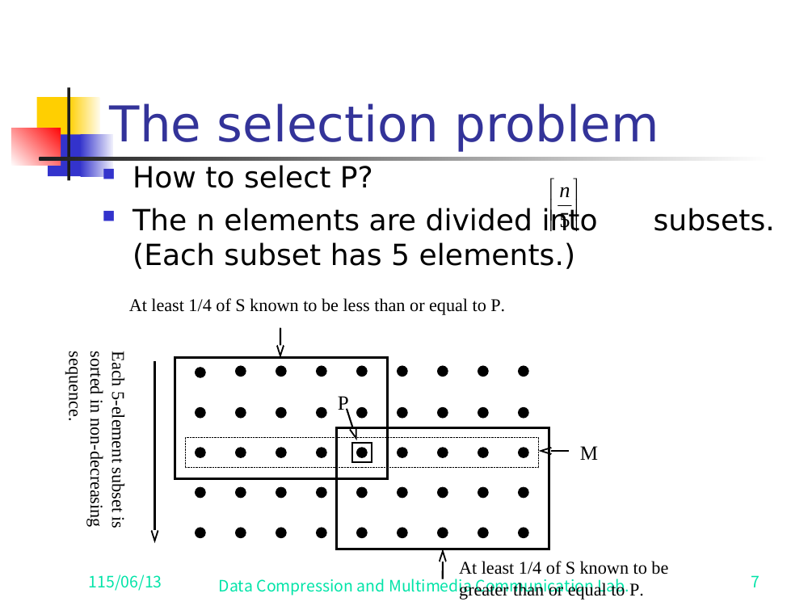
<figcaption>Slide 7 — "How to select P?" Each column is one sorted 5-element subset; the dotted row <code>M</code> holds the group medians and <code>P</code> is their median. The upper-left rectangle holds ≥1/4 of S known to be ≤ P; the lower-right rectangle holds ≥1/4 known to be ≥ P.</figcaption>

- Every group whose median is `≤ p`: at least 3 of its 5 elements (the median and the two above it in the sorted column) are `≤ p`. About **half** the groups have median `≤ p`. Hence **at least about `n/4` elements are `≤ p`** (the upper-left block).
- Symmetrically, **at least about `n/4` elements are `≥ p`** (the lower-right block).

**Guarantees:**
- At least **1/4 of `S`** is **≤ p**.
- At least **1/4 of `S`** is **≥ p**.

Therefore **at least `n/4` elements are pruned** in each iteration, and **at most `3n/4` elements remain** for the next iteration.

---

## 5. The Full Linear-Time Selection Algorithm

### Algorithm (5 steps)

- **Input:** a set `S` of `n` elements.
- **Output:** the k-th smallest element of `S`.

1. **Step 1.** Divide `S` into `⌈n/5⌉` subsets, each containing five elements. Add dummy elements to the last subset if `n` is not a multiple of 5.
2. **Step 2.** Sort each subset of elements.
3. **Step 3.** Find the element `p` which is the **median of the medians** of the `⌈n/5⌉` subsets.
4. **Step 4.** Partition `S` into `S₁, S₂, S₃` (elements less than, equal to, and greater than `p`, respectively).
5. **Step 5.** Three-way recursion:
   - If **`|S₁| ≥ k`** → discard `S₂, S₃`, solve "select k-th smallest from `S₁`" next iteration.
   - Else if **`|S₁| + |S₂| ≥ k`** → `p` is the k-th smallest element of `S`. Done.
   - Otherwise → let `k′ = k − |S₁| − |S₂|`, solve "select k′-th smallest from `S₃`" next iteration.

Key facts (from §4): **at least `n/4` pruned per iteration**, and the **remaining problem in step 5 has at most `3n/4` elements**.

### Per-step cost

| Step | Work | Cost |
|---|---|---|
| Step 1 | Divide into groups of 5 | `O(n)` |
| Step 2 | Sort each group (each is constant size 5) | `O(n)` |
| Step 3 | Recursively find median of `⌈n/5⌉` medians | `T(n/5)` |
| Step 4 | Partition `S` around `p` | `O(n)` |
| Step 5 | Recurse on ≤ `3n/4` survivors | `T(3n/4)` |

### Recurrence

```
T(n) = T(3n/4) + T(n/5) + O(n)
```

Note the **two** recursive calls: one of size `n/5` (finding the pivot in step 3) and one of size `3n/4` (the surviving subproblem in step 5). Because `3/4 + 1/5 = 19/20 < 1`, the recurrence still solves to `O(n)`.

### Proof that `T(n) = O(n)` — polynomial substitution

Assume `T(n)` can be written as a polynomial:

```
T(n)     = a₀ + a₁n + a₂n² + …          (a₁ ≠ 0)
T(3n/4)  = a₀ + (3/4)a₁n + (9/16)a₂n² + …
T(n/5)   = a₀ + (1/5)a₁n + (1/25)a₂n² + …
```

Adding the two recursive terms and comparing with `T(19n/20)`:

```
T(19n/20) = a₀ + (19/20)a₁n + (361/400)a₂n² + …
```

Coefficient comparison (the linear and higher coefficients of `T(3n/4) + T(n/5)` vs `T(19n/20)`):

- Linear term: `(3/4 + 1/5)a₁n = (19/20)a₁n` — matches `T(19n/20)`'s linear term.
- Quadratic term: `(9/16 + 1/25)a₂n²` vs `(361/400)a₂n²`. Now `9/16 + 1/25 = 225/400 + 16/400 = 241/400 < 361/400`. So the sum's quadratic part is *smaller*.

Hence, accounting for the extra constant `a₀`:

```
T(3n/4) + T(n/5) ≤ a₀ + T(19n/20)
```

> ⚠️ Reconstructed detail: the slide states `T(3n/4) + T(n/5) ≤ a₀ + T(19n/20)` directly. The coefficient comparison `9/16 + 1/25 = 241/400 < 361/400` (and similarly for higher terms) is the justification I filled in for *why* the inequality holds.

Substituting into the recurrence (with the `O(n)` term written as `cn`):

```
T(n) ≤ cn + T(19n/20)
```

Unrolling this single-term recurrence:

```
T(n) ≤ cn + (19/20)cn + T((19/20)²·n)

     ≤ cn + (19/20)cn + (19/20)²cn + … + (19/20)ᵖ·cn + T((19/20)ᵖ⁺¹·n)
```

where `p` is chosen so the surviving size is constant: `(19/20)ᵖ⁺¹·n ≤ 1 ≤ (19/20)ᵖ·n`.

The geometric series with ratio `19/20`:

```
cn · ( 1 + 19/20 + (19/20)² + … )  =  cn · 1/(1 − 19/20)  =  cn · 20  =  20cn
```

So, adding the constant base-case cost `b`:

```
T(n) ≤ 20cn + b = O(n)
```

### `cn log n` vs `20cn`

The naive sort-based selection costs `cn log n`. The prune-and-search version costs `20cn`. The crossover: `20cn < cn log n` exactly when `log n > 20`, i.e. `n > 2²⁰ ≈ 10⁶`. The point is **asymptotically** `20cn = O(n)` beats `O(n log n)`: the constant `20` is fixed while `log n` grows without bound.

---

## 6. Linear Programming with Two Variables

### General problem

```
Minimize    a·x + b·y
subject to  aᵢ·x + bᵢ·y ≤ cᵢ ,   i = 1, 2, …, n
```

### Simplified problem

A canonical, easier-to-visualize version (we will reduce the general one to this later):

```
Minimize    y
subject to  y ≥ aᵢ·x + bᵢ ,   i = 1, 2, …, n
```

Each constraint `y ≥ aᵢx + bᵢ` says the feasible point must lie **on or above** the line `aᵢx + bᵢ`.

### The boundary function `F(x)`

The lower boundary of the feasible region is the **upper envelope** of all the lines:

```
F(x) = max { aᵢ·x + bᵢ : i = 1, 2, …, n }
```

`F(x)` is a **convex**, piecewise-linear function (the pointwise maximum of linear functions). ✅ **Verified against slide 14 (Fig. 7-2).** The slide explicitly prints the formula `F(x) = max_{1≤i≤n} {aᵢx + bᵢ}` (printed as `1≤x≤n` on the slide — an obvious typo for `1≤i≤n`). The figure shows a gray convex feasible region above the upper envelope of eight constraint lines `a₁x+b₁ … a₈x+b₈`, with the optimum `(x₀, y₀)` at the lowest boundary point (marked by a red vertical segment). Earlier carved render (Figure A.1) showed the same kind of plot with five labelled lines; slide 14 is the authoritative version. So the F(x) body is **not** blank on the slide.

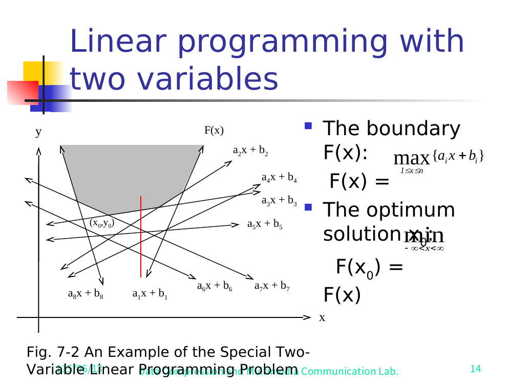
<figcaption>Slide 14 (Fig. 7-2) — the upper envelope <code>F(x) = max{aᵢx+bᵢ}</code> of eight constraint lines, with the optimum <code>(x₀, y₀)</code> at the lowest boundary point (red segment).</figcaption>

### The optimum

The optimum `x₀` minimizes the boundary:

```
F(x₀) = min over x of  F(x)
```

`(x₀, y₀)` with `y₀ = F(x₀)` is the optimal solution — the lowest point of the convex envelope. ✅ **Verified against slide 14 (Fig. 7-2)**, which prints the optimum as `F(x₀) = min_{-∞<x<∞} F(x)` and marks `(x₀, y₀)` at the bottom of the convex envelope. (The carved Figure A.1 with five labelled lines depicts the closely-related Fig. 7-3 pruning picture, case `x₀ < xₘ`.)

### Deciding which side `x₀` is on, given a test point `xₘ`

Suppose a test abscissa `xₘ` is known. How do we know whether `x₀ < xₘ` or `x₀ > xₘ`? Evaluate `yₘ = F(xₘ)`.

**Case 1: `yₘ` lies on only one constraint.** Let `g` be the slope of that constraint.
- If `g > 0` → `x₀ < xₘ` (envelope still descending to the left).
- If `g < 0` → `x₀ > xₘ` (envelope still descending to the right).

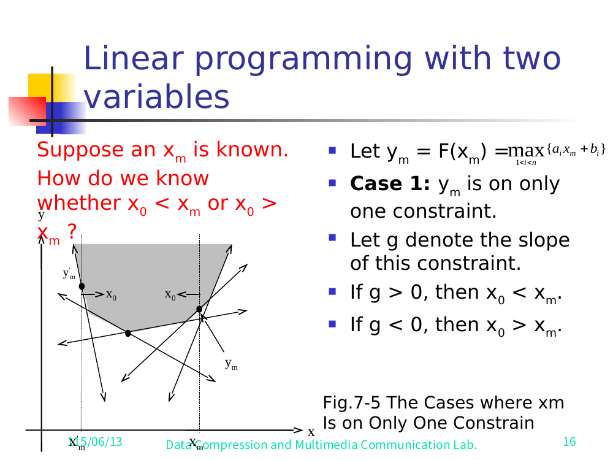0 giving x0<xm and g<0 giving x0>xm">
<figcaption>Slide 16 (Fig. 7-5) — the cases where <code>xₘ</code> is on only one constraint of slope <code>g</code>.</figcaption>

**Case 2: `yₘ` is the intersection of several constraints.** ✅ **Verified against slide 17 (Fig. 7-6).** The slide prints the slope definitions explicitly:
```
g_max = max_{1≤i≤n} { aᵢ : aᵢxₘ + bᵢ = F(xₘ) }   (max slope of constraints achieving F(xₘ))
g_min = min_{1≤i≤n} { aᵢ : aᵢxₘ + bᵢ = F(xₘ) }   (min slope of constraints achieving F(xₘ))
```
- **Case 2a:** `g_min > 0` and `g_max > 0` → `x₀ < xₘ`.
- **Case 2b:** `g_min < 0` and `g_max < 0` → `x₀ > xₘ`.
- **Case 2c:** `g_min < 0` and `g_max > 0` → `(xₘ, yₘ)` **is** the optimum solution (envelope has its minimum exactly here).

The Fig. 7-6 plot draws a convex envelope with three test abscissae on the x-axis: the slide maps **Case 2a → `xₘ,₃`**, **Case 2b → `xₘ,₁`**, **Case 2c → `xₘ,₂`** (with the `g_min`/`g_max` slope labels on the active lines at each intersection). The single-constraint Case 1 is the separate **Fig. 7-5** (slide 16).

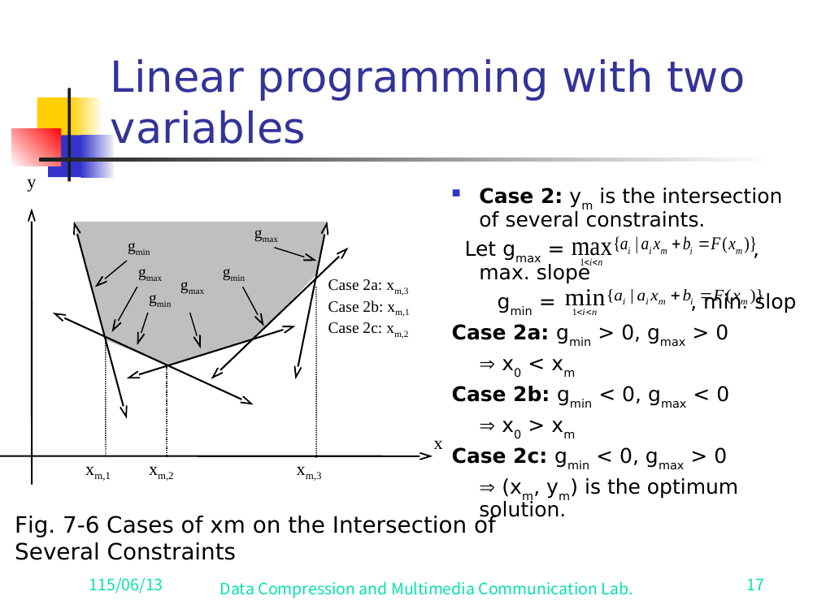
<figcaption>Slide 17 (Fig. 7-6) — <code>xₘ</code> on the intersection of several constraints. Case 2a (<code>xₘ,₃</code>) ⇒ <code>x₀&lt;xₘ</code>; Case 2b (<code>xₘ,₁</code>) ⇒ <code>x₀&gt;xₘ</code>; Case 2c (<code>xₘ,₂</code>) ⇒ optimum.</figcaption>

### Pruning constraints

Once we know `x₀`'s side relative to `xₘ`, we can **delete** constraints (Fig. 7-3):

> If `x₀ < xₘ` and the intersection of `a₃x + b₃` and `a₂x + b₂` is **greater than** `xₘ`, then for all `x < xₘ` one of these two constraints is always smaller than the other. The always-smaller constraint **cannot** contribute to the upper envelope near the optimum, so it can be **deleted**. (Symmetric reasoning for `x₀ > xₘ`.)

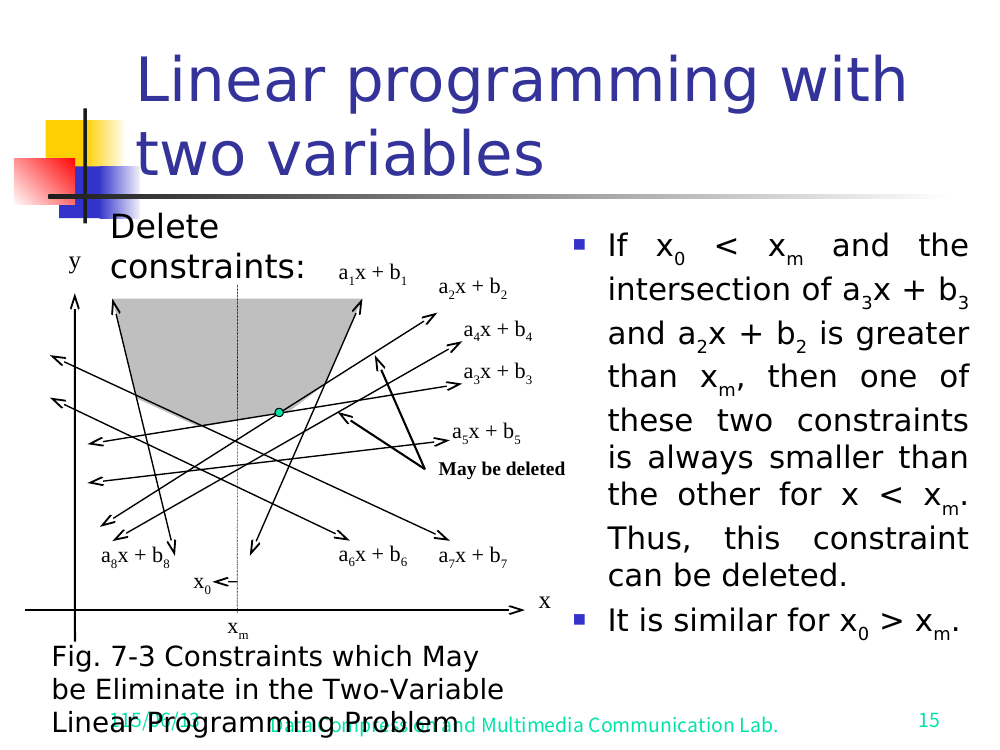
<figcaption>Slide 15 (Fig. 7-3) — constraints which may be eliminated. With <code>x₀ &lt; xₘ</code>, the line annotated "May be deleted" never reaches the envelope for <code>x &lt; xₘ</code>.</figcaption>

### Choosing `xₘ` (so that a constant fraction is pruned)

> Arbitrarily group the `n` constraints into `n/2` **pairs**. For each pair, find their intersection. Among these `n/2` intersection x-coordinates, choose the **median** as `xₘ`.

This guarantees that for half the pairs the intersection lies on the "deletable" side, so **`n/4` constraints are pruned per iteration**.

### Algorithm (simplified two-variable LP)

- **Input:** constraints `S`: `aⱼx + bⱼ`, `j = 1, …, n`.
- **Output:** the value `x₀` minimizing `y` subject to `y ≥ aⱼx + bⱼ` for all `j`.

1. **Step 1.** If `S` has ≤ 2 constraints, solve by brute force.
2. **Step 2.** Divide `S` into `n/2` pairs. For each pair `(aᵢx+bᵢ, aⱼx+bⱼ)`, find their intersection `pᵢⱼ` with x-value `xᵢⱼ`.
3. **Step 3.** Among the `xᵢⱼ`'s (at most `n/2` of them), find the median `xₘ`.
4. **Step 4.** Determine `yₘ = F(xₘ)`, `g_min`, and `g_max`.
5. **Step 5.**
   - **5a.** If `g_min` and `g_max` are **not** of the same sign → `yₘ` is the solution. **Exit.**
   - **5b.** Otherwise: `x₀ < xₘ` if `g_min > 0`; `x₀ > xₘ` if `g_min < 0`.
6. **Step 6.** Prune:
   - **6a.** If `x₀ < xₘ`: for each pair whose intersection x-coordinate is **larger** than `xₘ`, prune the constraint that is always smaller for `x ≤ xₘ`.
   - **6b.** If `x₀ > xₘ`: for each pair whose intersection x-coordinate is **less** than `xₘ`, prune the constraint that is always smaller for `x ≥ xₘ`.

   Let `S` be the remaining constraints. **Go to Step 2.**

**Pruning rate:** there are `n/2` intersections, so **`n/4` constraints pruned per iteration**.
**Time complexity:** `O(n)`. The slide states only "O(n)"; by the same prune-and-search argument each iteration does `O(n)` work and prunes a constant fraction (≈1/4 of constraints), giving `T(n) = T(3n/4) + O(n) = O(n)`.

### Reducing the general problem to the simplified one

The general two-variable LP `Minimize ax + by  s.t.  aᵢx + bᵢy ≤ cᵢ` is transformed by the substitution:

```
x′ = x
y′ = ax + by
```

giving

```
Minimize    y′
subject to  aᵢ′·x′ + bᵢ′·y′ ≤ cᵢ′ ,   i = 1, …, n
where   aᵢ′ = aᵢ − bᵢ·a/b ,   bᵢ′ = bᵢ/b ,   cᵢ′ = cᵢ
```

Rewriting (changing symbols), the general problem splits the constraints into two index sets `I₁` and `I₂` (constraints whose `y`-coefficient sign differs become "`y ≥`" or "`y ≤`" constraints):

```
Minimize    y
subject to  y ≥ aᵢx + bᵢ   (i ∈ I₁)
            y ≤ aᵢx + bᵢ   (i ∈ I₂)
            a ≤ x ≤ b
```

Define:

```
F₁(x) = max { aᵢx + bᵢ : i ∈ I₁ }   (lower envelope constraint — must lie above)
F₂(x) = min { aᵢx + bᵢ : i ∈ I₂ }   (upper envelope constraint — must lie below)
```

Then the problem becomes:

```
Minimize    F₁(x)
subject to  F₁(x) ≤ F₂(x),   a ≤ x ≤ b
```

(Fig. 7-9: feasible where `F₁(x) ≤ F₂(x)`, between `x = a` and `x = b`.)

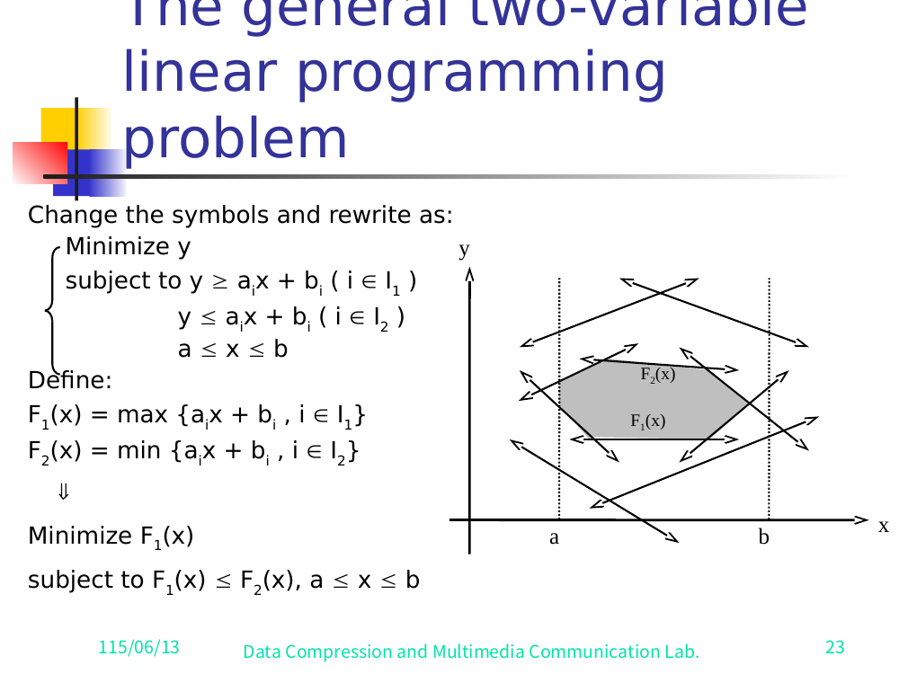
<figcaption>Slide 23 — the general problem rewritten with <code>F₁(x)=max{aᵢx+bᵢ : i∈I₁}</code> and <code>F₂(x)=min{aᵢx+bᵢ : i∈I₂}</code>; feasible region is the shaded lens where <code>F₁(x) ≤ F₂(x)</code>.</figcaption>

### Pruning and feasibility test for the general problem

Define `F(x) = F₁(x) − F₂(x)`. Then **`xₘ` is feasible ⟺ `F(xₘ) ≤ 0`**.

Slopes at `xₘ`:
```
g_min = min { aᵢ : i ∈ I₁, aᵢxₘ + bᵢ = F₁(xₘ) }   (min slope of active I₁ lines)
g_max = max { aᵢ : i ∈ I₁, aᵢxₘ + bᵢ = F₁(xₘ) }   (max slope of active I₁ lines)
h_min = min { aᵢ : i ∈ I₂, aᵢxₘ + bᵢ = F₂(xₘ) }   (min slope of active I₂ lines)
h_max = max { aᵢ : i ∈ I₂, aᵢxₘ + bᵢ = F₂(xₘ) }   (max slope of active I₂ lines)
```
> ⚠️ Note: the slide lists `hmin = …` **twice** (once for min, once for max) — clearly a typo; the second should be `h_max`. Corrected above.

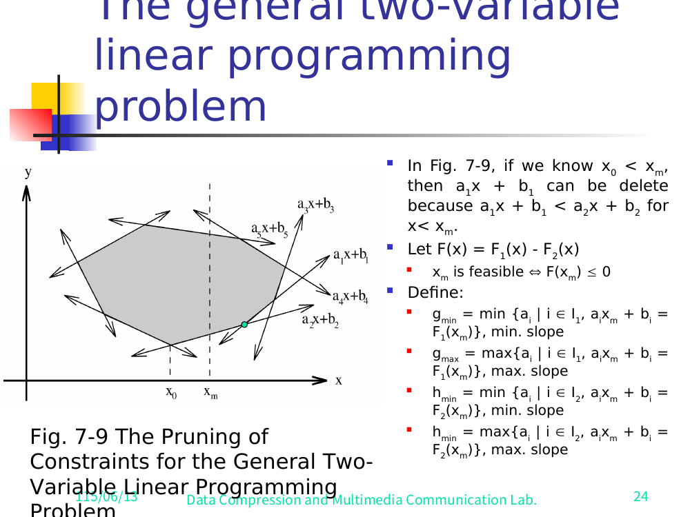
<figcaption>Slide 24 (Fig. 7-9) — pruning constraints for the general problem; <code>F(x)=F₁(x)−F₂(x)</code>, <code>xₘ</code> feasible ⟺ <code>F(xₘ)≤0</code>. The slope definitions appear at right (the second <code>hmin</code> is the slide's typo for <code>h_max</code>).</figcaption>

**Case 1: `F(xₘ) ≤ 0` (`xₘ` feasible).**
- `g_min > 0` and `g_max > 0` → `x₀ < xₘ`.
- `g_min < 0` and `g_max < 0` → `x₀ > xₘ`.
- `g_min < 0` and `g_max > 0` → `xₘ = x₀` is the **optimum**.

**Case 2: `F(xₘ) > 0` (`xₘ` infeasible).**
- `g_min > h_max` → `x₀ < xₘ`.
- `g_min < h_max` → `x₀ > xₘ`.
- `g_min ≤ h_max` **and** `g_max ≥ h_min` → **no feasible solution exists**.

### Algorithm (general two-variable LP)

- **Input:** `I₁`: `y ≥ aᵢx + bᵢ`, `i = 1…n₁`;  `I₂`: `y ≤ aᵢx + bᵢ`, `i = n₁+1…n`;  `a ≤ x ≤ b`.
- **Output:** `x₀` minimizing `y` subject to all constraints.

1. **Step 1.** Arrange the constraints in `I₁` and `I₂` into arbitrary disjoint pairs (within each set). For each pair: if `aᵢx + bᵢ` is **parallel** to `aⱼx + bⱼ`, delete `aᵢx + bᵢ` if `bᵢ < bⱼ` for `i,j ∈ I₁` (or if `bᵢ > bⱼ` for `i,j ∈ I₂`). Otherwise find the intersection `pᵢⱼ` with x-coordinate `xᵢⱼ`.
2. **Step 2.** Find the median `xₘ` of the `xᵢⱼ`'s (at most `n/2` of them).
3. **Step 3.**
   - If `xₘ` is optimal → report and exit.
   - If no feasible solution exists → report and exit.
   - Otherwise → determine whether `x₀` lies to the **left** or **right** of `xₘ`.
4. **Step 4.** Discard at least **1/4** of the constraints. **Go to Step 1.**

**Time complexity:** `O(n)`.

---

## 7. The 1-Center Problem (Smallest Enclosing Circle)

### Definition

Given `n` planar points, find the **smallest circle** that covers (encloses) all `n` points. (Fig. 7-16.)

The center of the optimum circle lies in a region bounded by **perpendicular bisectors**: `L₁₂` = bisector of the segment joining `p₁, p₂`; `L₃₄` = bisector of segment joining `p₃, p₄`; etc. A point such as `p₁` can be **eliminated** without affecting the solution if it is dominated. ✅ **Verified against slide 34** (= Figure A.3): two bisectors `L₁₂` (positive slope) and `L₃₄` (negative slope) cross at origin `p`; points `p₁, p₂` on the right, `p₃, p₄` in the upper-left inside the shaded admissible region (upper-left quadrant). Slide 34's red caption reads "The area where the center of the optimum circle may be located." (The same figure is reused on slide 50 for Step 10.)

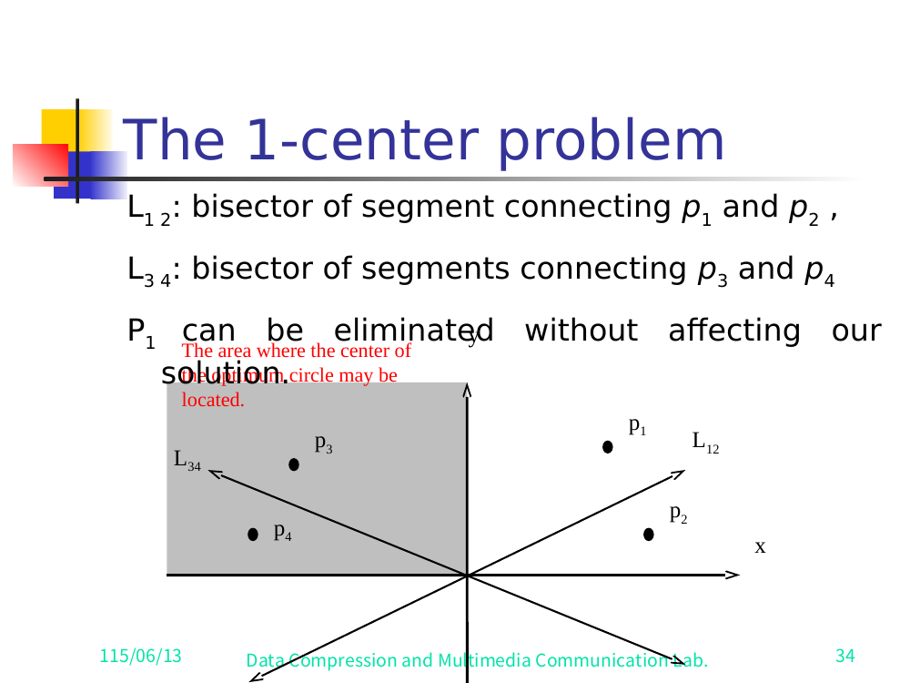
<figcaption>Slide 34 — perpendicular-bisector elimination. <code>L₁₂</code> and <code>L₃₄</code> bound the shaded region "where the center of the optimum circle may be located"; <code>p₁</code> can be eliminated.</figcaption>

### 7.1 The Constrained 1-Center Problem

The center is **restricted to lie on a given straight line** `y = y′`.

- **Input:** `n` points and a straight line `y = y′`.
- **Output:** the constrained center `x*` on the line `y = y′`.

✅ Illustrated by **Figure A.2** (carved image) and confirmed by **slide 35** (statement "The center is restricted to lying on a straight line") and **slide 38 / Fig. 7-18** (the pruning geometry on `y = 0`).

**Algorithm:**

1. **Step 1.** If `n ≤ 2`, solve by brute force.
2. **Step 2.** Form disjoint pairs `(p₁,p₂), (p₃,p₄), …, (pₙ₋₁,pₙ)`. If there is an odd number of points, let the final pair be `(pₙ, p₁)`.
3. **Step 3.** For each pair `(pᵢ, pᵢ₊₁)`, find the point `xᵢ,ᵢ₊₁` on the line `y = y′` **equidistant** from both: `d(pᵢ, xᵢ,ᵢ₊₁) = d(pᵢ₊₁, xᵢ,ᵢ₊₁)`.
4. **Step 4.** Find the **median** of the `n/2` values `xᵢ,ᵢ₊₁`. Denote it `xₘ`.
5. **Step 5.** Compute the distance from every `pᵢ` to `xₘ`. Let `pⱼ` be the **farthest** point. Let `xⱼ` be the projection of `pⱼ` onto `y = y′`. If `xⱼ` is to the **left (right)** of `xₘ`, then the optimal solution `x*` must be to the **left (right)** of `xₘ`.
6. **Step 6.** Prune:
   - If `x* < xₘ`: for each `xᵢ,ᵢ₊₁ > xₘ`, prune `pᵢ` if `pᵢ` is closer to `xₘ` than `pᵢ₊₁`, otherwise prune `pᵢ₊₁`.
   - If `x* > xₘ`: for each `xᵢ,ᵢ₊₁ < xₘ`, prune `pᵢ` if `pᵢ` is closer to `xₘ` than `pᵢ₊₁`, otherwise prune `pᵢ₊₁`.
7. **Step 7.** **Go to Step 1.**

**Intuition for pruning:** of the two points in a pair, the one **closer** to `xₘ` (on the far side from `x*`) can never be the farthest point determining the radius, so it is discarded. (Fig. 7-18.)

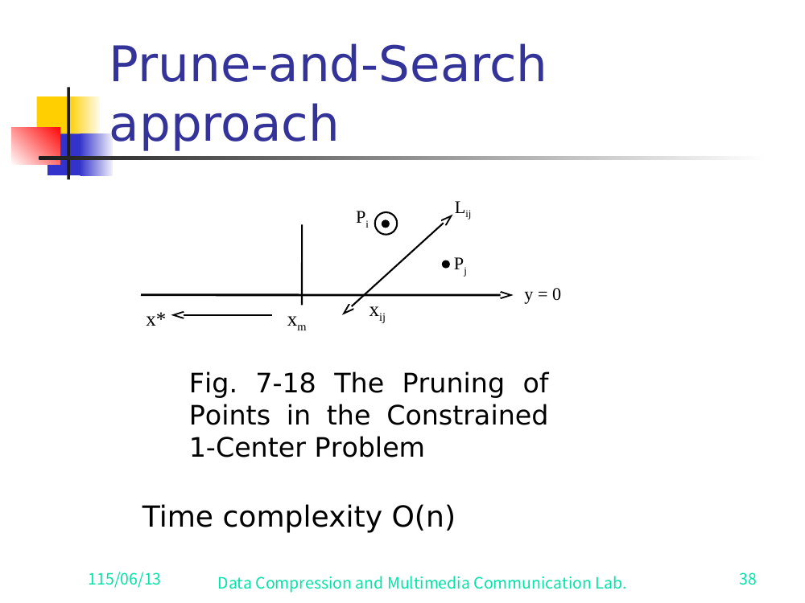
<figcaption>Slide 38 (Fig. 7-18) — pruning points in the constrained 1-center problem. With <code>x*</code> to the left of <code>xₘ</code>, of the pair <code>(Pᵢ,Pⱼ)</code> the point closer to <code>xₘ</code> is pruned.</figcaption>

**Time complexity:** `O(n)`.

### 7.2 The General 1-Center Problem

Using the **constrained** 1-center algorithm we can pin `x*` to a given line. We can do more: determine the sign of the optimum center's coordinates.

Let `(xₛ, yₛ)` be the center of the optimum (unconstrained) circle. We can determine whether `yₛ > 0`, `yₛ < 0`, or `yₛ = 0`; similarly for `xₛ`.

**Setup:** For the constrained problem on `y = 0`, let `(x*, 0)` be the constrained center. Let `I` be the set of points **farthest** from `(x*, 0)`.

**Case 1: `I` contains one point `P = (xₚ, yₚ)`.**
- `yₛ` has the **same sign** as `yₚ`. (We should move the center toward that farthest point.) ✅ **Verified against slide 40 (Fig. 7-20, Case 1)** = Figure A.4: the constrained circle on `y = 0` has its single farthest point `p` directly above center `x*` (apex of the half-disk), so the unconstrained optimum moves **upward** toward `p`. Slide 40 prints the rule "`yₛ` has the same sign as that of `yₚ`."

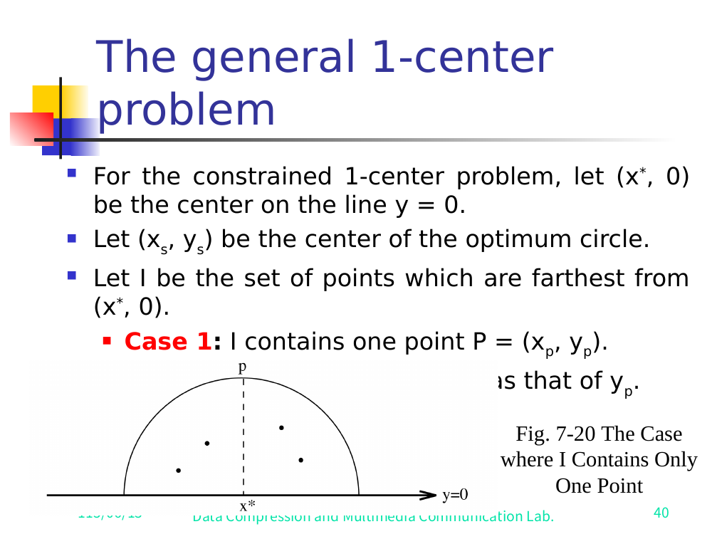
<figcaption>Slide 40 (Fig. 7-20, Case 1) — <code>I</code> contains one farthest point <code>p</code> directly above <code>x*</code>, so the unconstrained optimum moves upward: <code>yₛ</code> has the same sign as <code>yₚ</code>.</figcaption>

**Case 2: `I` contains more than one point.** ✅ **Verified against slide 41 (Fig. 7-20(b)).**
- Find the **smallest arc** spanning all points in `I`. Let `P₁ = (x₁, y₁)` and `P₂ = (x₂, y₂)` be the two **endpoints** of that smallest spanning arc.
- If the arc **≥ 180°** → `yₛ = 0` (the circle is already optimal — the farthest points "surround" the center).
- Else (`< 180°`) → **`yₛ` has the same sign as that of `(y₁ + y₂)/2`** (this expression IS printed on slide 41 — i.e. the sign of the midpoint-of-arc-endpoints' y-coordinate). Slide 41(b) draws the circle with farthest points `P₁,P₃,P₄,P₂` clustered on a short upper-right arc, center `(x*,0)`.

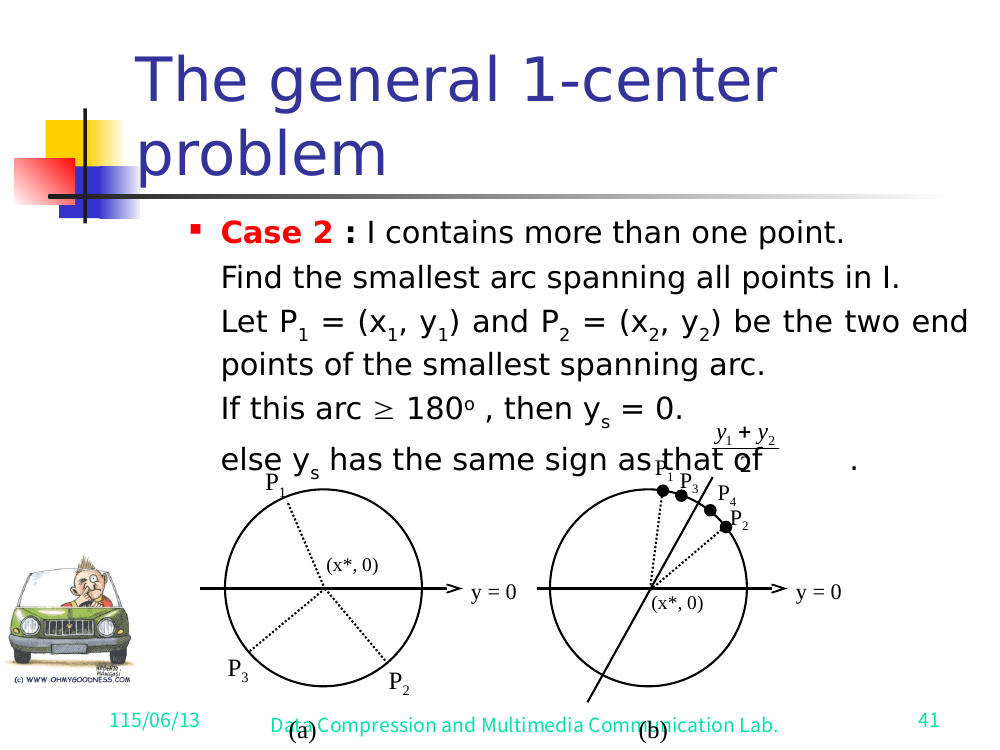
<figcaption>Slide 41 (Fig. 7-20(a)/(b)) — <code>I</code> contains several farthest points. Arc ≥180° ⇒ <code>yₛ=0</code>; arc &lt;180° ⇒ <code>yₛ</code> follows the sign of <code>(y₁+y₂)/2</code>.</figcaption>

**Why (acute vs obtuse):**
- If the farthest points form an **acute triangle** with respect to the center → the circle **is optimal**.
- If they form an **obtuse** configuration (spanning arc `< 180°`) → the circle is **not** optimal; the center can be moved.

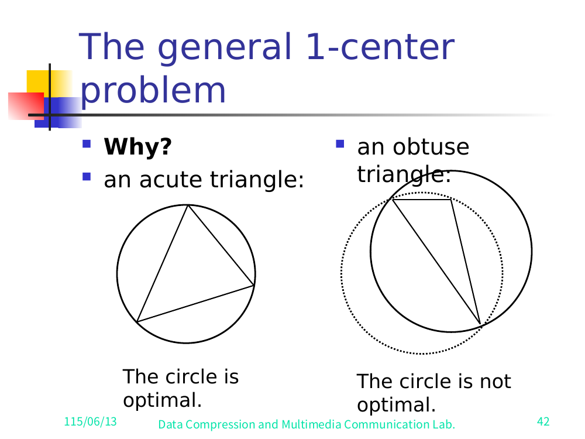
<figcaption>Slide 42 — why: farthest points forming an acute triangle ⇒ the circle is optimal; an obtuse configuration ⇒ not optimal (a smaller circle exists).</figcaption>

**Direction of `x*` / sign of `yₛ` when arc `< 180°`:**

When the smallest spanning arc is `< 180°` (slide 43, **Fig. 7-23**), `(x₁ − x*)` and `(x₂ − x*)` must be of **opposite signs** — otherwise we could move `x*` toward where both `P₁` and `P₂` lie and shrink the circle.

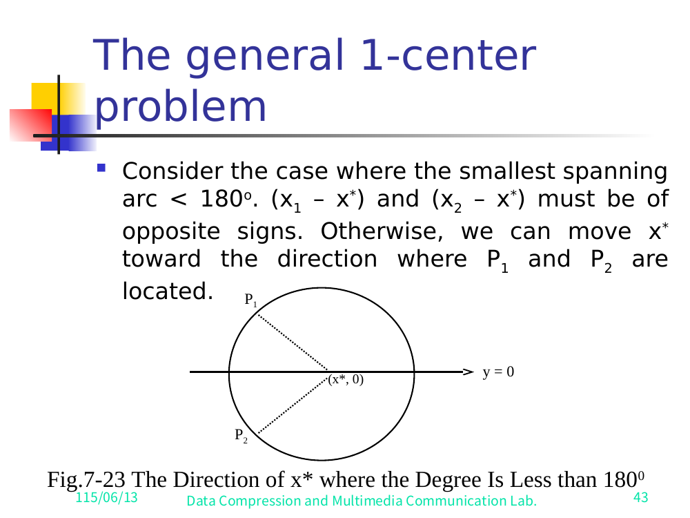
<figcaption>Slide 43 (Fig. 7-23) — direction of <code>x*</code> when the arc is &lt;180°: <code>(x₁−x*)</code> and <code>(x₂−x*)</code> have opposite signs.</figcaption>

Let `P₁ = (a, b)` and `P₂ = (c, d)`. **Without loss of generality assume `a > x*`, `b > 0` and `c < x*`, `d < 0`** (this WLOG is stated verbatim on slide 44). Let the current radius be `r`. Slide 44 draws four sub-figures (a)-(d), each shading the candidate region (regions 1, 2, 3, 4) where a smaller enclosing circle's center could lie; the optimum center must lie in **region 3** (the shaded region of sub-figure (c), the lower-left wedge between the two equal-radius arcs through `P₁` and `P₂`).

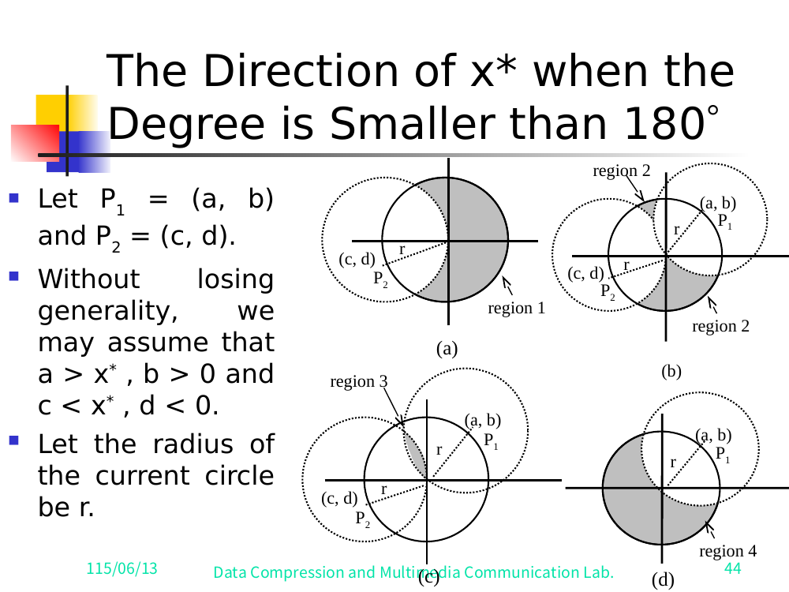x*, b>0, c<x*, d<0">
<figcaption>Slide 44 — the four candidate regions. The optimum center must lie in <strong>region 3</strong> (sub-figure (c), the lower-left wedge).</figcaption>

✅ **Verified against slide 45.** The slide **does** print the closed-form sign expressions (the note's earlier "blank" claim was wrong — the formulas were merely typeset as overlapping fractions). The slide says "the sign of `yₛ` must be the sign of" and "similarly, `xₛ` has the same sign as that of", with the fractions:

```
sign(yₛ) = sign( (b + d)/2 )  =  sign( (y₁ + y₂)/2 )
sign(xₛ) = sign( (a + c)/2 )  =  sign( (x₁ + x₂)/2 )
```

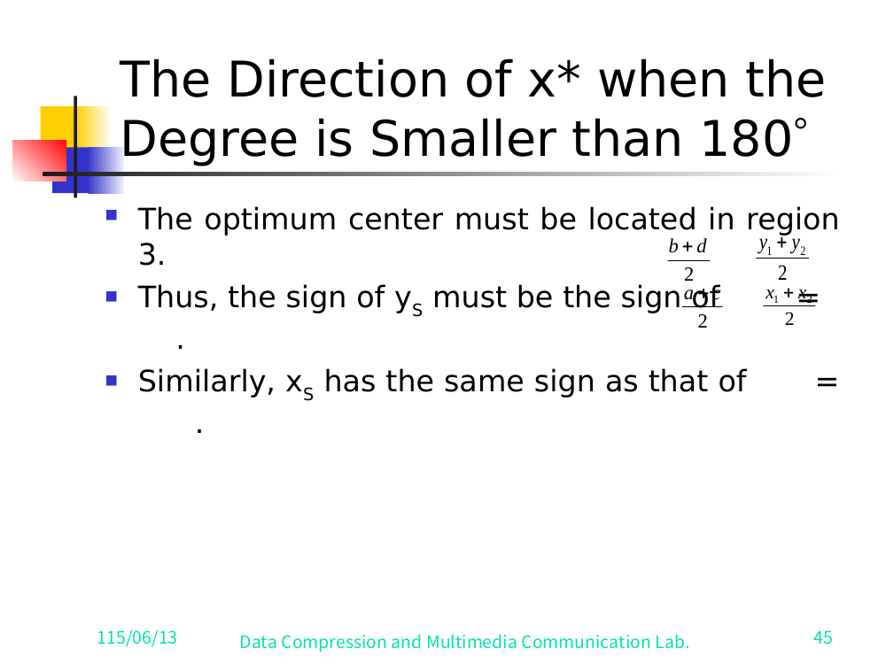
<figcaption>Slide 45 — the closed-form sign rules: <code>sign(yₛ)=sign((b+d)/2)=sign((y₁+y₂)/2)</code> and <code>sign(xₛ)=sign((a+c)/2)=sign((x₁+x₂)/2)</code>, with the optimum center in region 3.</figcaption>

i.e. the optimum center's coordinates take the sign of the **midpoint of the two spanning-arc endpoints** `P₁=(a,b)=(x₁,y₁)` and `P₂=(c,d)=(x₂,y₂)`. (Since `P₁,P₂` are the arc endpoints, `(a,b)≡(x₁,y₁)` and `(c,d)≡(x₂,y₂)`, so the two forms of each line are identical.) This is consistent with slide 41's Case-2 statement that `yₛ` follows the sign of `(y₁+y₂)/2`.

> ✅ Resolved: the §7.2 sign formulas are present on slides 41 and 45 and are now transcribed above. The slide-45 layout has the two text boxes overlapping the fraction objects, which is why an earlier text dump appeared blank; under the clean per-slide render the fractions `(b+d)/2`, `(y₁+y₂)/2`, `(a+c)/2`, `(x₁+x₂)/2` are legible.

### 7.3 The General 1-Center Algorithm (full)

- **Input:** a set `S = {p₁, …, pₙ}` of `n` points.
- **Output:** the smallest enclosing circle for `S`.

1. **Step 1.** If `S` has ≤ **16** points, solve by brute force.
2. **Step 2.** Form disjoint pairs `(p₁,p₂), …, (pₙ₋₁,pₙ)`. For each pair `(pᵢ, pᵢ₊₁)` find the perpendicular bisector of segment `pᵢpᵢ₊₁`. Denote them `Lₖ` (`k = 1,…,n/2`) and compute their slopes `sₖ`.
3. **Step 3.** Compute the **median** of the slopes `sₖ`; denote it `sₘ`.
4. **Step 4.** Rotate the coordinate system so the x-axis coincides with `y = sₘ·x`. Let `I⁺` (`I⁻`) be the set of `Lₖ` with positive (negative) slope. (Each has size `n/4`.)
5. **Step 5.** Construct disjoint pairs `(Lᵢ⁺, Lᵢ⁻)`, `i = 1,…,n/4`, with `Lᵢ⁺ ∈ I⁺`, `Lᵢ⁻ ∈ I⁻`. Find each pair's intersection `(aᵢ, bᵢ)`.
6. **Step 6.** Find the **median of the `bᵢ`'s**; denote it `y*`. Apply the **constrained 1-center** subroutine to `S` with the center forced onto `y = y*`. Let its solution be `(x′, y*)`.
7. **Step 7.** Apply procedure 7.2 with `S` and `(x′, y*)`. If `yₛ = y*` → report "the circle from step 6 with center `(x′, y*)` is optimal" and exit. Otherwise record whether `yₛ > y*` or `yₛ < y*`.
8. **Step 8.** If `yₛ > y*`, find the median of the `aᵢ`'s among `(aᵢ,bᵢ)` with `bᵢ < y*`. If `yₛ < y*`, find the median of `aᵢ`'s among those with `bᵢ > y*`. Denote the median `x*`. Apply the constrained 1-center algorithm forcing the center onto `x = x*`. Let its solution be `(x*, y′)`.
9. **Step 9.** Apply procedure 7.2 with `S` and `(x*, y′)`. If `xₛ = x*` → report "the circle from step 8 with center `(x*, y′)` is optimal" and exit. Otherwise record `xₛ > x*` or `xₛ < x*`.
10. **Step 10.** Prune based on the quadrant of the optimum relative to `(x*, y*)`. In each case `(aᵢ, bᵢ)` is the intersection of `Lᵢ⁺` and `Lᵢ⁻`:
    - **Case 1: `xₛ > x*` and `yₛ > y*`.** For all `(aᵢ,bᵢ)` with `aᵢ < x*` and `bᵢ < y*`: let `Lᵢ⁻` be the bisector of `pⱼ, pₖ`; prune the one of `pⱼ/pₖ` that is closer to `(x*, y*)`.
    - **Case 2: `xₛ < x*` and `yₛ > y*`.** For all `(aᵢ,bᵢ)` with `aᵢ > x*` and `bᵢ < y*`: let `Lᵢ⁺` be the bisector of `pⱼ, pₖ`; prune the closer one.
    - **Case 3: `xₛ < x*` and `yₛ < y*`.** For all `(aᵢ,bᵢ)` with `aᵢ > x*` and `bᵢ > y*`: let `Lᵢ⁻` be the bisector of `pⱼ, pₖ`; prune the closer one.
    - **Case 4: `xₛ > x*` and `yₛ < y*`.** For all `(aᵢ,bᵢ)` with `aᵢ < x*` and `bᵢ > y*`: let `Lᵢ⁺` be the bisector of `pⱼ, pₖ`; prune the closer one.
11. **Step 11.** Let `S` be the remaining points. **Go to Step 1.**

**Pruning rate:** ✅ **Verified against slide 52** ("One point for each of n/4 intersections of `Lᵢ⁺` and `Lᵢ⁻` is pruned away. Thus, n/16 points are pruned away in each iteration."). Only the intersections in the correct quadrant (relative to `(x*, y*)`) qualify, giving **`n/16` points pruned per iteration**. Slide 52's figure shows the four quadrants about `(xₘ, yₘ)` with the prunable quadrant shaded and bisector-pair crosses scattered in each.

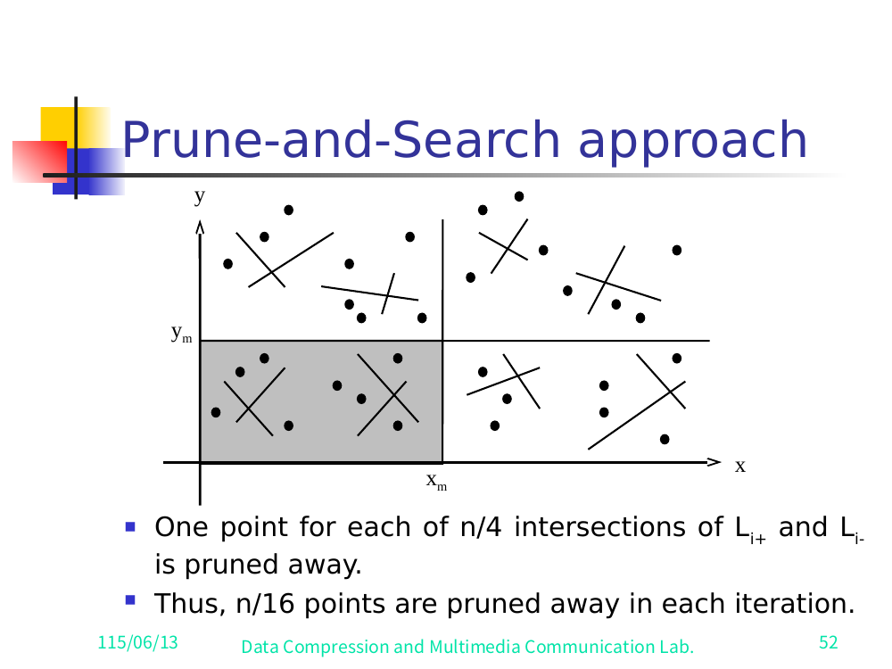
<figcaption>Slide 52 — pruning in the general 1-center step. Only intersections in the correct quadrant relative to <code>(xₘ,yₘ)</code> qualify; one point is pruned per qualifying intersection, giving <code>n/16</code> pruned per iteration.</figcaption>

**Time complexity:**
```
T(n) = T(15n/16) + O(n) = O(n)
```
(Since `15/16 < 1` and per-iteration work is `O(n)`, the geometric series sums to `O(n)` — same general-method argument as §1.)

---

## Verification status (after reading the full 53-slide render `render/A06full/`)

### ✅ Resolved / verified against specific slides

1. **Geometric-series closed form (§1)** → **slide 4.** The slide genuinely stops at "Since `1 − f < 1`, as `n → ∞`, `∴ T(n) = O(nᵏ)`"; the closed form `1/(1 − (1−f)ᵏ)` is a legitimate fill-in but is **not on the slide** (correctly flagged).
2. **Median definition (§2)** → **slide 5.** Slide explicitly writes `⌈n/2⌉`-th smallest. No placeholder. Verified.
3. **Selection boundary conditions (§3, §5)** → **slides 6 & 9.** The deck really is inconsistent: slide 6 uses strict `>`; slide 9 (formal Step 5) uses `≥`. The `≥` version is correct. Verified.
4. **Median-of-medians "1/4" grid (§4)** → **slide 7.** The grid figure IS in the deck (columns of 5 sorted top-to-bottom, dotted median row `M`, boxed `P`, two solid rectangles for the ≥1/4-each regions). The §4 ASCII was replaced with the real layout. Verified.
5. **Boundary function `F(x)` (§6)** → **slide 14 (Fig. 7-2).** **The note's "F(x) = blank" claim was WRONG.** The slide prints `F(x) = max_{1≤i≤n}{aᵢx+bᵢ}` (typeset `1≤x≤n`, a typo) and `F(x₀) = min_{-∞<x<∞} F(x)`, over a gray convex region with eight labelled lines and optimum `(x₀,y₀)`. Corrected + verified.
6. **Fig. 7-6 three-subcase plot + Case-2 slopes (§6)** → **slide 17.** Real plot; slide prints `g_max`/`g_min` set-builder definitions and the 2a/2b/2c rules. Case→point map: 2a↔xₘ,₃, 2b↔xₘ,₁, 2c↔xₘ,₂. Verified. (Single-constraint Case 1 = **Fig. 7-5, slide 16**.)
7. **`F₁`/`F₂` definitions & general-LP reduction (§6)** → **slides 22–23.** Slide 22 prints the substitution `x'=x, y'=ax+by` and `aᵢ'=aᵢ−bᵢa/b, bᵢ'=bᵢ/b, cᵢ'=cᵢ`; slide 23 prints `F₁(x)=max{aᵢx+bᵢ, i∈I₁}`, `F₂(x)=min{aᵢx+bᵢ, i∈I₂}` and Fig. 7-9-style region. Verified.
8. **`h_min` listed twice (§6)** → **slide 24.** Confirmed: the slide's 4th bullet really reads `h_min = max{…}` — a slide typo; should be `h_max`. The note's correction stands. Verified.
9. **§7.2 sign expressions** → ✅ **NOW RESOLVED — slides 41 & 45.** The note's "STILL UNVERIFIED / blank" claim was WRONG. The closed forms are printed on the slides:
   - `sign(yₛ) = sign((b+d)/2) = sign((y₁+y₂)/2)`
   - `sign(xₛ) = sign((a+c)/2) = sign((x₁+x₂)/2)`
   (slide 45; slide 41 also shows `yₛ` follows `sign((y₁+y₂)/2)`). The overlap of text boxes in the original dump made them look blank. Transcribed into §7.2.
10. **1-center `n/16` pruning rate (§7.3)** → **slide 52.** Slide states "One point for each of n/4 intersections of `Lᵢ⁺` and `Lᵢ⁻` is pruned away. Thus, n/16 points are pruned away in each iteration." Figure shows the four quadrants around `(xₘ, yₘ)` with the prunable quadrant shaded. Verified; `T(n)=T(15n/16)+O(n)=O(n)` on slide 53.

### Remaining genuinely-reconstructed (not on any slide)

- **Geometric-series closed form `1/(1−(1−f)ᵏ)` (§1):** confirmed absent from slide 4 (the slide leaves it implicit). Standard fill-in only.
- **Step-5 coefficient comparison `9/16 + 1/25 = 241/400 < 361/400` (§5):** slide 11 asserts `T(3n/4)+T(n/5) ≤ a₀ + T(19n/20)` directly without the comparison; the `241/400 < 361/400` justification remains my fill-in (the slide does print the `(9/16)`, `(1/25)`, `(361/400)` quadratic coefficients, so the comparison is trivially supported, but is not spelled out).

---

## Appendix A — Figures

> **Two sources.** (1) The original carved images from `/home/brant/finals_study/algo/render/A06/` — figures A.1–A.4 below (nine images, five decorative junk: red rose, panda doodles, house icon, the "ohmygoodness.com" green-car cartoon). (2) The **clean per-slide render** `/home/brant/finals_study/algo/render/A06full/slide-NN.png` (53 slides), which I have now read in full — figures A.5–A.10 below.
>
> **Correction to the earlier note:** the full render set **does** contain the median-of-medians grid (slide 7), the F(x)/x₀ envelope plot Fig. 7-2 (slide 14), and the Fig. 7-6 three-subcase plot (slide 17). The earlier claim that these were absent was based only on the carved-image subset. They are transcribed below and the body sections (§4, §6) are upgraded to ✅ Verified.

### Figure A.1 — Two-variable LP: convex feasible region and the optimum `x₀`

- **Source:** `png_003.png`
- **Axes:** vertical `y`, horizontal `x`, origin at lower-left.
- **Content:** a shaded **convex region** (the feasible region) bounded by straight constraint lines. Five lines are labelled, each with an **outward-pointing normal arrow** (the half-plane direction): `a₁x+b₁` and `a₄x+b₄` on the right (shallow positive / shallow negative slope), `a₂x+b₂` lower-right, `a₃x+b₃` a steep near-vertical line on the right, `a₅x+b₅` on the upper-right. The remaining (unlabelled) edges bound the left side of the region.
- **Markers:** two **dashed vertical lines** drop to the x-axis at `x₀` and `xₘ`, with **`x₀` to the LEFT of `xₘ`**. `x₀` is the abscissa of the lowest point of the convex boundary (the optimum); `xₘ` is the test abscissa.
- **What it resolves:** confirms `F(x)` is the convex lower-boundary envelope of the constraints and that the optimum is its lowest point. This figure depicts the decision case **`x₀ < xₘ`**.

### Figure A.2 — Constrained 1-center (center on line `y = 0`)

- **Source:** `png_005.png`
- **Content:** a single **circle** whose **center is marked `x*`** lying **on the horizontal line `y = 0`** (line drawn with an arrowhead, labelled `y=0` at right). Approximately **eleven points** (filled dots) are scattered inside the circle; two lie essentially on the `y=0` line and the rest above/below it.
- **What it shows:** the constrained 1-center problem — the smallest enclosing circle subject to its center being pinned to the given line `y = y′` (here `y′ = 0`). The radius is set by the farthest point(s) from `x*`.

### Figure A.3 — General 1-center: perpendicular-bisector elimination region

- **Source:** `png_008.png`
- **Axes:** `y` vertical, `x` horizontal; the crossing point of the axes / bisectors is labelled **`p`**.
- **Bisectors:** **`L₁₂`** — a line of **positive slope** through `p`, arrowheads pointing up-right (toward its label `L₁₂`) and down-left. **`L₃₄`** — a line of **negative slope** through `p`, arrowheads pointing down-right (toward label `L₃₄`) and up-left.
- **Points:** `p₁` and `p₂` on the **right** half (`p₁` above `p₂`); `p₃` and `p₄` in the **upper-left**, inside the shaded region (`p₃` above `p₄`).
- **Shaded region:** the **upper-left wedge/quadrant** bounded by the two bisectors and the positive `y`-axis — the admissible region for the optimum center after the bisector constraints `L₁₂` (perp. bisector of `p₁p₂`) and `L₃₄` (perp. bisector of `p₃p₄`) are imposed. Points outside the relevant half-plane (e.g. `p₁`) can be eliminated.

### Figure A.4 — Sign determination, single farthest point (`yₛ` follows `yₚ`)

- **Source:** `png_006.png`
- **Content:** an **upper half-disk** (semicircle) sitting on the horizontal line `y = 0` (labelled `y=0`, arrow at right). The **apex of the arc is labelled `p`** and a **dashed vertical segment** drops from `p` to the center **`x*`** on the line. Four interior points (filled dots) are scattered below the apex (two left of the dashed line, two right).
- **What it resolves:** the §7.2 **Case 1** geometry. The single farthest point `p` lies **directly above** the constrained center `x*` (on `y = 0`); therefore the unconstrained optimum center should move **upward toward `p`**, i.e. `yₛ` has the **same sign as `yₚ`** (here positive). Confirms the qualitative "move toward the farthest point" rule. This is **slide 40 (Fig. 7-20, Case 1)** in the full render; slide 40 prints "`yₛ` has the same sign as that of `yₚ`."

### Figure A.5 — Median-of-medians grid (slide 7)

- **Source:** `render/A06full/slide-07.png` ("How to select P?").
- **Layout:** `⌈n/5⌉` columns (drawn as 7), each a 5-element subset of dots; left-side down-arrow labelled "Each 5-element subset is sorted in non-decreasing sequence" (smallest top, largest bottom). Middle (3rd) row = group medians, in a **dotted rectangle labelled `M`** at the right. The median-of-medians **`P`** is the boxed dot in the middle of that row (label + arrow).
- **Guarantee rectangles:** a solid **upper-left** rectangle labelled "At least 1/4 of S known to be less than or equal to P" (arrow from top); a solid **lower-right** rectangle labelled "At least 1/4 of S known to be greater than or equal to P" (arrow from bottom). These staircase around `P`.
- **Resolves:** §4 grid (was ASCII reconstruction → now ✅ verified).

### Figure A.6 — Fig. 7-2: F(x) upper-envelope plot (slide 14)

- **Source:** `render/A06full/slide-14.png` ("Fig. 7-2 An Example of the Special Two-Variable Linear Programming Problem").
- **Axes:** `y` up, `x` right. Gray **convex feasible region** sitting above the upper envelope of **eight** constraint lines, each with an outward normal arrow, labelled `a₁x+b₁ … a₈x+b₈`. Optimum `(x₀, y₀)` at the lowest envelope point, marked with a short **red vertical segment**.
- **Formulas printed on slide (right column):** `F(x) = max_{1≤i≤n}{aᵢx+bᵢ}` (printed `1≤x≤n`, a typo) and the optimum `F(x₀) = min_{-∞<x<∞} F(x)`.
- **Resolves:** §6 `F(x)` definition (was wrongly flagged "blank" → now ✅ verified; formula IS on the slide).

### Figure A.7 — Fig. 7-3 / 7-5 / 7-6: constraint pruning & xₘ cases (slides 15, 16, 17)

- **Fig. 7-3 (slide 15):** convex envelope, dashed vertical at `xₘ`, `x₀` to its left (case `x₀<xₘ`), one line annotated "May be deleted"; green dot = optimum. Resolves §6 "deleting constraints".
- **Fig. 7-5 (slide 16):** Case 1, `yₘ` on a single constraint of slope `g`; `g>0 ⇒ x₀<xₘ`, `g<0 ⇒ x₀>xₘ`. Shows two test verticals.
- **Fig. 7-6 (slide 17):** three test abscissae `xₘ,₁ < xₘ,₂ < xₘ,₃` on a convex envelope, with `g_min`/`g_max` slope labels on active lines. Right column prints `g_max = max{aᵢ|aᵢxₘ+bᵢ=F(xₘ)}`, `g_min = min{…}`, and Cases 2a (`g_min,g_max>0 ⇒ x₀<xₘ`, at `xₘ,₃`), 2b (`<0 ⇒ x₀>xₘ`, at `xₘ,₁`), 2c (`g_min<0<g_max ⇒ optimum`, at `xₘ,₂`). Resolves §6 Case 2 (→ ✅ verified).

### Figure A.8 — General-LP feasibility cases F₁/F₂ (slides 25–30, Fig. 7-9 = slide 24)

- **Source:** `render/A06full/slide-24..30.png`.
- **Slide 23:** definitions `F₁(x)=max{aᵢx+bᵢ:i∈I₁}` (lower env., must lie above), `F₂(x)=min{…:i∈I₂}` (upper env., must lie below); shaded lens between them over `a≤x≤b`.
- **Slide 24 (Fig. 7-9):** pruning picture, optimum (green dot), `x₀<xₘ`; right column lists `g_min,g_max` (over `I₁`) and `h_min, h_min`(sic — second is the slide's typo for `h_max`) over `I₂`.
- **Slides 25–27 (Case 1, `F(xₘ)≤0` feasible):** 1a `g_min>0,g_max>0 ⇒ x₀<xₘ`; 1b `<0,<0 ⇒ x₀>xₘ`; 1c `g_min<0<g_max ⇒ xₘ=x₀` optimum.
- **Slides 28–30 (Case 2, `F(xₘ)>0` infeasible):** 2a `g_min>h_max ⇒ x₀<xₘ`; 2b `g_min<h_max ⇒ x₀>xₘ`; 2c `g_min≤h_max & g_max≥h_min ⇒ no feasible solution`.

### Figure A.9 — Fig. 7-18: pruning in the constrained 1-center problem (slide 38)

- **Source:** `render/A06full/slide-38.png`.
- **Content:** horizontal line `y=0`; bisector `Lᵢⱼ` (positive slope) crossing `y=0` at `xᵢⱼ`; points `Pᵢ` (above-left, boxed dot) and `Pⱼ` (right). `xₘ` marked with leftward arrow to `x*`. Illustrates: of a pair, the point closer to `xₘ` on the far side from `x*` is pruned.

### Figure A.10 — Fig. 7-23 & "region 1–4" sub-figures; sign of xₛ/yₛ (slides 41–45)

- **Sources:** `render/A06full/slide-41.png` (Fig. 7-20(a)/(b)), `slide-42.png` (acute vs obtuse triangle: "circle is optimal" / "not optimal"), `slide-43.png` (Fig. 7-23, arc < 180°, `P₁` upper-left and `P₂` lower-left of `(x*,0)`), `slide-44.png` (four sub-figures (a)-(d) shading regions 1–4; WLOG `a>x*,b>0,c<x*,d<0`, radius `r`), `slide-45.png` (the sign formulas).
- **Key recovered formulas (slide 45):**
  - `sign(yₛ) = sign((b+d)/2) = sign((y₁+y₂)/2)`
  - `sign(xₛ) = sign((a+c)/2) = sign((x₁+x₂)/2)`
  with the optimum center forced into **region 3** (slide-44(c)). Slide 41(b) independently states `yₛ` follows `sign((y₁+y₂)/2)` for the arc-`<180°` case.
- **Resolves:** §7.2 sign determination — the closed forms ARE on the slides (earlier marked unrecovered → now ✅ verified).
