# Chapter 7 — Dynamic Programming

## Overview

**Dynamic Programming (DP)** is an algorithm-design method used when the solution to a problem can be viewed as **the result of a sequence of decisions**. Instead of committing to a locally best choice at every step (as the greedy method does), DP records the optimal values of subproblems and combines them, guaranteeing a globally optimal answer.

Key ideas this chapter develops:

- A problem is solved as a **sequence of decisions** D₁, D₂, …, Dₙ.
- The **Principle of Optimality** lets us write a **recurrence relation** linking a subproblem's optimum to smaller subproblems' optima.
- Many such problems can equivalently be expressed as finding a **min-cost (or max-profit) path through a multistage graph**.
- The two routes to a DP solution:
  1. **Find the recurrence relations**, or
  2. **Represent the problem by a multistage graph**.
  (In the textbook these are shown to be equivalent.)

Topics covered: multistage graph & shortest path (forward/backward reasoning), principle of optimality, 0/1 knapsack, forward vs. backward approach, plus further DP applications — resource allocation, traveling salesperson, longest common subsequence, 0/1 knapsack as a multistage graph, and optimal binary search trees.

---

## 1. Why Not Greedy? — Motivating Example

To find a shortest path in a multistage graph, the greedy method makes the cheapest decision at each stage. This can fail.

- Naïve greedy (always take the cheapest outgoing edge):
  `1 + 2 + 5 = 8` — the greedy choice. *(The slide states only this sum. Greedy is not guaranteed optimal on a multistage graph — see below, where greedy gives 23 but the true optimum is 9.)*
- Greedy starting `S → A → D → T`:
  `1 + 4 + 18 = 23` — far from optimal.
- The **true shortest path** is:
  `S → C → F → T = 5 + 2 + 2 = 9`.

So greedy gives 23 while the optimum is 9. DP is needed because the right early decision (go to C, an expensive-looking first edge of cost 5) only pays off later.

---

## 2. Multistage Graph

### Formal definition

A **multistage graph** `G = (V, E)` is a **directed** graph in which:

- The vertices are partitioned into `k ≥ 2` disjoint sets `V₁, V₂, …, V_k` (with `1 ≤ i ≤ k`).
- Every edge `⟨u, v⟩ ∈ E` goes **from one stage to the next**: `u ∈ Vᵢ` and `v ∈ V_{i+1}` for some `i`, `1 ≤ i < k`.
- The first and last stages are singletons: `|V₁| = |V_k| = 1`. Call the lone source `s ∈ V₁` and the lone sink `t ∈ V_k`.

Each set `Vᵢ` defines a **stage** of the graph.

**The multistage-graph problem:** find a **minimum-cost path** from `s` (in `V₁`) to `t` (in `V_k`).

### The running example graph

The slides use a 4-stage graph with vertices `S` (stage 1); `A, B, C` (stage 2); `D, E, F` (stage 3); `T` (stage 4). The edge weights below are **consistent with every numeric result in the deck** (e.g. `d(S,T)=9`, `d(A,T)=22`, `d(B,T)=18`, `d(C,T)=4`).

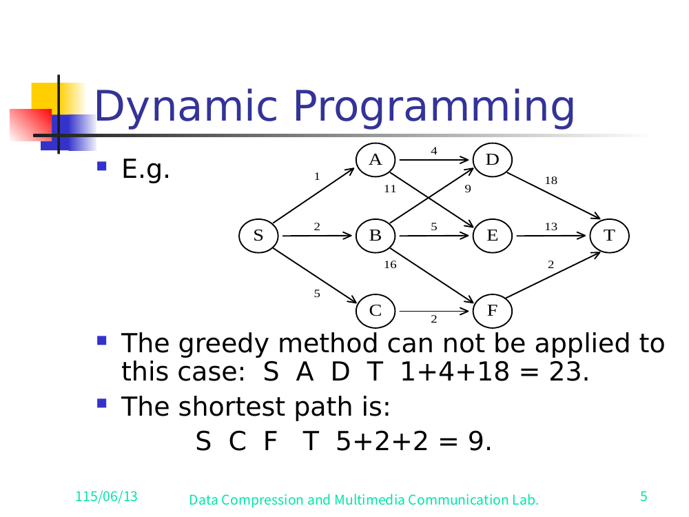
<figcaption>Slide 5 — the full multistage graph. Greedy <code>S A D T = 1+4+18 = 23</code>; true shortest path <code>S C F T = 5+2+2 = 9</code>.</figcaption>

> ✅ Verified against slide 5 (the full multistage-graph figure). Every edge weight below was read directly off the rendered slide and matches exactly. The companion abstract figures on slide 6 (`S→{A,B,C}→T`) and slide 7 (`A→{D,E}→T`) confirm `S→A=1, S→B=2, S→C=5` and `A→D=4, A→E=11`.

| Edge | Cost | Edge | Cost |
|------|-----:|------|-----:|
| S → A | 1 | A → D | 4 |
| S → B | 2 | A → E | 11 |
| S → C | 5 | B → D | 9 |
| D → T | 18 | B → E | 5 |
| E → T | 13 | B → F | 16 |
| F → T | 2 | C → F | 2 |

Stages: `V₁={S}`, `V₂={A,B,C}`, `V₃={D,E,F}`, `V₄={T}`.

> ✅ Verified against slide 5: `T` is the final singleton stage. The penultimate-stage vertices `D, E, F` connect directly to `T` with the weights `D→T=18`, `E→T=13`, `F→T=2`, as drawn on the slide and confirmed by the worked lines `d(D,T)=18`, `d(E,T)=13`, `d(F,T)=2`.

---

## 3. Backward Reasoning

Define `d(X, T)` = cost of the shortest path **from vertex X to the sink T**. Work **from the sink backward** toward the source. (Base cases at the stage just before `T`: `d(D,T)=18`, `d(E,T)=13`, `d(F,T)=2`.)

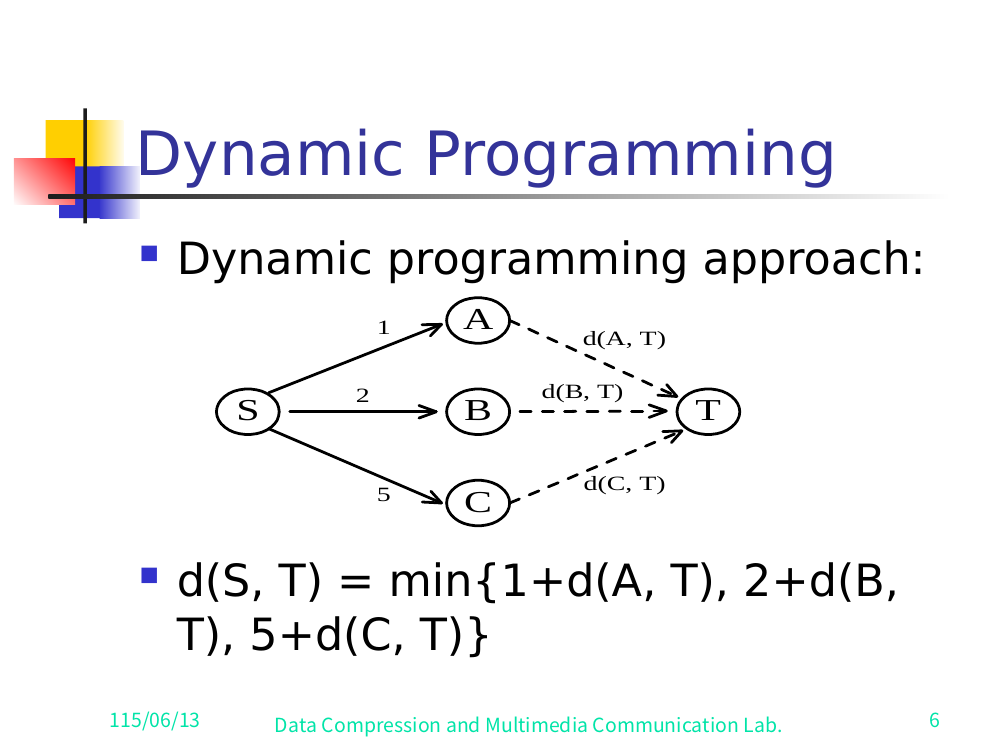
<figcaption>Slide 6 — backward reasoning across the first stage: d(S,T) = min{1+d(A,T), 2+d(B,T), 5+d(C,T)}.</figcaption>

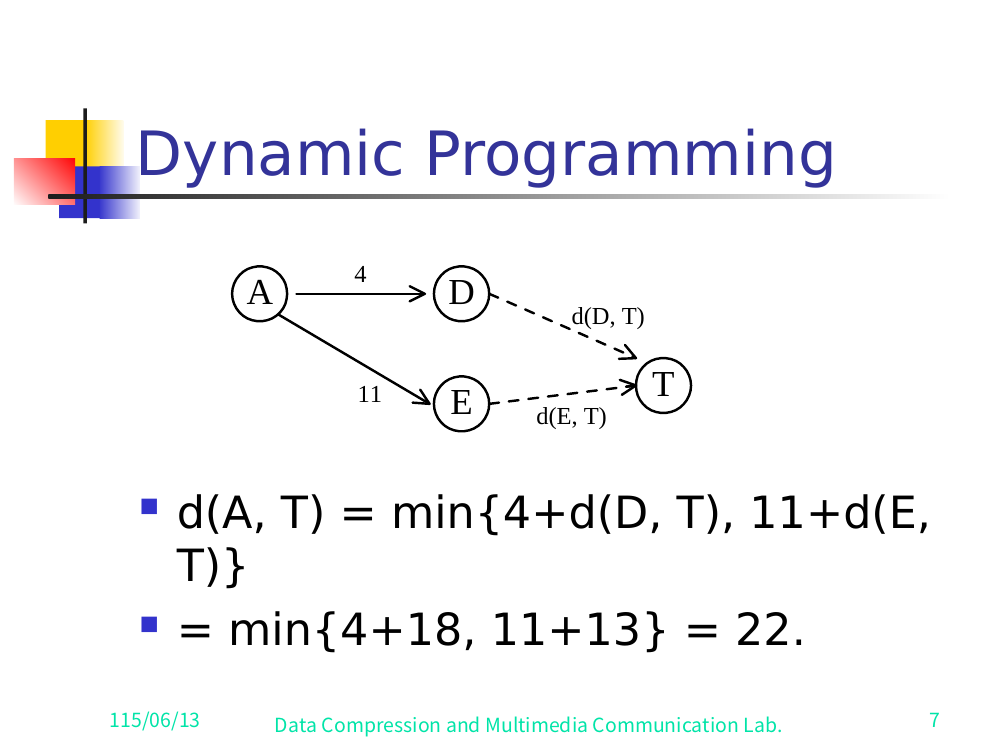
<figcaption>Slide 7 — one subproblem expanded: d(A,T) = min{4+d(D,T), 11+d(E,T)} = min{4+18, 11+13} = 22.</figcaption>

```
d(C, T) = min{ 2 + d(F, T) }
        = 2 + 2
        = 4

d(A, T) = min{ 4 + d(D, T), 11 + d(E, T) }
        = min{ 4 + 18, 11 + 13 }
        = min{ 22, 24 }
        = 22

d(B, T) = min{ 9 + d(D, T), 5 + d(E, T), 16 + d(F, T) }
        = min{ 9 + 18, 5 + 13, 16 + 2 }
        = min{ 27, 18, 18 }
        = 18

d(S, T) = min{ 1 + d(A, T), 2 + d(B, T), 5 + d(C, T) }
        = min{ 1 + 22, 2 + 18, 5 + 4 }
        = min{ 23, 20, 9 }
        = 9
```

**Answer:** `d(S, T) = 9`, achieved via `S → C → F → T`.

This style — express each vertex's optimal cost in terms of vertices **closer to the sink**, then resolve from the sink backward — is called **backward reasoning**.

---

## 4. Forward Reasoning

Define `d(S, X)` = cost of the shortest path **from the source S to vertex X**. Work **from the source forward** toward the sink.

Base (stage-2 vertices, directly reachable from S):

```
d(S, A) = 1
d(S, B) = 2
d(S, C) = 5
```

Stage-3 vertices:

```
d(S, D) = min{ d(S, A) + d(A, D), d(S, B) + d(B, D) }
        = min{ 1 + 4, 2 + 9 }
        = min{ 5, 11 }
        = 5

d(S, E) = min{ d(S, A) + d(A, E), d(S, B) + d(B, E) }
        = min{ 1 + 11, 2 + 5 }
        = min{ 12, 7 }
        = 7

d(S, F) = min{ d(S, A) + d(A, F), d(S, B) + d(B, F) }
        = min{ 2 + 16, 5 + 2 }
        = min{ 18, 7 }
        = 7
```

> ✅ Verified against slide 9 — with a caveat about the slide itself. The slide literally prints `d(S,F)=min{d(S,A)+d(A,F), d(S,B)+d(B,F)} = min{2+16, 5+2} = 7`. But the **graph (slide 5) has no edges `A→F` or `B→F`'s-pair that produce these constants under those labels**: F's only incoming edges are `B→F=16` and `C→F=2`. So the slide's *labels* are wrong; the *numbers* are right. The correct reading consistent with the graph is `d(S,F)=min{d(S,B)+d(B,F), d(S,C)+d(C,F)} = min{2+16, 5+2} = 7`. Result `d(S,F)=7` is firm; the slide's term-labels (`A`,`B`) are a typo for (`B`,`C`).

Final stage:

```
d(S, T) = min{ d(S, D) + d(D, T), d(S, E) + d(E, T), d(S, F) + d(F, T) }
        = min{ 5 + 18, 7 + 13, 7 + 2 }
        = min{ 23, 20, 9 }
        = 9
```

**Answer:** `d(S, T) = 9` — the same optimum, reached by reasoning **forward**.

Here each vertex's optimal cost is expressed in terms of vertices **closer to the source**, then resolved from the source forward — **forward reasoning**.

---

## 5. Principle of Optimality

**Statement.** Suppose that, in solving a problem, we must make a sequence of decisions `D₁, D₂, …, Dₙ`. If this sequence is **optimal**, then the **last k decisions** (for any `1 ≤ k ≤ n`) must themselves be optimal.

**Shortest-path corollary.**
If `i, i₁, i₂, …, j` is a shortest path from `i` to `j`, then the suffix `i₁, i₂, …, j` must be a shortest path from `i₁` to `j`.

> Intuition: if the suffix were not optimal, we could replace it with a cheaper suffix and obtain a cheaper overall path — contradicting optimality of the whole.

**Consequence:** if a problem can be described by a multistage graph, then it can be solved by dynamic programming.

---

## 6. 0/1 Knapsack via Dynamic Programming

### Problem formulation

Represent the problem as `KNAP(k, j, Y)`:

```
maximize     Σ_{i=k}^{j} pᵢ·xᵢ
subject to   Σ_{i=k}^{j} wᵢ·xᵢ ≤ Y
             xᵢ = 0 or 1,    k ≤ i ≤ j
```

The full 0/1 knapsack problem is then `KNAP(1, n, M)` — all `n` objects, capacity `M`.

### Optimality argument (split on the first decision)

Let `y₁, y₂, …, yₙ` be an **optimal** sequence of 0/1 values for `x₁, x₂, …, xₙ`.

- **If `y₁ = 0`:** then `y₂, y₃, …, yₙ` must be an optimal sequence for `KNAP(2, n, M)`.
  *(If it weren't, we could improve it and thereby improve the whole — contradiction.)*
- **If `y₁ = 1`:** then `y₂, y₃, …, yₙ` must be an optimal sequence for `KNAP(2, n, M − w₁)` (capacity reduced by the weight of object 1), by the principle of optimality.

### The recurrence

Let `gⱼ(y)` = the value of an optimal solution to `KNAP(j+1, n, y)`.

Then `g₀(M)` is the value of an optimal solution to the whole problem `KNAP(1, n, M)`.

Since `x₁` can be 0 or 1, the principle of optimality gives:

```
g₀(M) = max{ g₁(M),  g₁(M − w₁) + p₁ }
```

and in general:

```
gᵢ(y) = max{ g_{i+1}(y),  g_{i+1}(y − w_{i+1}) + p_{i+1} }
```

- First term: skip object `i+1` (`x_{i+1}=0`).
- Second term: take object `i+1` (`x_{i+1}=1`), gaining profit `p_{i+1}` and using capacity `w_{i+1}`.

### Base case and solving direction

```
gₙ(y) = 0   for all y
```

Solve **backward through the index** using the recurrence:

1. From `gₙ(y)` obtain `g_{n−1}(y)` (apply the recurrence with `i = n−1`).
2. From `g_{n−1}(y)` obtain `g_{n−2}(y)`.
3. Repeat, eventually determining `g₁(y)` and finally `g₀(M)` — the answer.

---

## 7. Forward Approach vs. Backward Approach

Let `x₁, x₂, …, xₙ` be the decision variables.

| Approach | Decision `xᵢ` is formulated in terms of… | Knapsack recurrence | Boundary |
|----------|------------------------------------------|---------------------|----------|
| **Forward** | optimal decision sequences for `x_{i+1}, …, xₙ` | `gᵢ(y) = max{ g_{i+1}(y), g_{i+1}(y − w_{i+1}) + p_{i+1} }` | `g₀(M) = max{ g₁(M), g₁(M − w₁) + p₁ }` |
| **Backward** | optimal decision sequences for `x₁, …, x_{i−1}` | `gᵢ(y) = max{ g_{i−1}(y), g_{i−1}(y − wᵢ) + pᵢ }` | `gₙ(M) = max{ g_{n−1}(M), g_{n−1}(M − wₙ) + pₙ }` |

In the backward approach, `gᵢ(y)` is the optimal value of `KNAP(1, i, y)`.

**Crucial subtlety about solving direction:**

- If the recurrence is **formulated using the forward approach**, the relations are **solved backwards** — i.e. beginning with the **last** decision.
- If the recurrence is **formulated using the backward approach**, the relations are **solved forwards**.

(Formulation direction and solution direction are opposite to one another.)

---

## 8. Summary — How to Solve a Problem by Dynamic Programming

To solve a problem by DP, do **either**:

1. **Find the recurrence relations**, or
2. **Represent the problem by a multistage graph**.

In the textbook, these two are shown to be **equivalent**.

---

# Further DP Applications (also in this deck)

The remaining slides apply the same machinery to several classic problems.

## 9. The Resource Allocation Problem

- `m` resources, `n` projects.
- `p(i, j)` = profit when `j` resources are allocated to project `i`.
- **Goal:** maximize total profit.

**Profit table (deck example, slide 19).** Rows = project `i`, columns = number of resources `j`:

| Project \ Resources | 1 | 2 | 3 |
|---------------------|--:|--:|--:|
| 1 | 2 | 8 | 9 |
| 2 | 5 | 6 | 7 |
| 3 | 4 | 4 | 4 |
| 4 | 2 | 4 | 5 |

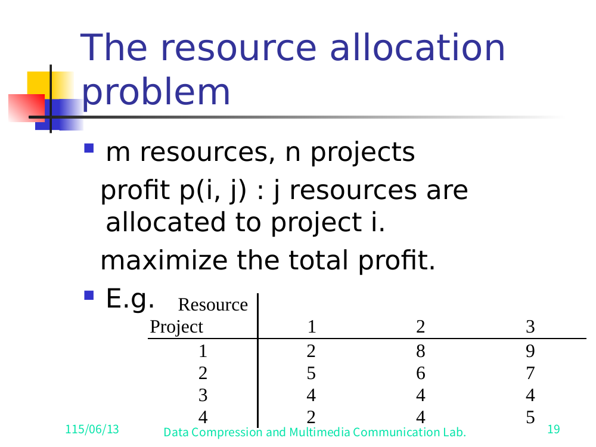
<figcaption>Slide 19 — the resource-allocation profit table p(i, j).</figcaption>

**Multistage-graph model.** A node `(i, j)` means *`i` resources allocated to projects `1, 2, …, j`* (i.e. the first `j` projects collectively use `i` resources).

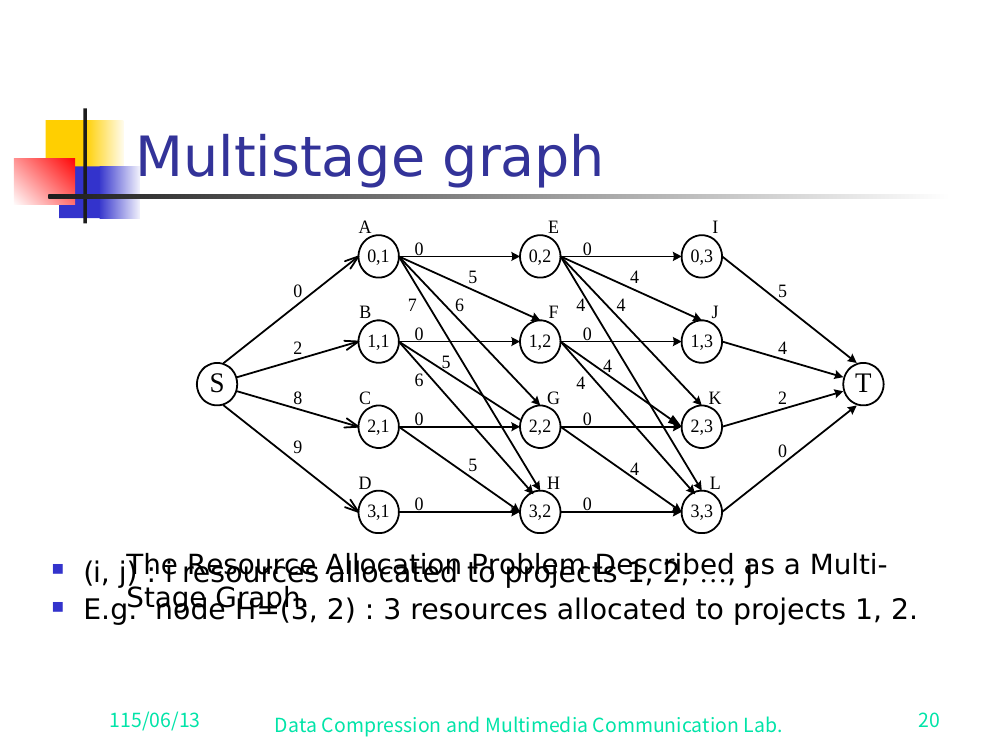
<figcaption>Slide 20 — the resource-allocation problem described as a multistage graph.</figcaption>
Example: node `H = (3, 2)` ⇒ 3 resources allocated across projects 1 and 2.

The problem becomes **find the longest (max-profit) path from S to T**.

Worked example from the deck:

```
S → C → H → L → T,   8 + 5 = 13
```

with the interpretation:
- 2 resources allocated to project 1,
- 1 resource allocated to project 2,
- 0 resources to projects 3 and 4.

> ✅ Verified against slides 19–21. Slide 20 shows the full figure "The Resource Allocation Problem Described as a Multi-Stage Graph"; slide 21 states the winning path and allocation verbatim. Node naming on slide 20 (each labeled `(i,j)` = `i` resources allocated to the first `j` projects):
> - Stage 1: `S`. Stage 2: `A=(0,1)`, `B=(1,1)`, `C=(2,1)`, `D=(3,1)`. Stage 3: `E=(0,2)`, `F=(1,2)`, `G=(2,2)`, `H=(3,2)`. Stage 4: `I=(0,3)`, `J=(1,3)`, `K=(2,3)`, `L=(3,3)`. Stage 5: `T`.
> - Edge weights are the profit increments from the table above. The S-edges read `S→A=0, S→B=2, S→C=8, S→D=9` (project-1 profits for 0/1/2/3 resources). The winning path is shown bold on slide 21: `S —8→ C —5→ H —0→ L —0→ T`, total `8+5=13`.
>
> Note: slide 20 is a dense diagram; many interior edge labels overlap and only the S-stage edges and the winning-path edges are read with full confidence. The path, totals, and allocation are confirmed exactly.

---

## 10. The Traveling Salesperson Problem (TSP)

Given a **directed** graph with a **cost matrix**, find the shortest tour that starts at vertex 1, visits every vertex exactly once, and returns to 1.

**Small example (slide 22).** Directed graph on 4 vertices with cost matrix (rows = from, cols = to; `∞` = no edge):

|       | 1 | 2 | 3 | 4 |
|-------|--:|--:|--:|--:|
| **1** | ∞ | 2 | 10| 5 |
| **2** | 2 | ∞ | 9 | ∞ |
| **3** | 4 | 3 | ∞ | 4 |
| **4** | 6 | 8 | 7 | ∞ |

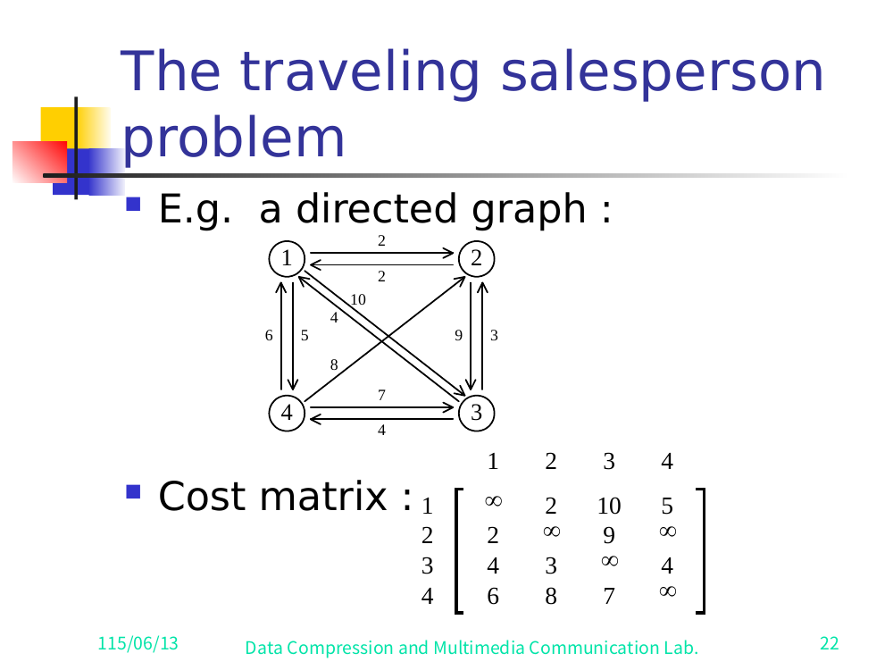
<figcaption>Slide 22 — the TSP directed graph and cost matrix.</figcaption>

```
Shortest tour: 1, 4, 3, 2, 1   →   5 + 7 + 3 + 2 = 17
```

**Tour multistage graph (slide 23, "Fig. A Multi-Stage Graph Describing All Possible Tours of a Directed Graph").**

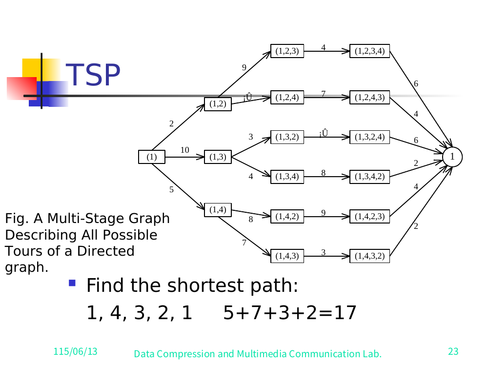
<figcaption>Slide 23 — a multistage graph describing all possible tours; optimum 1, 4, 3, 2, 1 = 17.</figcaption> Root `(1)` branches by first vertex chosen, edge costs `c(1,k)`: `(1,2)` cost 2, `(1,3)` cost 10, `(1,4)` cost 5. Each then expands to the third vertex, then the fourth, then returns to `1`. The bottom branch realizes the optimum: `(1) →5 (1,4) →7 (1,4,3) →3 (1,4,3,2) →2 1`, total 17.

**Multistage-graph view.** All possible tours form a multistage graph (one stage per "next vertex chosen"). Partial tours that end at the same vertex with the same remaining set can be **merged**:

> Suppose 6 vertices. We can combine the partial tours `{1, 2, 3, 4}` and `{1, 3, 2, 4}` into one node, because: the last vertex visited is the same (here vertex 3 in the deck's phrasing), and the remaining vertices to visit are the same (`4, 5, 6`). Their futures are identical, so they share a subproblem.

**DP recurrence (Held–Karp).** Let `g(i, S)` = the length of a shortest path that **starts at vertex `i`, goes through all vertices in `S`, and terminates at vertex 1**.

- **Length of an optimal tour (slide 25):**
  ```
  g(1, V − {1}) = min_{2 ≤ k ≤ n} { c_{1k} + g(k, V − {1, k}) }
  ```
- **General form (slide 25):**
  ```
  g(i, S) = min_{j ∈ S} { c_{ij} + g(j, S − {j}) }
  ```
- **Base:** `g(i, ∅) = c_{i1}`.

> ✅ Verified against slide 25. The slide prints both recurrences (with the `min_{2≤k≤n}` and `min_{j∈S}` ranges) exactly as above; the `g(i,S)` definition is stated verbatim on slide 25.

**Time complexity (slide 25, verbatim).**

```
n + Σ_{k=2}^{n-1} (n−1)·C(n−2, n−k)·(n−k)  =  O(n² · 2ⁿ)
```

> ✅ Verified against slide 25: the slide shows the explicit sum `n + Σ_{k=2} (n−1)(ⁿ⁻²_{n−k})(n−k) = O(n² 2ⁿ)`, the standard Held–Karp bound — exponential but far better than `(n−1)!` brute force.

---

## 11. Longest Common Subsequence (LCS)

**Subsequence.** A subsequence of a string `A` is obtained by deleting 0 or more symbols from `A` (not necessarily consecutive).
For `A = b a c a d`: examples include `ad, ac, bac, acad, bacad, bcd`.

**Common subsequence.** Of `A = b a c a d` and `B = a c c b a d c b`: e.g. `ad, ac, bac, acad`.

**Longest common subsequence of A and B:** `a c a d`.

### Recurrence

Let `A = a₁ a₂ … a_m` and `B = b₁ b₂ … b_n`.
Let `L_{i,j}` = length of the LCS of the prefixes `a₁…aᵢ` and `b₁…bⱼ`.

```
            ┌ L_{i-1, j-1} + 1                  if aᵢ = bⱼ
L_{i,j} =   │
            └ max{ L_{i-1, j}, L_{i, j-1} }     if aᵢ ≠ bⱼ
```

**Boundary:** `L_{0,0} = L_{0,j} = L_{i,0} = 0` for `1 ≤ i ≤ m`, `1 ≤ j ≤ n`.

(Reference: Fig. 8-17, "The Dynamic Programming Approach to Solve the Longest Common Subsequence Problem.")

**Recovering the subsequence.** After all `L_{i,j}` are filled in (for `A = b a c a d`, `B = a c c b a d c b`), **trace back** through the table to recover the actual LCS (`a c a d`).

**The L table (slide 29, verified).** Rows = `A = b a c a d` (plus a 0-row), columns = `B = a c c b a d c b` (plus a 0-column):

| A \ B |   | a | c | c | b | a | d | c | b |
|-------|--:|--:|--:|--:|--:|--:|--:|--:|--:|
|       | 0 | 0 | 0 | 0 | 0 | 0 | 0 | 0 | 0 |
| **b** | 0 | 0 | 0 | 0 | 1 | 1 | 1 | 1 | 1 |
| **a** | 0 | 1 | 1 | 1 | 1 | 2 | 2 | 2 | 2 |
| **c** | 0 | 1 | 2 | 2 | 2 | 2 | 2 | 3 | 3 |
| **a** | 0 | 1 | 2 | 2 | 2 | 3 | 3 | 3 | 3 |
| **d** | 0 | 1 | 2 | 2 | 2 | 3 | 4 | 4 | 4 |

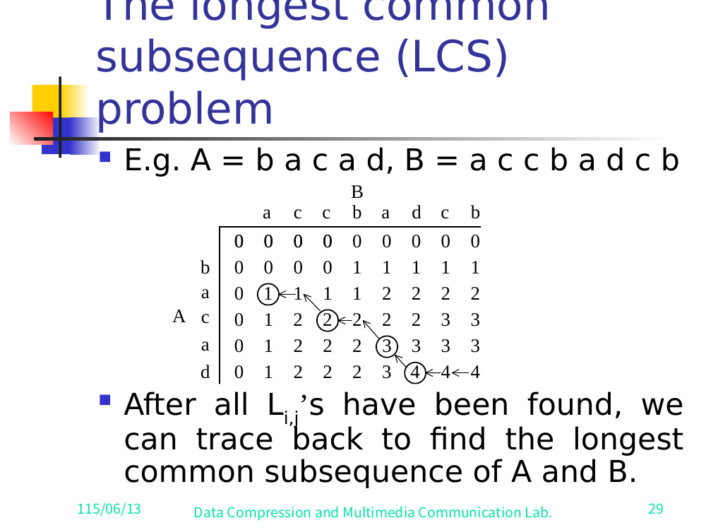
<figcaption>Slide 29 — the LCS L-table with the circled trace-back 1 → 2 → 3 → 4 giving <code>a c a d</code>.</figcaption>

The slide circles the trace-back cells `1 → 2 → 3 → 4` (the `a`, `c`, `a`, `d` matches), giving LCS = `a c a d` (length 4 = bottom-right cell).

---

## 12. 0/1 Knapsack as a Multistage Graph

The same 0/1 knapsack problem of §6 can be drawn as a multistage graph.

```
n objects, weights  W₁, W₂, …, Wₙ
           profits   P₁, P₂, …, Pₙ
           capacity  M

maximize    Σ Pᵢ·xᵢ
subject to  Σ Wᵢ·xᵢ ≤ M
            xᵢ = 0 or 1,   1 ≤ i ≤ n
```

**Deck example data (slide 30).** `M = 10`, three objects:

| i | Wᵢ | Pᵢ |
|---|---:|---:|
| 1 | 10 | 40 |
| 2 |  3 | 20 |
| 3 |  5 | 30 |

**The staged graph (slide 31).** Nodes are labeled by the partial decision vector. `S` branches on `x₁`: `S →(x₁=1, weight 40) "1"` and `S →(x₁=0, weight 0) "0"`. Each node then branches on `x₂` (edge weight `P₂=20` if `x₂=1`, else 0), then on `x₃` (edge weight `P₃=30` if `x₃=1`, else 0), then a weight-0 edge to `T`. (Infeasible high-capacity branches are pruned — e.g. taking object 1 at weight 10 leaves no room.)

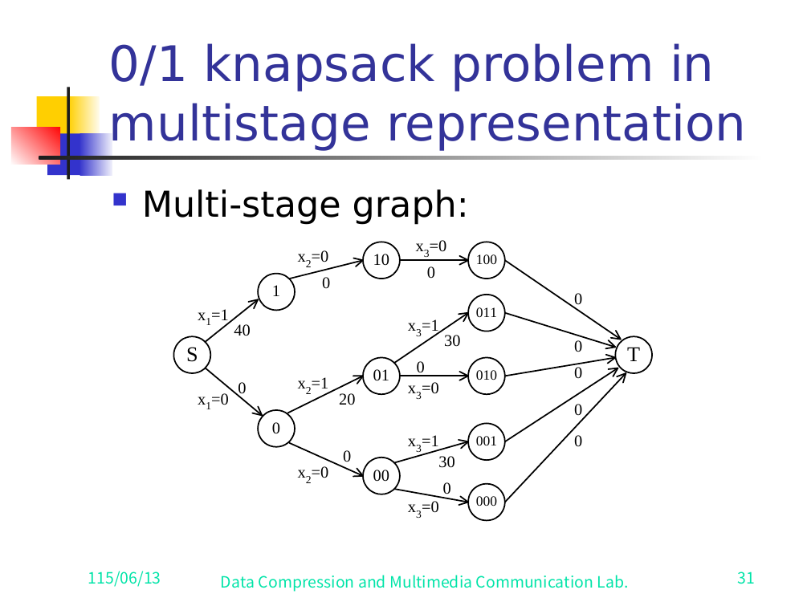
<figcaption>Slide 31 — the 0/1 knapsack problem in multistage representation. Longest path = max profit; optimum x₁=0, x₂=1, x₃=1 → 20+30 = 50.</figcaption>

The **longest path** (max profit) from S to T in this multistage graph is the optimal solution. Deck answer (slides 31–32):

```
x₁ = 0, x₂ = 1, x₃ = 1   →   20 + 30 = 50
```

### Recurrence (prefix form)

Let `fᵢ(Q)` = the value of an optimal solution using objects `1, 2, …, i` with capacity `Q`.

```
fᵢ(Q) = max{ f_{i-1}(Q),  f_{i-1}(Q − Wᵢ) + Pᵢ }
```

The optimal answer is `fₙ(M)`.
*(This is the backward-approach formulation of the same knapsack recurrence from §6/§7.)*

---

## 13. Optimal Binary Search Trees (OBST)

### Setup

- `n` identifiers in sorted order: `a₁ < a₂ < a₃ < … < aₙ`.
- `Pᵢ`, `1 ≤ i ≤ n`: probability that `aᵢ` is searched (**successful** search → internal node).
- `Qᵢ`, `0 ≤ i ≤ n`: probability that a search key `x` falls strictly between neighbors, `aᵢ < x < a_{i+1}` (**unsuccessful** search → external node), with sentinels `a₀ = −∞`, `a_{n+1} = +∞`.

Examples of identifier sets used in the deck: `{3, 7, 9, 12}` (slide 33, four candidate BSTs) and `{4, 5, 8, 10, 11, 12, 14}` (slide 35, the worked tree with external nodes). ✅ Verified against slides 33–35.

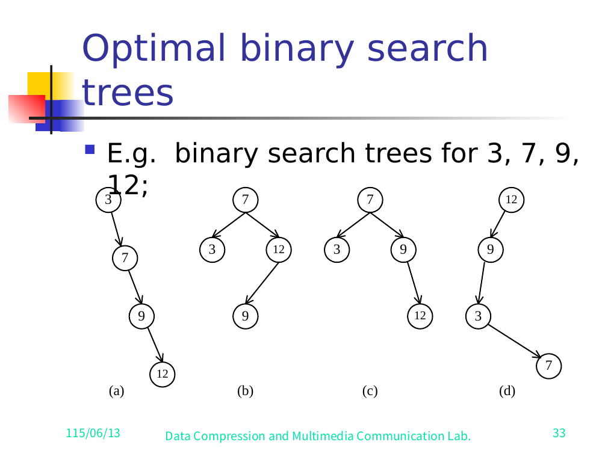
<figcaption>Slide 33 — four candidate BSTs for {3, 7, 9, 12}.</figcaption>

### Expected cost of a binary search tree

With the root at level 1, the expected cost is:

```
Cost =  Σᵢ Pᵢ · level(aᵢ)  +  Σᵢ Qᵢ · ( level(Eᵢ) − 1 )
```

where `Eᵢ` are the external (failure) nodes. (See Fig. "A Binary Tree with Added External Nodes" — slide 35, drawn for identifiers `4,5,8,10,11,12,14`.)

> ✅ Verified against slide 35. The slide prints `Σ_{i=1}^{n} Pᵢ·level(aᵢ) + Σ_{i=0}^{n} Qᵢ·(level(Eᵢ)−1)`, with "The level of the root : 1". The lower index on the `P` sum is `i=1`, on the `Q` sum is `i=0` (external nodes `E₀ … Eₙ`). Slide 34 also confirms the probability normalization `Σ_{i=1}^{n} Pᵢ + Σ_{i=0}^{n} Qᵢ = 1`.

**The example tree (slide 35).** For identifiers `4,5,8,10,11,12,14`, the drawn BST has root `10`; left child `5` (with children `4` and `8`), right child `14` (left child `11`, which has right child `12`; `14`'s right is external `E₇`). External (failure) nodes `E₀…E₆` hang off the leaves, `E₅,E₆` off node `12`. Slide 33 also shows four candidate BSTs (a)–(d) for the smaller set `3,7,9,12`.

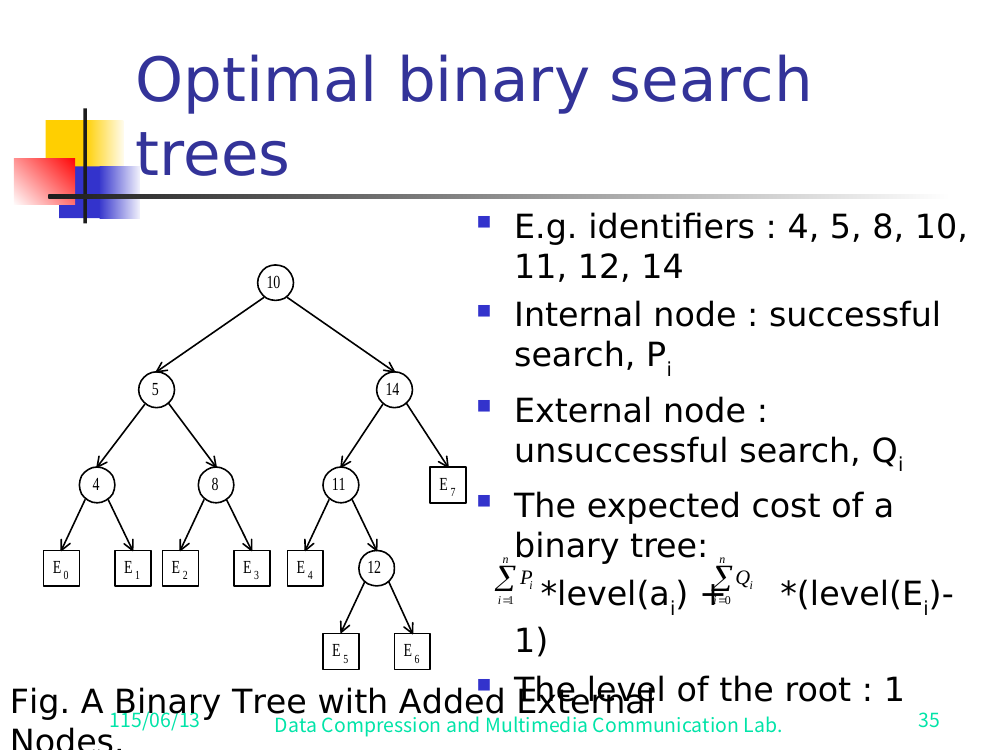
<figcaption>Slide 35 — a binary search tree with added external nodes; expected cost Σ Pᵢ·level(aᵢ) + Σ Qᵢ·(level(Eᵢ)−1), root at level 1.</figcaption>

### Recurrence

Let `C(i, j)` = cost of an **optimal** BST containing `aᵢ, …, aⱼ`.

For the full tree, choosing root `a_k`:

```
C(1, n) = min_k { Pk + [ Q₀ + (cost of left subtree weights) + C(1, k−1) ]
                       + [ Qk + (cost of right subtree weights) + C(k+1, n) ] }
```

**General formula** (subtree on `aᵢ … aⱼ`, trying each `a_k` as root):

```
C(i, j) = min_{i ≤ k ≤ j} { Pk
                          + [ Q_{i-1} + … + C(i, k−1) ]
                          + [ Qk      + … + C(k+1, j) ] }

        = min_{i ≤ k ≤ j} { C(i, k−1) + C(k+1, j) + W(i, j) }
```

where `W(i, j) = Q_{i-1} + Σ_{l=i}^{j}(P_l + Q_l)` is the total weight of the subtree (the `Q_{i-1} + …` term). The `+ W(i,j)` accounts for every node in the subtree dropping one level deeper when the subtree gains a root.

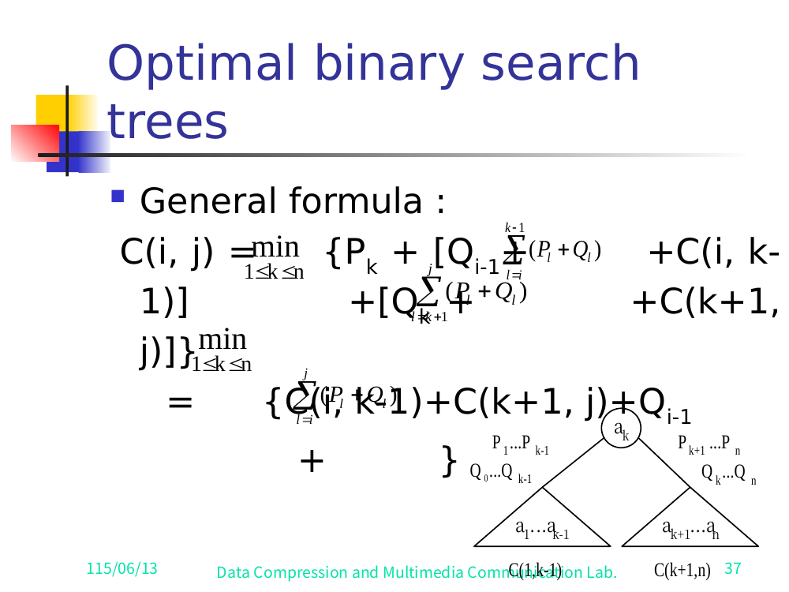
<figcaption>Slide 37 — the general C(i, j) recurrence and the split-at-root subtree triangle.</figcaption>

> ✅ Verified against slides 36–37. Slide 36 prints the root-`aₖ` form
> `C(1,n) = min_{1≤k≤n} { Pₖ + [Q₀ + Σ_{i=1}^{k-1}(Pᵢ+Qᵢ) + C(1,k−1)] + [Qₖ + Σ_{i=k+1}^{?}(Pᵢ+Qᵢ) + C(k+1,n)] }`.
> Slide 37 prints the general form `C(i,j) = min_{1≤k≤n} { Pₖ + [Q_{i-1} + Σ_{l=i}^{k-1}(P_l+Q_l) + C(i,k−1)] + [Qₖ + Σ_{l=k+1}^{j}(P_l+Q_l) + C(k+1,j)] }` and collapses it to `= min { C(i,k−1) + C(k+1,j) + Σ_{l=i}^{j}(P_l+Q_l) + Q_{i-1} }` — i.e. `C(i,k−1)+C(k+1,j)+W(i,j)`. Both slides include the triangle diagram (root `aₖ`, left subtree `C(1,k−1)`/`a₁…a_{k-1}` with weights `P₁…P_{k-1}, Q₀…Q_{k-1}`, right subtree `C(k+1,n)`/`a_{k+1}…aₙ` with `P_{k+1}…Pₙ, Qₖ…Qₙ`).
>
> Note: slides 36–37 are heavily overlapped (formula and diagram collide), so the exact upper limit of the second inner sum on slide 36 is obscured; the slide-37 general form makes it unambiguous (it is `j`, here `n`). No numeric `n=4` *value* table appears — slide 38's "E.g. n=4" is a **dependency diagram**, not a cost table (see below).

### Time complexity

```
O(n³)
```

Reasoning (slide 38, verbatim):
- When `j − i = m`, there are `(n − m)` values `C(i, j)` to compute.
- Each `C(i, j)` with `j − i = m` is computed in `O(m)` time (trying `m+1` candidate roots).
- Summing over all `m`: `O( Σ_{1≤m<n} m·(n − m) ) = O(n³)`.

(See Fig. "Computation Relationships of Subtrees", slide 38.) ✅ Verified against slide 38: it shows the `n=4` dependency DAG — `C(1,2),C(2,3),C(3,4)` feed `C(1,3),C(2,4)`, which feed `C(1,4)` — and the closed sum `O(Σ_{1≤m<n} m(n−m)) = O(n³)`.

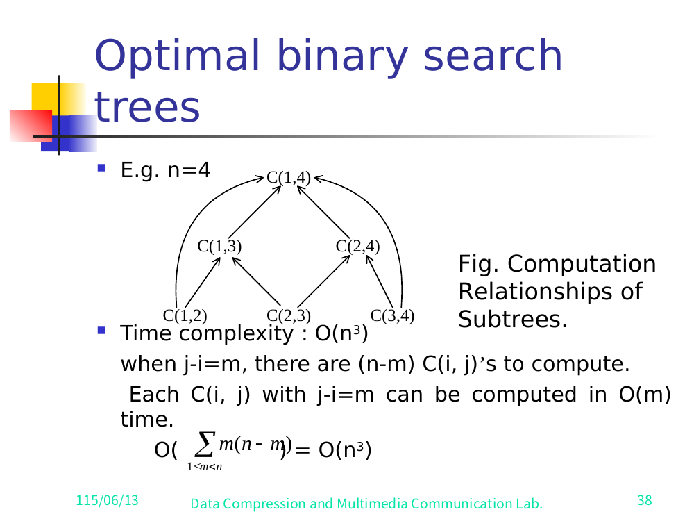
<figcaption>Slide 38 — computation relationships of subtrees (n=4); O(n³) overall.</figcaption>

---

## ✅ Verification log (resolved against full slide renders)

All items previously flagged as reconstructed have now been checked against the per-slide PNG renders in `/home/brant/finals_study/algo/render/A07full/` (38 slides, vision pass 2026-06-13):

1. **Multistage-graph edge weights (§2).** ✅ **Verified against slide 5.** The full figure was read directly; every edge matches the prior reconstruction (see verdict in Appendix A).
2. **`d(S,F)` predecessors (§4).** ✅ **Resolved (slide 9).** Result `d(S,F)=7` confirmed. The slide's term-labels read `d(S,A)+d(A,F), d(S,B)+d(B,F)` but the graph has no such edges; the correct labels are `d(S,B)+d(B,F)=2+16` and `d(S,C)+d(C,F)=5+2`. The slide itself has a label typo; numbers are right.
3. **Resource-allocation figure (§9).** ✅ **Verified (slides 19–21).** Profit table, node labeling, S-stage edges, and winning path `S→C→H→L→T = 8+5 = 13` all confirmed.
4. **TSP recurrences and complexity (§10).** ✅ **Verified (slides 22–25).** Cost matrix, tour multistage graph, both Held–Karp recurrences, base case, and the explicit complexity sum `= O(n²·2ⁿ)` all read off the slides.
5. **OBST expected-cost summations (§13).** ✅ **Verified (slides 34–35).** `Σ_{i=1}^{n} Pᵢ·level(aᵢ) + Σ_{i=0}^{n} Qᵢ·(level(Eᵢ)−1)`.
6. **OBST recurrence weight terms (§13).** ✅ **Verified (slides 36–37).** Both forms and the `+W(i,j)` collapse confirmed. The "n=4" item (slide 38) is a dependency DAG, not a numeric cost table.
7. **LCS / knapsack-multistage tables (§11, §12).** ✅ **Verified.** Full LCS `L` table (slide 29), knapsack `W/P` table + staged graph (slides 30–31), answer `50` (slide 32).

---

## Appendix A — Figures (transcribed from full slide renders)

**Source directory:** `/home/brant/finals_study/algo/render/A07full/` (per-slide PNG renders, 38 slides)
**Extraction date:** 2026-06-13 (vision pass over clean full-slide renders)

The earlier carve (`render/A07/`) recovered only two decorative clip-art images (a cartoon angel, a red rose bud — both appear as slide decoration on slides 1 and 14) and **no diagrams**, because the DP figures were authored as native PowerPoint vector shapes. The full per-slide renders below now make every figure legible. Text-only slides are omitted.

### Slide 3 — Multistage greedy motivating graph (linear)
Linear 4-node chain `S → A → B → T` with parallel edges. Weights: `S→A`: top arc 3, bottom arc 5, straight 1. `A→B`: top arc 2, straight 4, bottom arc 6. `B→T`: top arc 7, straight 5. Greedy "shortest" sum shown: `1 + 2 + 5 = 8`.

### Slide 5 — THE running multistage graph (full, with numeric weights)
Stages: `S` | `A,B,C` | `D,E,F` | `T`. Edge list read directly:

| Edge | w | Edge | w | Edge | w |
|------|--:|------|--:|------|--:|
| S→A | 1 | A→D | 4  | D→T | 18 |
| S→B | 2 | A→E | 11 | E→T | 13 |
| S→C | 5 | B→D | 9  | F→T | 2  |
|     |   | B→E | 5  |     |    |
|     |   | B→F | 16 |     |    |
|     |   | C→F | 2  |     |    |

Captions: "greedy … S A D T 1+4+18 = 23"; "shortest path … S C F T 5+2+2 = 9."

### Slide 6 — Abstract backward figure `S→{A,B,C}→T`
`S→A=1, S→B=2, S→C=5`, dashed `d(A,T), d(B,T), d(C,T)` into `T`. Eqn `d(S,T)=min{1+d(A,T), 2+d(B,T), 5+d(C,T)}`.

### Slide 7 — Abstract figure `A→{D,E}→T`
`A→D=4, A→E=11`, dashed `d(D,T), d(E,T)`. `d(A,T)=min{4+18,11+13}=22`.

### Slide 19 — Resource allocation profit table
`m` resources, `n` projects, profit `p(i,j)`. Table (rows project 1–4, cols 1–3 resources): row1 `2,8,9`; row2 `5,6,7`; row3 `4,4,4`; row4 `2,4,5`.

### Slide 20 — Resource Allocation as a Multi-Stage Graph
5 stages. Stage 2 `A=(0,1),B=(1,1),C=(2,1),D=(3,1)`; stage 3 `E=(0,2),F=(1,2),G=(2,2),H=(3,2)`; stage 4 `I=(0,3),J=(1,3),K=(2,3),L=(3,3)`; `S`,`T` singletons. S-edges: `S→A=0, S→B=2, S→C=8, S→D=9`. Dense interior labels (the profit increments) overlap; the S-edges and winning path are read with confidence.

### Slide 21 — Resource allocation answer
`S —8→ C —5→ H —0→ L —0→ T`, `8+5=13`. Allocation: 2 resources to project 1, 1 to project 2, 0 to projects 3 & 4.

### Slide 22 — TSP directed graph + cost matrix
4-vertex directed graph. Cost matrix (from→to), `∞` on diagonal:
`1: [∞,2,10,5]  2: [2,∞,9,∞]  3: [4,3,∞,4]  4: [6,8,7,∞]`.

### Slide 23 — TSP "all possible tours" multistage graph
Root `(1)` → `(1,2)`=2, `(1,3)`=10, `(1,4)`=5; expands to the 3rd then 4th vertex then back to `1`. Optimal branch `(1)→(1,4)→(1,4,3)→(1,4,3,2)→1` = `5+7+3+2=17`. Caption: "Fig. A Multi-Stage Graph Describing All Possible Tours of a Directed graph." Answer: `1,4,3,2,1 = 17`.

### Slide 24 — TSP node-merging illustration
`(1,3,2)→(1,3,2,4)` and `(1,2,3)→(1,2,3,4)` merge (last vertex 3, remaining {4,5,6} same) into one node; shown as `(2),(4,5,6)` & `(3),(4,5,6)` → `(4),(5,6)`.

### Slide 25 — TSP recurrences + complexity
`g(1,V−{1}) = min_{2≤k≤n}{c_{1k} + g(k,V−{1,k})}`; `g(i,S) = min_{j∈S}{c_{ij} + g(j,S−{j})}`; complexity `n + Σ_{k=2}^{n-1}(n−1)·C(n−2,n−k)·(n−k) = O(n²·2ⁿ)`.

### Slide 28 — LCS DP dependency diagram (Fig. 8-17)
Grid of `L_{i,j}` cells with arrows right, down, and diagonal-down (the three recurrence dependencies), flowing toward `L_{m,n}`.

### Slide 29 — LCS L table (A=bacad, B=accbadcb)
See the full table in §11. Trace-back circles `1→2→3→4` give LCS = `a c a d`.

### Slide 30 — 0/1 knapsack data
`M=10`; objects `(i, Wᵢ, Pᵢ)`: `(1,10,40), (2,3,20), (3,5,30)`.

### Slide 31 — 0/1 knapsack as a multistage graph
`S` branches `x₁=1`(w 40) / `x₁=0`(w 0); each branches `x₂` (w 20 if 1) then `x₃` (w 30 if 1) then weight-0 edges to `T`. Node labels are partial decision strings (`1`,`0`,`10`,`01`,`00`,`100`,`011`,`010`,`001`,`000`).

### Slide 33 — Four candidate BSTs for {3,7,9,12}
(a) right-going chain `3→7→9→12`; (b) root 7, children 3 & 12, 12's left child 9; (c) root 7, children 3 & 9, 9's right child 12; (d) left-going-ish `12→9→3→7`.

### Slide 35 — OBST example tree (Fig. A Binary Tree with Added External Nodes)
Identifiers `4,5,8,10,11,12,14`. Root `10`; left `5` (children `4`,`8`), right `14` (left `11` with right child `12`; right external `E₇`). External nodes `E₀…E₆` at the leaves (`E₅,E₆` under `12`). Cost formula `Σ_{i=1}^{n}Pᵢ·level(aᵢ) + Σ_{i=0}^{n}Qᵢ·(level(Eᵢ)−1)`, root at level 1.

### Slide 36 / 37 — OBST recurrence + subtree triangle diagram
Root-`aₖ` form (36) and general `C(i,j)` form (37); both with the split-at-root triangle: left `C(i,k−1)` over `a₁…a_{k-1}` (weights `P₁…P_{k-1},Q₀…Q_{k-1}`), right `C(k+1,n)` over `a_{k+1}…aₙ` (weights `P_{k+1}…Pₙ,Qₖ…Qₙ`). Collapses to `C(i,j)=min_k{C(i,k−1)+C(k+1,j)+W(i,j)}`.

### Slide 38 — OBST computation-relationships DAG (n=4)
`C(1,2),C(2,3),C(3,4)` → `C(1,3),C(2,4)` → `C(1,4)`. Complexity `O(Σ_{1≤m<n} m(n−m)) = O(n³)`.

### Multistage edge-weight verdict
The note's reconstructed set
`S→A=1, S→B=2, S→C=5, A→D=4, A→E=11, B→D=9, B→E=5, B→F=16, C→F=2, D→T=18, E→T=13, F→T=2`
**✅ MATCHES slide 5 exactly** — every edge weight confirmed by direct reading of the rendered figure. All dependent results hold: `d(C,T)=4`, `d(A,T)=22`, `d(B,T)=18`, `d(S,T)=9`, `d(S,D)=5`, `d(S,E)=7`, `d(S,F)=7`.
