# Chapter 8 — The Theory of NP-Completeness

> Course: R.C.T. Lee, Tseng, Chang, Tsai — *Introduction to the Design and Analysis of Algorithms*.
> Slide-deck companion (69 slides). This is the proof/QA-heavy final topic: **the reductions are the core exam material.**
>
> **Notation legend** (the slides render these as plain glyphs; restored here):
> `∨` = OR, `∧`/`&` = AND, `¬x` (written `-x` in the deck) = NOT x, `→` = implies, `⇔`/`iff` = if-and-only-if, `≤ ≥ ≠ ∈ ∉ ⊆ ∪ Σ` as usual, `□` = the empty clause, `xᵢ` subscripts, `(k+1)ⁱ` superscripts.
> Markers like *"Lab. N"* in the raw dump are slide numbers; cited below as **(slide N)**.

---

## Overview

The chapter builds the theory of **intractability**: a large family of problems (the NP-complete, NPC, problems) for which no polynomial-time algorithm is known, and for which a polynomial algorithm for *any one* of them would yield one for *all* of them (collapsing NP into P).

Core class definitions **(slide 2)**:

| Class | Definition |
|-------|------------|
| **P** | Problems solvable by a **deterministic** polynomial-time algorithm. |
| **NP** | **Decision** problems solvable by a **non-deterministic** polynomial-time algorithm (guess + polynomial-time check). |
| **NP-hard** | Problems to which **every** NP problem reduces. (Need not be in NP themselves.) |
| **NP-complete (NPC)** | Problems that are NP-hard **and** belong to NP. |

**Concept of reduction (slide 3).**
> **Def:** Problem A **reduces** to problem B (written **A → B**) iff A can be solved by a deterministic polynomial-time algorithm that uses, as a subroutine, a deterministic polynomial-time algorithm that solves B.

Intuition: "A → B" means **B is at least as hard as A** — if you can solve B fast, you can solve A fast.

**Key concepts (slides 4–5):**

- Up to now, **none** of the NPC problems can be solved by a deterministic polynomial-time algorithm in the worst case.
- There does not *seem* to exist any polynomial-time algorithm for the NPC problems.
- The lower bound of any NPC problem **seems** to be of the order of an **exponential** function.
- The theory of NP-completeness always considers the **worst case**.
- **Not all NP problems are difficult** — e.g. the **Minimum Spanning Tree (MST)** problem is an NP problem yet is solvable in polynomial time.
- If **A, B ∈ NPC**, then **A → B and B → A** (all NPC problems are inter-reducible; they are "equally hard").
- **The big theorem:** If **any** NPC problem can be solved in polynomial time, then **all** NP problems can be — i.e. **NP = P**.

---

## The Reduction Map

Every reduction shown in the deck. An edge `X → Y` means *"X reduces to Y"* and is used to prove **Y is NP-complete given X is."* Cook's theorem seeds the chain with SAT.

```
                          [ Cook's Theorem ]
                  every NP problem → SAT ; SAT is the first NPC problem
                                     |
        ┌─────────────────┬──────────┼───────────────┬───────────────────────┐
        │                 │          │               │                       │
        v                 v          v               v                       v
     3-SAT            CLIQUE      SATY (≤3 lits)   DIRECTED              NODE COVER
   (SAT→3-SAT)      (SAT→clique)   |               HAMILTONIAN          (SAT→node cover,
        │               │         v               CYCLE                 via the BEGIN/
        │               v       CHROMATIC          (SAT→dir.HC)          choice construction
        │          NODE COVER   NUMBER (CN)           │                  — also clique→NC)
        │          (clique→NC)     │                  v
        │                          v                TSP (decision)
        │                       EXACT COVER         (dir.HC → TSP)
        │                          │
        │                          v
        │                    SUM OF SUBSETS
        │                          │
        │                          v
        │                      PARTITION
        │                     /          \
        │                    v            v
        │              BIN PACKING    0/1 KNAPSACK (decision)
        │                    │         (partition → 0/1 knapsack)
        │                    v
        │              VLSI DISCRETE LAYOUT
        │              (bin packing → VLSI)
        │
   (3-SAT is itself NPC; SATY = "satisfiability with ≤ 3 literals/clause" feeds CN)
```

**Reductions covered (13 total):**

1. SAT → 3-SAT
2. SATY (≤3 literals/clause) → Chromatic Number (CN)
3. (Node cover → SAT) — the nondeterministic-construction direction, proving node cover ∈ NP / how to encode it as SAT
4. CN → Exact Cover
5. Exact Cover → Sum of Subsets
6. Sum of Subsets → Partition
7. Partition → Bin Packing
8. Bin Packing → VLSI Discrete Layout
9. SAT → Clique decision
10. Clique decision → Node cover decision
11. SAT → Directed Hamiltonian Cycle
12. Directed Hamiltonian Cycle → TSP decision
13. Partition → 0/1 Knapsack decision

*(Plus Cook's theorem: every NP problem → SAT.)*

---

## Decision vs. Optimization Problems (slides 6–7)

- A **decision problem** has a Yes/No answer.
- An **optimization problem** is harder (asks for the best value/solution).
- NP-completeness is defined on **decision** problems.

**Example — Traveling Salesperson Problem (TSP):**

| Version | Question |
|---------|----------|
| Optimization | Find the **shortest** tour. |
| Decision | Is there a tour whose total length **≤ C** for a constant C? |

**Solving the optimization problem via the decision algorithm (slide 7):**

Repeatedly call the decision algorithm with different bounds and **binary-search** on C:

```
Give c1 and test (Yes/No)
Give c2 and test
   ⋮
Give cn and test
```

Decide each cᵢ by **binary search** over the range `1 … K`, where K can be taken as the **sum of all edge weights** (or obtained from a heuristic / approximation algorithm — Chapter 9). Each test is one decision-algorithm call; binary search uses O(log K) calls, so an efficient decision algorithm yields an efficient optimization algorithm.

---

## The Satisfiability Problem (SAT) (slides 8–13)

**Building blocks (slide 10):**

- **Literal:** `xᵢ` or `¬xᵢ`.
- **Clause:** a disjunction (OR) of literals, e.g. `cᵢ = x₁ ∨ x₂ ∨ ¬x₃`.
- **Formula (CNF, conjunctive normal form):** a conjunction (AND) of clauses, `C₁ ∧ C₂ ∧ … ∧ Cₘ`.

> **Def (SAT):** Given a Boolean formula (in CNF), determine whether it is **satisfiable** — i.e. whether some truth assignment makes the whole formula true.

**Satisfiable example (slide 8):**

```
   x₁ ∨ x₂ ∨ x₃
 ∧ ¬x₁
 ∧ ¬x₂
```

The assignment `x₁ ← F, x₂ ← F, x₃ ← T` makes the formula **true**. (Notation: writing `(¬x₁, ¬x₂, x₃)` denotes exactly this assignment `x₁←F, x₂←F, x₃←T`.)

**Definition of satisfiable (slide 9):** If there is **at least one** assignment satisfying the formula, the formula is **satisfiable**; otherwise it is **unsatisfiable**.

**Unsatisfiable example (slide 9):**

```
   x₁ ∨ x₂
 ∧ x₁ ∨ ¬x₂
 ∧ ¬x₁ ∨ x₂
 ∧ ¬x₁ ∨ ¬x₂
```

All four combinations of `(x₁, x₂)` falsify one clause, so this is unsatisfiable.

### The Resolution Principle (slides 11–12)

**Resolvent rule:** from two clauses containing complementary literals, derive a new clause (the **resolvent**) consisting of all the *other* literals:

```
c₁ : ¬x₁ ∨ ¬x₂ ∨ x₃
c₂ : x₁ ∨ x₄
─────────────────────────────  (resolve on x₁ / ¬x₁)
c₃ : ¬x₂ ∨ x₃ ∨ x₄   (resolvent)
```

- If **no new clauses** can be deduced ⇒ the formula is **satisfiable**.
- If the **empty clause `□`** is deduced ⇒ the formula is **unsatisfiable**.

**Worked deduction — satisfiable (slide 11):**

```
   ¬x₁ ∨ ¬x₂ ∨ x₃          (1)
   x₁                       (2)
   x₂                       (3)
(1)&(2)  ⊢  ¬x₂ ∨ x₃        (4)
(4)&(3)  ⊢  x₃              (5)
(1)&(3)  ⊢  ¬x₁ ∨ x₃        (6)
```

No empty clause arises ⇒ **satisfiable**.

**Worked deduction — unsatisfiable, deriving `□` (slide 12):**

```
   ¬x₁ ∨ ¬x₂ ∨ x₃          (1)
   x₁ ∨ ¬x₂                 (2)
   x₂                       (3)
   ¬x₃                      (4)
─────── deduce ───────
(1)&(2)  ⊢  ¬x₂ ∨ x₃        (5)
(4)&(5)  ⊢  ¬x₂             (6)
(6)&(3)  ⊢  □               (7)   ← empty clause
```

Empty clause `□` derived ⇒ **unsatisfiable**.

### Semantic Tree (slide 13)

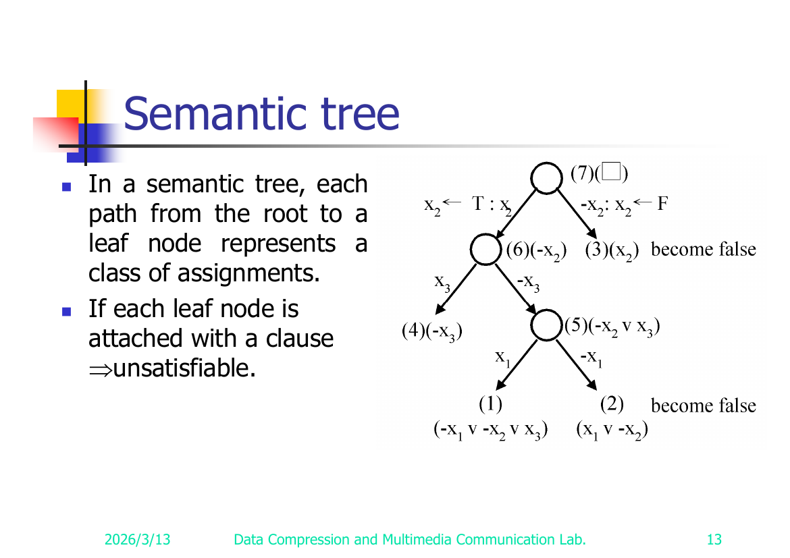
<figcaption>Slide 13 — Semantic tree for the slide-12 unsatisfiable example. Every leaf is falsified by some clause ⇒ unsatisfiable.</figcaption>

- In a **semantic tree**, each **path from root to a leaf** represents a *class of truth assignments* (each level branches on one variable: true vs. false).
- If **every leaf node** can be attached (falsified by) some clause of the formula, then the formula is **unsatisfiable** (no assignment escapes contradiction).

---

## Nondeterministic Algorithms (slides 14–19)

A **nondeterministic algorithm** has two stages:

1. **Guessing** — magically choose a candidate solution.
2. **Checking** — verify the guess deterministically.

> If the **checking** stage runs in **polynomial time**, the algorithm is an **NP (nondeterministic polynomial)** algorithm.

**NP problems are decision problems.** Examples (slide 14): searching, MST, sorting, the satisfiability problem (SAT), the traveling salesperson problem (TSP).

**Primitives (Horowitz & Sahni 1998, slide 16):**

- `Choice(S)` — arbitrarily chooses one element of set S. *(Time O(1).)*
- `Failure` — signals an unsuccessful completion.
- `Success` — signals a successful completion.

> A nondeterministic algorithm **terminates unsuccessfully iff there exists no set of choices** leading to a `Success` signal. A deterministic interpretation can be made by allowing **unbounded parallelism** (explore all choice paths at once).

### Nondeterministic Searching (slide 17)

```
j ← Choice(1 : n)            /* guess  */
if A(j) = x then Success     /* check  */
            else Failure
```

`Choice(1:n)` is O(1); the check is O(1) ⇒ polynomial. So searching is an NP problem.

### Nondeterministic Sorting (slide 18)

```
B ← 0
for i = 1 to n do                 // Guessing: scatter A into B by guessed positions
    j ← Choice(1 : n)
    if B[j] ≠ 0 then Failure       // position already used
    B[j] = A[i]

for i = 1 to n-1 do               // Checking: verify B is sorted
    if B[i] > B[i+1] then Failure
Success
```

### Nondeterministic SAT (slide 19)

```
for i = 1 to n do                          // Guessing
    xᵢ ← Choice(true, false)

if E(x₁, x₂, …, xₙ) is true                // Checking
   then Success
   else Failure
```

### Decision version of sorting (slide 15)

> Given `a₁, a₂, …, aₙ` and `C`, is there a permutation `(a₁, a₂, …, aₙ)` such that
> `|a₂ − a₁| + |a₃ − a₂| + … + |aₙ − a_{n−1}| < C` ?

### Not all decision problems are NP — the Halting Problem (slide 15)

> **Halting problem:** Given a program with certain input data, will the program terminate or not?

- It is **NP-hard** (every NP problem reduces to it).
- It is **undecidable** — so it is **not** in NP (no algorithm, deterministic or not, decides it). This shows NP-hard ⊋ NP-complete: a problem can be NP-hard yet lie outside NP.

---

## Cook's Theorem (slide 20)

> **Cook's Theorem:** **NP = P iff the satisfiability problem is a P problem.**

Consequences:

- **SAT is NP-complete.**
- It is the **first** NP-complete problem.
- **Every NP problem reduces to SAT** (every NP problem → SAT).

### Why every NP problem → SAT (slides 34)

- Every NP problem can be solved by an NP (nondeterministic polynomial) algorithm.
- Every NP algorithm can be **transformed in polynomial time into a SAT instance** (Horowitz & Sahni 1998)…
- …such that the **SAT instance is satisfiable iff the answer to the original NP problem is "Yes."**
- Therefore every NP problem → SAT, hence **SAT is NP-complete.**

### Worked Example — Transforming Searching into SAT (slides 21–24)

**Problem:** Does there exist a number in `{ x(1), x(2), …, x(n) }` equal to **7**? Take **n = 2**.

The nondeterministic search algorithm is encoded as a Boolean formula. Logical form **(slide 22)**:

```
   i=1 ∨ i=2
 ∧ i=1 → i≠2
 ∧ i=2 → i≠1
 ∧ x(1)=7 ∧ i=1 → SUCCESS
 ∧ x(2)=7 ∧ i=2 → SUCCESS
 ∧ x(1)≠7 ∧ i=1 → FAILURE
 ∧ x(2)≠7 ∧ i=2 → FAILURE
 ∧ FAILURE → ¬SUCCESS
 ∧ SUCCESS                 (guarantees a successful termination)
 ∧ x(1)=7                  (input data)
 ∧ x(2)≠7                  (input data)
```

Rewritten as **CNF (slide 23)** — using `(A → B) ≡ (¬A ∨ B)`:

```
   i=1 ∨ i=2                          (1)
   i≠1 ∨ i≠2                          (2)
   x(1)≠7 ∨ i≠1 ∨ SUCCESS             (3)
   x(2)≠7 ∨ i≠2 ∨ SUCCESS             (4)
   x(1)=7 ∨ i≠1 ∨ FAILURE             (5)
   x(2)=7 ∨ i≠2 ∨ FAILURE             (6)
   ¬FAILURE ∨ ¬SUCCESS                (7)
   SUCCESS                            (8)
   x(1)=7                             (9)
   x(2)≠7                            (10)
```

**Satisfying assignment (slide 24):**

| Assign | Satisfies clauses |
|--------|-------------------|
| `i=1`        | (1) |
| `i≠2`        | (2), (4), (6) |
| `SUCCESS`    | (3), (4), (8) |
| `¬FAILURE`   | (7) |
| `x(1)=7`     | (5), (9) |
| `x(2)≠7`     | (4), (10) |

The formula is **satisfiable** ⇒ "Yes, 7 is present" (it is x(1)).

#### Variant A — both inputs ≠ 7 ⇒ unsatisfiable via resolution (slides 26–27)

Searching for 7 but `x(1)≠7, x(2)≠7`. CNF (note clauses (9),(10) flip to `x(1)≠7`, `x(2)≠7`, and (7)=`SUCCESS`, (8)=`¬SUCCESS ∨ ¬FAILURE`):

```
   i=1 ∨ i=2                          (1)
   i≠1 ∨ i≠2                          (2)
   x(1)≠7 ∨ i≠1 ∨ SUCCESS             (3)
   x(2)≠7 ∨ i≠2 ∨ SUCCESS             (4)
   x(1)=7 ∨ i≠1 ∨ FAILURE             (5)
   x(2)=7 ∨ i≠2 ∨ FAILURE             (6)
   SUCCESS                            (7)
   ¬SUCCESS ∨ ¬FAILURE                (8)
   x(1)≠7                             (9)
   x(2)≠7                            (10)
```

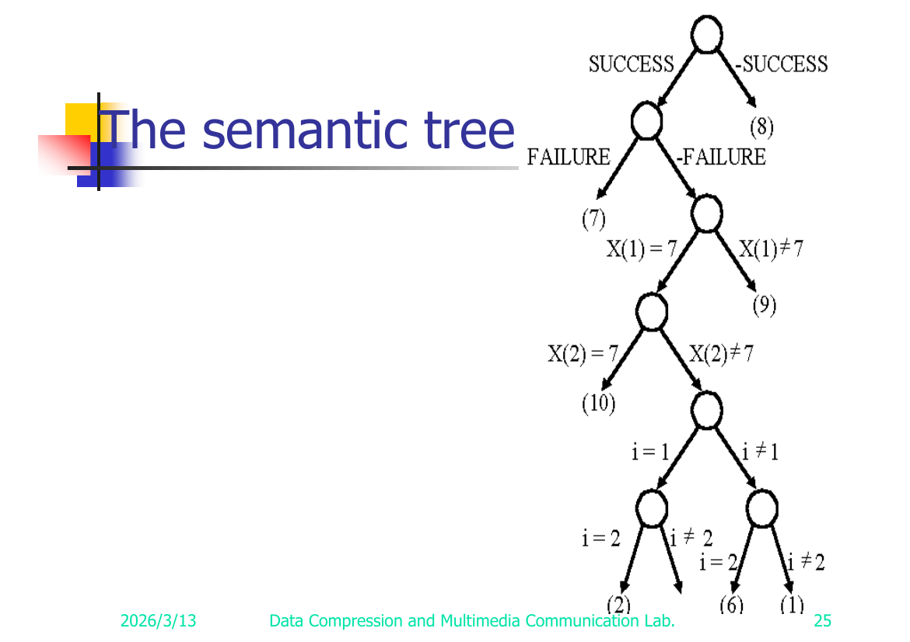
<figcaption>Slide 25 — Semantic tree for the "both inputs ≠ 7" CNF. Every leaf is attached to a clause ⇒ unsatisfiable ⇒ 7 is absent.</figcaption>

**Apply resolution (slide 27):**

```
(9)&(5)   ⊢  i≠1 ∨ FAILURE            (11)
(10)&(6)  ⊢  i≠2 ∨ FAILURE            (12)
(7)&(8)   ⊢  ¬FAILURE                 (13)
(13)&(11) ⊢  i≠1                      (14)
(13)&(12) ⊢  i≠2                      (15)
(14)&(1)  ⊢  i=2                      (16)
(15)&(16) ⊢  □                        (17)
```

Empty clause `□` ⇒ **unsatisfiable** ⇒ **7 does not exist** in x(1) or x(2). Correct.

> ⚠️ Reconstructed: the dump labels two derived lines both "(11)" and then "(16)"; per the deduction chain the lines are renumbered (11)–(17) as above (slide 27).

#### Variant B — both inputs = 7 ⇒ satisfiable, both i=1 and i=2 work (slides 28–29)

Searching for 7 where `x(1)=7, x(2)=7`. CNF:

```
   i=1 ∨ i=2                          (1)
   i≠1 ∨ i≠2                          (2)
   x(1)≠7 ∨ i≠1 ∨ SUCCESS             (3)
   x(2)≠7 ∨ i≠2 ∨ SUCCESS             (4)
   x(1)=7 ∨ i≠1 ∨ FAILURE             (5)
   x(2)=7 ∨ i≠2 ∨ FAILURE             (6)
   SUCCESS                            (7)
   ¬SUCCESS ∨ ¬FAILURE                (8)
   x(1)=7                             (9)
   x(2)=7                            (10)
```

The semantic tree shows **both** assignments (`i=1` and `i=2`) satisfy the clauses — either index witnesses the answer "Yes."

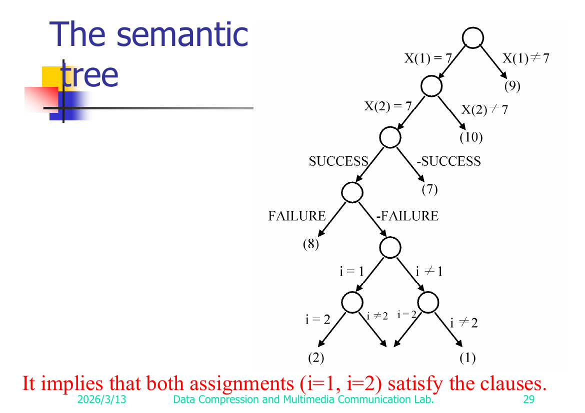
<figcaption>Slide 29 — Semantic tree for the "both inputs = 7" CNF. Caption (red): "It implies that both assignments (i=1, i=2) satisfy the clauses." ⇒ satisfiable.</figcaption>

---

## Proving a problem A is NP-complete (slide 35)

To show **A is NP-complete:**

1. **(I)** Prove **A ∈ NP** (give a nondeterministic polynomial algorithm / poly-time checker).
2. **(II)** Prove that **some known B ∈ NPC reduces to A**, i.e. **B → A**.

Then **A ∈ NPC**.

**Why this works:** (II) shows A is **at least as hard as** an already-hardest problem B, so A is NP-hard; (I) places it inside NP. Together ⇒ NP-complete.

> **Caution (slide 43):** If a problem is NP-complete, its **special cases may or may not** be NP-complete.

---

## Reduction 1 — SAT → 3-SAT (slides 36–42)

**3-SAT:** SAT where **each clause has exactly three literals.**

**(I) 3-SAT ∈ NP** — obvious (it is a restricted SAT; guess + check in poly time).

**(II) SAT → 3-SAT — Construction.** Convert each clause of a SAT instance into a set of 3-literal clauses by **padding with new variables yᵢ**, by clause size:

**1 literal `L₁`** → 4 clauses with 2 fresh variables `y₁, y₂` (all four sign combos):
```
L₁ ∨  y₁ ∨  y₂
L₁ ∨ ¬y₁ ∨  y₂
L₁ ∨  y₁ ∨ ¬y₂
L₁ ∨ ¬y₁ ∨ ¬y₂
```

**2 literals `L₁, L₂`** → 2 clauses with 1 fresh variable `y₁`:
```
L₁ ∨ L₂ ∨  y₁
L₁ ∨ L₂ ∨ ¬y₁
```

**3 literals** → **unchanged.**

**More than 3 literals `L₁, L₂, …, Lₖ`** → chain with `k−3` fresh variables `y₁ … y_{k−3}`:
```
L₁    ∨ L₂   ∨  y₁
L₃    ∨ ¬y₁  ∨  y₂
L₄    ∨ ¬y₂  ∨  y₃
        ⋮
L_{k−2} ∨ ¬y_{k−4} ∨ y_{k−3}
L_{k−1} ∨ Lₖ ∨ ¬y_{k−3}
```

**Worked example (slides 39).** SAT instance:
```
x₁ ∨ x₂
¬x₃
x₁ ∨ ¬x₂ ∨ x₃ ∨ ¬x₄ ∨ x₅
```
Transformed 3-SAT instance:
```
 x₁ ∨ x₂ ∨  y₁          (from 2-literal clause)
 x₁ ∨ x₂ ∨ ¬y₁

¬x₃ ∨  y₂ ∨  y₃         (from 1-literal clause ¬x₃)
¬x₃ ∨ ¬y₂ ∨  y₃
¬x₃ ∨  y₂ ∨ ¬y₃
¬x₃ ∨ ¬y₂ ∨ ¬y₃

 x₁ ∨ ¬x₂ ∨  y₄         (from 5-literal clause, chained)
 x₃ ∨ ¬y₄ ∨  y₅
¬x₄ ∨  x₅ ∨ ¬y₅
```

**Correctness — S satisfiable ⇔ S′ satisfiable (slides 40–42).**

- **(⇒)** Given a satisfying assignment of the original clause `S = L₁ ∨ … ∨ Lₖ` (k ≥ 4), at least one `Lᵢ = T`. Assign the chain variables so the new clauses are all satisfied:
  - set `y_{i−1} = F`,
  - set `yⱼ = T` for `j ≤ i−1`... *(reconstructed reading; see note)* — concretely, set `yⱼ = T` for the clauses **before** Lᵢ's clause and `yⱼ = F` for those **after**, which is exactly what is needed because the clause containing `Lᵢ` is `Lᵢ ∨ ¬y_{i−2} ∨ y_{i−1}` and `Lᵢ = T` already satisfies it. Hence S′ is satisfiable.
  - (3-literal and shorter clauses are trivial: any satisfying literal carries over; the fresh y's can be set freely.)
- **(⇐)** If S′ is satisfiable, a satisfying assignment **cannot** rely on the `yᵢ`'s alone — because the chain forces a contradiction (resolving the chain on all the `yᵢ`'s yields `L₁ ∨ … ∨ Lₖ`, the empty padding cancels). Therefore at least one original `Lᵢ` must be true, so S is satisfiable. *(The resolution principle can also be applied to show this.)*

⇒ **3-SAT is NP-complete.**

> ⚠️ Reconstructed: the (⇒) chain-variable assignment on slide 41 is heavily garbled in the dump (`yi-1=F`, `yj=T ∀j≤i-1`, `yj=F ∀j>i-1` with a `(∵ Li ∨ ¬yi-2 ∨ yi-1)` hint). The reconstruction above (set y's true before, false after the true-literal's clause) is the standard textbook argument; **validate against slide 41.**

---

## Reduction 2 — SATY (≤ 3 literals/clause) → Chromatic Number (CN) (slides 44–49)

**Coloring / Chromatic Number (slides 44–45).** A **coloring** of `G=(V,E)` is `f : V → {1,…,k}` with `f(u) ≠ f(v)` whenever `(u,v) ∈ E`. The **CN decision problem:** does G have a coloring with k colors?

> Example (slide 45): a graph is 3-colorable with `f(a)=1, f(b)=2, f(c)=1, f(d)=2, f(e)=3`.

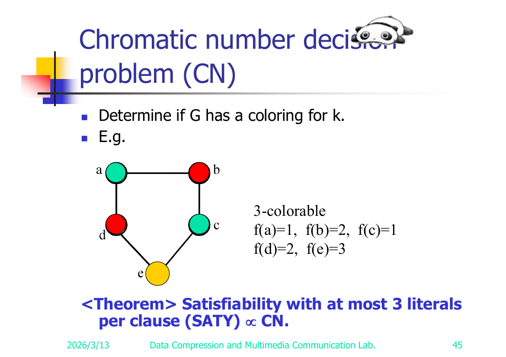
<figcaption>Slide 45 — Chromatic-number example graph, 3-colorable.</figcaption>

> **Theorem:** Satisfiability with **at most 3 literals per clause (SATY)** → CN.

**Construction (slide 46).** Instance of SATY: variables `x₁,…,xₙ` (with **n ≥ 4**), clauses `c₁,…,c_r`. Build graph `G=(V,E)`:

**Vertices:**
```
V = { x₁, …, xₙ }              (positive-literal vertices)
  ∪ { ¬x₁, …, ¬xₙ }            (negative-literal vertices)
  ∪ { y₁, …, yₙ }              (newly added "palette" vertices)
  ∪ { c₁, …, c_r }             (clause vertices)
```

**Edges:**
```
E = { (xᵢ, ¬xᵢ)        | 1 ≤ i ≤ n }          // a variable and its negation conflict
  ∪ { (yᵢ, yⱼ)         | i ≠ j }              // all yᵢ mutually adjacent (form a clique)
  ∪ { (yᵢ, xⱼ)         | i ≠ j }              // yᵢ adjacent to every xⱼ except xᵢ
  ∪ { (yᵢ, ¬xⱼ)        | i ≠ j }              // yᵢ adjacent to every ¬xⱼ except ¬xᵢ
  ∪ { (xᵢ, cⱼ)         | xᵢ ∉ cⱼ }            // clause vertex joined to literals NOT in it
  ∪ { (¬xᵢ, cⱼ)        | ¬xᵢ ∉ cⱼ }
```

> ✅ Verified against slides 46 & 47. Slide 46 prints the edge set verbatim: `E = {(xᵢ,¬xᵢ)|1≤i≤n} ∪ {(yᵢ,yⱼ)|i≠j} ∪ {(yᵢ,xⱼ)|i≠j} ∪ {(yᵢ,¬xⱼ)|i≠j} ∪ {(xᵢ,cⱼ)|xᵢ∉cⱼ} ∪ {(¬xᵢ,cⱼ)|¬xᵢ∉cⱼ}`. The clause-vertex edges use **`∉`** (joined to literals NOT in the clause) exactly as reconstructed. Slide 47's drawn graph + 5-coloring confirms the worked instance. See Appendix A — Slide 47.

> ✅ Worked example (slide 47, verified): clauses `(1) x₁ ∨ x₂ ∨ x₃` and `(2) ¬x₃ ∨ ¬x₄ ∨ x₂`, **n=4**. The deck draws the resulting graph (8 literal vertices, the y₁..y₄ clique, clause nodes c₁,c₂ wired to non-member literals) with a 5-coloring: x₁=1, x₂=5, x₃=5, x₄=4, ¬x₁=5, ¬x₂=2, ¬x₃=3, ¬x₄=5, y₁..y₄=1..4, c₁=1, c₂=3 — encoding the assignment x₁=T, x₂=F, x₃=F, x₄=T. **Full transcription + edge list in Appendix A — Slide 47.**

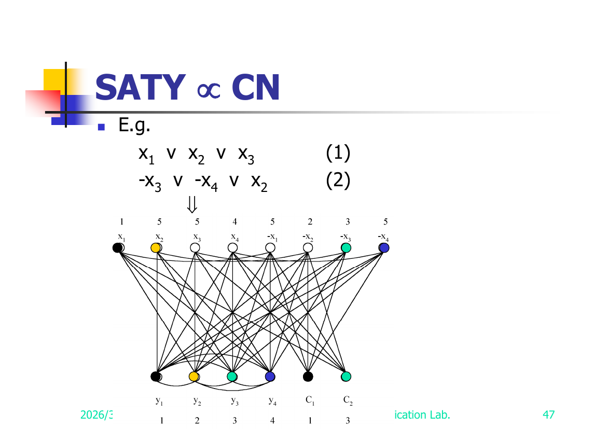
<figcaption>Slide 47 — SATY→CN construction (worked instance). Numeric labels are the 5-coloring; it reads off the satisfying assignment x₁=T, x₂=F, x₃=F, x₄=T.</figcaption>

**Claim: satisfiable ⇔ (n+1)-colorable.**

**(⇒) Satisfiable → (n+1)-colorable (slide 48).** Given a satisfying assignment, color:
1. `f(yᵢ) = i`.
2. If `xᵢ = T` then `f(xᵢ) = i, f(¬xᵢ) = n+1`; else `f(xᵢ) = n+1, f(¬xᵢ) = i`.
3. For each clause `cⱼ`: pick a literal in `cⱼ` that is true. If `xᵢ ∈ cⱼ` and `xᵢ = T`, set `f(cⱼ) = f(xᵢ)`; if `¬xᵢ ∈ cⱼ` and `¬xᵢ = T`, set `f(cⱼ) = f(¬xᵢ)`. (A satisfied clause has **at least one** such true literal.)

This uses colors `{1,…,n+1}` and respects all edges ⇒ **(n+1)-colorable**.

**(⇐) (n+1)-colorable → Satisfiable (slide 49).** Given an (n+1)-coloring:
1. Each `yᵢ` must get color `i` (the y's form a clique adjacent to all literals except their own index, forcing the palette).
2. `f(xᵢ) ≠ f(¬xᵢ)` (they are adjacent); so for each i either `f(xᵢ)=i, f(¬xᵢ)=n+1` **or** `f(xᵢ)=n+1, f(¬xᵢ)=i`.
3. Each clause has at most 3 literals and `n ≥ 4`, so there is **at least one variable xᵢ with neither xᵢ nor ¬xᵢ in cⱼ**; hence `cⱼ` is adjacent to both `xᵢ` and `¬xᵢ`, one of which has color `n+1` ⇒ **`f(cⱼ) ≠ n+1`**, so `f(cⱼ) = i` for some `i ≤ n`.
4. Read off the assignment: if `f(cⱼ) = i = f(xᵢ)`, set `xᵢ = T`; if `f(cⱼ) = i = f(¬xᵢ)`, set `¬xᵢ = T`.
5. Since `f(cⱼ)=i=f(xᵢ)` means `(cⱼ, xᵢ) ∉ E`, i.e. `xᵢ ∈ cⱼ`, the chosen literal is actually **in** `cⱼ` and is true ⇒ `cⱼ` is satisfied. (Symmetric for `¬xᵢ`.)

⇒ the formula is satisfiable. Hence **CN is NP-complete.** ∎

---

## Reduction 3 — Node Cover → SAT (slides 30–33)

This shows how the **node cover** decision problem is encoded as a SAT instance (it is the "every NP problem → SAT" recipe applied concretely to node cover; equivalently it certifies node cover ∈ NP).

**Node cover (slide 30).** Given `G=(V,E)`, `S ⊆ V` is a **node cover** if for every edge `(u,v) ∈ E`, `u ∈ S` or `v ∈ S`. **Decision version:** does there exist S with **|S| ≤ K**?

> Example (slide 30): node covers `{1,3}` and `{5,2,4}`.

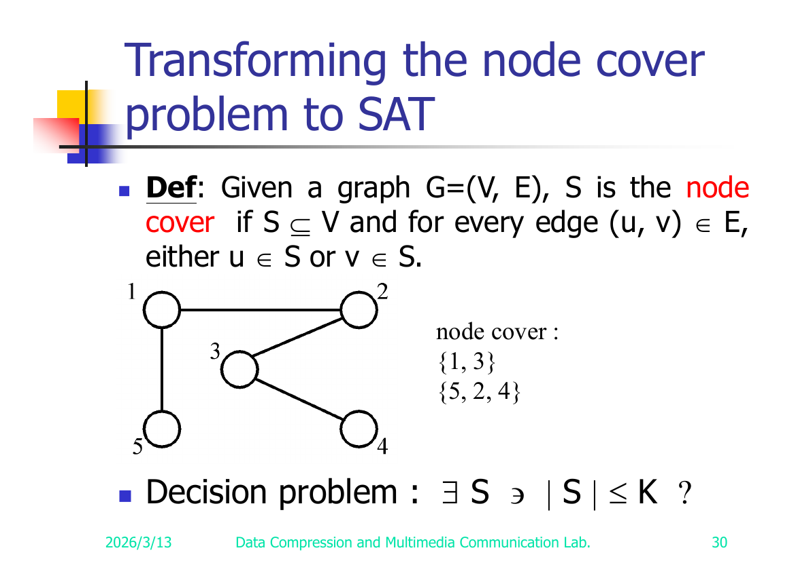
<figcaption>Slide 30 — Node cover example graph (5 vertices). Node covers shown: {1,3} and {5,2,4}.</figcaption>

**Nondeterministic construction (slide 31)** — guess K vertices, check every edge is covered:

```
BEGIN
   i₁ ← Choice({1, 2, …, n})
   i₂ ← Choice({1, 2, …, n} − {i₁})
       ⋮
   i_k ← Choice({1, 2, …, n} − {i₁, i₂, …, i_{k−1}})
   For j = 1 to m do
       BEGIN
         if eⱼ is not incident to one of the iₜ (1 ≤ t ≤ k)
            then FAILURE
       END
   SUCCESS
END
```

**The corresponding CNF (slides 32–33).** Encode "the t-th chosen vertex iₜ equals some value in 1..n", "the choices are distinct", "every edge is covered, else FAILURE", and the success/failure bookkeeping:

```
(A) Each iₜ takes some value (one clause per t):
    i₁=1 ∨ i₁=2 ∨ … ∨ i₁=n
    i₂=1 ∨ i₂=2 ∨ … ∨ i₂=n
              ⋮
    i_k=1 ∨ i_k=2 ∨ … ∨ i_k=n
    (intended meaning: i₁≠1 ⇒ i₁=2 ∨ i₁=3 ∨ … ∨ i₁=n, etc.)

(B) Distinctness — no value chosen twice (pairwise):
    i₁≠1 ∨ i₂≠1
    i₁≠1 ∨ i₃≠1
              ⋮
    i_{k−1}≠n ∨ i_k≠n
    (intended: i₁=1 ⇒ i₂≠1 ∧ … ∧ i_k≠1, …)

(C) Edge coverage — for each edge eⱼ=(rⱼ, sⱼ), some chosen vertex must be an endpoint, else FAILURE:
    i₁≠e₁ ∨ i₂≠e₁ ∨ … ∨ i_k≠e₁ ∨ FAILURE
       (i.e.  (i₁∉e₁ ∧ i₂∉e₁ ∧ … ∧ i_k∉e₁) → FAILURE )
    i₁≠e₂ ∨ i₂≠e₂ ∨ … ∨ i_k≠e₂ ∨ FAILURE
              ⋮
    i₁≠e_m ∨ i₂≠e_m ∨ … ∨ i_k≠e_m ∨ FAILURE

(D) Success / failure bookkeeping (slide 33):
    SUCCESS
    ¬SUCCESS ∨ ¬FAILURE
    r₁ ∈ e₁ ,  s₁ ∈ e₁          (endpoints of each edge — input data)
    r₂ ∈ e₂ ,  s₂ ∈ e₂
              ⋮
    r_m ∈ e_m , s_m ∈ e_m
```

The SAT instance is satisfiable **iff** there is a choice of k vertices covering all edges **iff** G has a node cover of size ≤ k. This is the per-problem instance of Cook's "every NP problem → SAT."

> ⚠️ Reconstructed: the entire CNF on slides 31–33 is fragmentary in the dump (the `=`, `≠`, `∈`, `∉` glyphs are dropped; the "r/s ∈ e" lines on slide 33 are bare). The grouping (A)–(D) and the intended meanings above are reconstructed from the nondeterministic pseudocode and the standard encoding; **validate clause-by-clause against slides 31–33.**

---

## Reduction 4 — CN → Exact Cover (slides 50–51)

**Set cover decision problem (slide 50).** A family `F = {S₁, S₂, …, S_k}` over universe `⋃_{Sᵢ∈F} Sᵢ = {u₁, u₂, …, uₙ}`. `T ⊆ F` is a **set cover** if `⋃_{Sᵢ∈T} Sᵢ = ⋃_{Sᵢ∈F} Sᵢ`. **Decision:** does F have a cover T with **≤ C** sets?

> Example: `F = {(a₁,a₃), (a₂,a₄), (a₂,a₃), (a₄)} = {s₁, s₂, s₃, s₄}`.
> `T = {s₁, s₃, s₄}` is a set cover.
> `T = {s₁, s₂}` is a set cover **and an exact cover** (disjoint, covers everything).

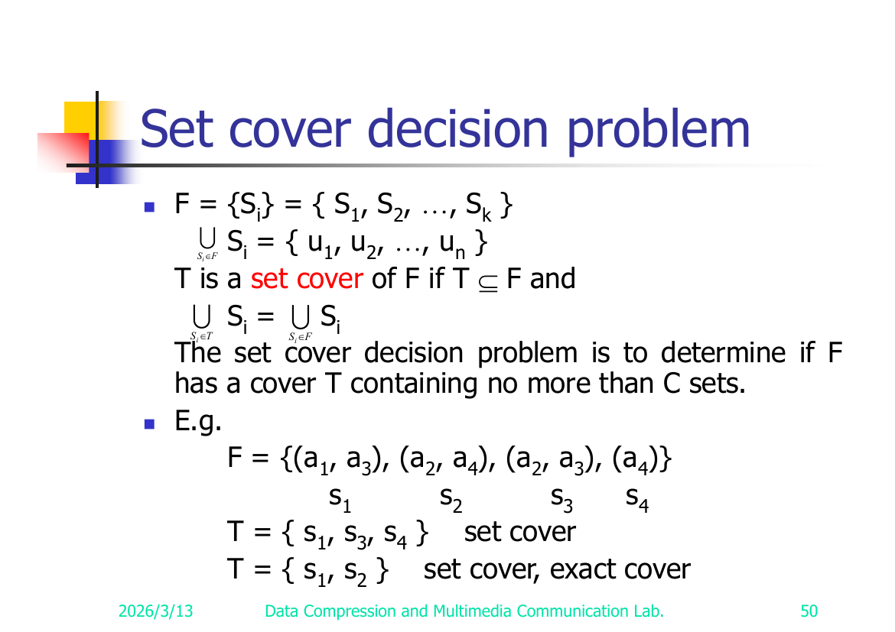
<figcaption>Slide 50 — Set cover decision problem with worked example. {s₁,s₂} is both a set cover and an exact cover.</figcaption>

**Exact cover problem (slide 51).** Same notation. Determine if F has an **exact cover** T: a cover of F whose sets are **pairwise disjoint**.

> **Theorem: CN → exact cover.** *(The deck states the theorem; the construction details are not expanded in the dump — see flagged items.)*

> ⚠️ Reconstructed/Not fully shown: slide 51 only states "CN → exact cover" as a theorem with **no construction in the dump**. **Validate whether slide 51 (or an animation) carries a construction; the deck appears to leave it as a stated result.**

---

## Reduction 5 — Exact Cover → Sum of Subsets (slides 52–54)

**Sum of subsets problem (slide 52).** Given positive numbers `A = {a₁, …, aₙ}` and a constant `C`, determine if some subset `A′ ⊆ A` has `Σ_{aᵢ∈A′} aᵢ = C`.

> Example (slide 52): `A = {7, 5, 19, 1, 12, 8, 14}`. For `C=21`, `A′={7,14}` works. For `C=11`, no solution.

> **Theorem: Exact cover → sum of subsets.**

**Construction (slide 53).** Instance of exact cover: `F = {S₁,…,S_k}` over universe `{u₁,…,uₙ}`. Build a sum-of-subsets instance `A = {a₁,…,a_k}` by encoding each set Sⱼ as a **base-(k+1) number** whose digit in position i flags membership of uᵢ:

```
aⱼ = Σ_{i=1..n}  eⱼᵢ · (k+1)^{i−1},   where  eⱼᵢ = 1 if uᵢ ∈ Sⱼ, else 0

C = Σ_{i=0..n−1} (k+1)^i = ((k+1)ⁿ − 1) / k     (all-ones in base k+1)
```

**Why base (k+1)?** There are k sets, so any subset of them sums **at most k** ones into any single digit position. Using base **k+1** guarantees **no carries** across digit positions: a subset of A sums to C (the all-ones number) **iff** every universe element uᵢ is covered **exactly once** ⇒ exactly an **exact cover.** A smaller base could let carries fake a sum.

**Worked example (slide 54).** `u₁=1, u₂=2, u₃=3`, `n=3`.

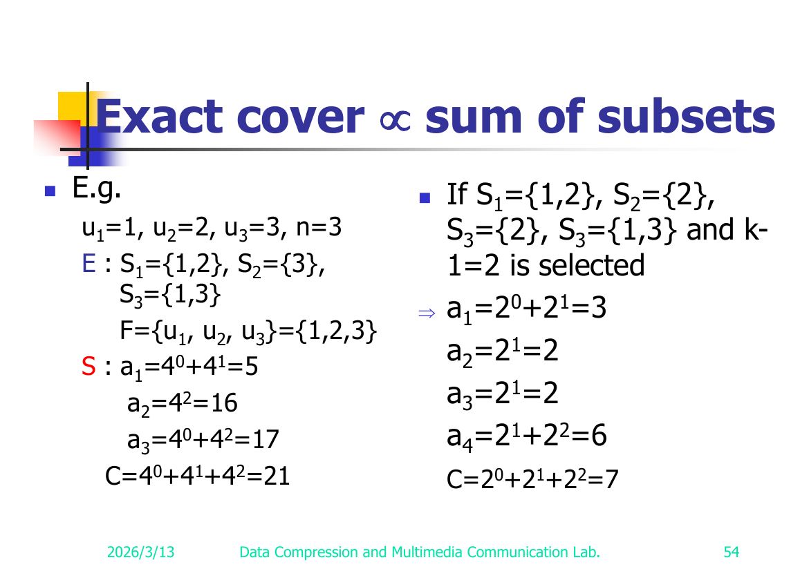
<figcaption>Slide 54 — Exact cover → sum of subsets. Left: proper base k+1=4. Right: deliberately too-small base 2 (the set list prints "S₃" twice — a slide typo for S₄={1,3}).</figcaption>

*Variant E (k=3 sets):* `S₁={1,2}, S₂={3}, S₃={1,3}`, `F = {u₁,u₂,u₃} = {1,2,3}`. Base `k+1 = 4`:
```
a₁ = 4⁰ + 4¹ = 5          (S₁ covers u₁,u₂)
a₂ = 4²    = 16           (S₂ covers u₃)
a₃ = 4⁰ + 4² = 17         (S₃ covers u₁,u₃)
C  = 4⁰ + 4¹ + 4² = 21
```
`a₁ + a₃ = 5 + 17 = 22 ≠ 21` and `a₂ + ... ` — the exact cover `{S₁, S₂}` gives `5 + 16 = 21 = C`. ✓ (sets disjoint, cover all)

*Variant (k chosen so k+1 = 2+1 = 3; 4 sets):* `S₁={1,2}, S₂={2}, S₃={2}, S₄={1,3}`. Here the deck uses base `k+1` with the indicated value:
```
a₁ = 2⁰ + 2¹ = 3
a₂ = 2¹     = 2
a₃ = 2¹     = 2
a₄ = 2¹ + 2² = 6
C  = 2⁰ + 2¹ + 2² = 7
```
Illustrates the role of the base (this variant deliberately uses a too-small base to show how collisions/carries arise).

> ✅ Verified against slide 54. Exponent restorations are correct (`4⁰+4¹`, `4²`, base 4 in variant 1; base 2 in variant 2). The duplicated "S₃" in variant 2 is a **typo on the slide itself** (the 4th set is meant to be S₄={1,3}). The key takeaways (the formula and "why k+1") are confirmed. See Appendix A — Slide 54.

---

## Reduction 6 — Sum of Subsets → Partition (slides 55–57)

**Partition problem (slide 55).** Given positive numbers `A = {a₁,…,aₙ}`, determine if there is a partition `P` with `Σ_{i∈P} aᵢ = Σ_{i∉P} aᵢ` (split A into two equal-sum halves).

> Example: `A = {1,3,8,4,10}` partitions into `{1,8,4}` (sum 13) and `{3,10}` (sum 13).

> **Theorem: sum of subsets → partition.**

**Construction (slide 56).** Instance of sum of subsets: `A = {a₁,…,aₙ}, C`. Build a partition instance `B = {b₁,…,b_{n+2}}`:

```
bᵢ      = aᵢ        for 1 ≤ i ≤ n
b_{n+1} = C + 1
b_{n+2} = (Σ_{1≤i≤n} aᵢ) + 1 − C
```

Let `Tsum = Σ aᵢ`. Then `Σ B = Tsum + (C+1) + (Tsum + 1 − C) = 2·Tsum + 2`, so each side of a partition must sum to `Tsum + 1`.

**Correctness.** A subset `S ⊆ A` with `Σ_S aᵢ = C` exists **iff** B has a balanced partition:
- Put `S ∪ {b_{n+2}}` on one side: sum `= C + (Tsum + 1 − C) = Tsum + 1`. ✓
- The other side is `(A∖S) ∪ {b_{n+1}}`: sum `= (Tsum − C) + (C+1) = Tsum + 1`. ✓

So the partition is `{ bᵢ | aᵢ ∈ S } ∪ {b_{n+2}}` and `{ bᵢ | aᵢ ∉ S } ∪ {b_{n+1}}`.

**Why `b_{n+1} = C+1` and not `C`? (slide 57).** To **force `b_{n+1}` and `b_{n+2}` into different subsets.** With the +1 offsets, `b_{n+1} + b_{n+2} = (C+1) + (Tsum+1−C) = Tsum + 2 > Tsum + 1`, so they **cannot both** be on the same side. This pins down the structure so a balanced partition of B corresponds exactly to a subset of A summing to C. (If we used `C` directly, the two padding numbers could land together and break the correspondence.)

---

## Reduction 7 — Partition → Bin Packing (slide 58)

**Bin packing problem (slide 58).** `n` items, each of size `cᵢ > 0`; bin capacity `C`. Determine if the items can be assigned into `k` bins with `Σ_{i∈binⱼ} cᵢ ≤ C` for every `1 ≤ j ≤ k`.

> **Theorem: partition → bin packing.**

**Construction *(reconstructed)*.** Given a partition instance `A = {a₁,…,aₙ}` with total `Tsum = Σ aᵢ`, build a bin-packing instance with the **same item sizes** `cᵢ = aᵢ`, bin capacity `C = Tsum / 2`, and `k = 2` bins.

**Correctness *(reconstructed)*.** A is partitionable into two equal halves (each summing to `Tsum/2`) **iff** the n items fit into **2 bins** each of capacity `Tsum/2` (each bin must be exactly full, forcing an equal split).

> ⚠️ Reconstructed: slide 58 states only the theorem "partition → bin packing"; **the dump shows no construction.** The 2-bins / capacity-Tsum/2 construction above is the standard one; **validate against slide 58.**

---

## Reduction 8 — Bin Packing → VLSI Discrete Layout (slides 59–60)

**VLSI discrete layout problem (slide 59).** Given `n` rectangles, each with integer height `hᵢ` and width `wᵢ`, and an area `A`, determine if there is a placement of the n rectangles within A obeying the **4 placement rules**:

1. Boundaries of rectangles are **parallel to the x-axis or y-axis** (axis-aligned).
2. **Corners lie on integer points.**
3. **No two rectangles overlap.**
4. Two rectangles are **separated by at least a unit distance.**

> The deck illustrates "A Successful Placement" (slide 60).

> **Theorem: bin packing → VLSI discrete layout.**

**Idea *(reconstructed)*.** Encode each bin-packing item of size `cᵢ` as a rectangle (e.g. `1 × cᵢ`), and the bins/capacity as the layout area A, so that a valid non-overlapping unit-separated placement exists iff the items pack into the bins. The discrete (integer-corner) + unit-separation rules make placement equivalent to discrete packing.

> ⚠️ Reconstructed: slide 60 states only the theorem; **no construction in the dump.** The rectangle-per-item encoding is the standard intuition; **validate against slide 60.**

---

## Reduction 9 — SAT → Clique Decision (slide 61)

**Max clique / clique (slide 61).** A **maximal complete subgraph** of `G=(V,E)` is a **clique**. The **max (maximum) clique problem** asks for the size of the largest clique in G.

> Example: maximal cliques `{a,b}, {a,c,d}, {c,d,e,f}`; **maximum** clique `{c,d,e,f}`.

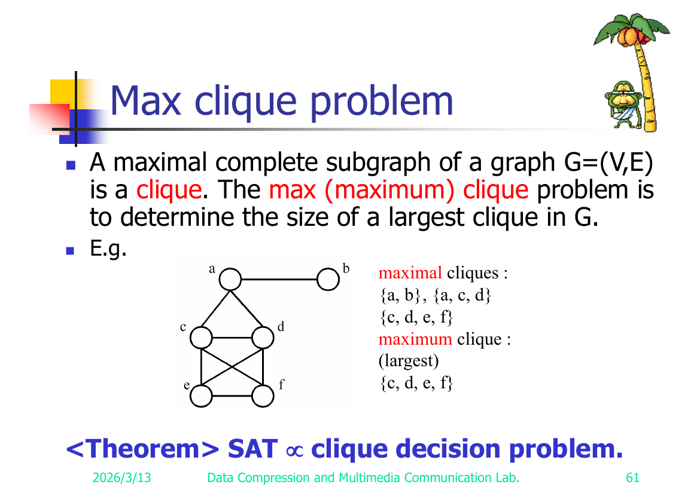
<figcaption>Slide 61 — Max clique example graph. Maximum clique {c,d,e,f} (a 4-clique).</figcaption>

The **clique decision problem:** does G have a clique of size ≥ k?

> **Theorem: SAT → clique decision problem.**

**Construction *(reconstructed, standard)*.** Given a CNF formula with clauses `c₁,…,c_m`:
- Create a vertex for **each literal occurrence** in each clause.
- Add an edge between two literal-vertices iff they are in **different clauses** and are **not complementary** (not `xᵢ` vs `¬xᵢ`).
- Ask for a clique of size **k = m** (number of clauses).

**Correctness *(reconstructed)*.** A clique of size m must pick exactly one literal from each clause, all mutually consistent (no variable and its negation) ⇒ a satisfying assignment; and conversely a satisfying assignment yields one true literal per clause forming an m-clique. So the formula is satisfiable iff G has an m-clique.

> ⚠️ Reconstructed: slide 61 states only the theorem (with the max-clique example); **no construction in the dump.** The literal-vertex / inter-clause-non-conflict construction is the standard Cook/Karp one; **validate against slide 61.**

---

## Reduction 10 — Clique Decision → Node Cover Decision (slides 62–63)

**Node cover decision problem (slide 62).** `S ⊆ V` is a **node cover** of `G=(V,E)` iff every edge of E is incident to at least one vertex of S. **Decision:** does there exist S with `|S| ≤ K`?

> **Theorem: clique decision problem → node cover decision problem.**

**Construction (slide 63).** Given `G=(V,E)` with `|V| = n`, form the **complement graph** `G′ = (V, E′)` where `E′ = { (u,v) | (u,v) ∉ E }`.

**Key fact:**
> **G has a clique of size k ⇔ G′ has a node cover of size n − k.**

**Correctness.** If `K ⊆ V` is a clique of size k in G, then **no edge of G′** has both endpoints in K (clique edges are absent from G′), so every edge of G′ touches `V∖K` ⇒ `V∖K` (size n−k) is a node cover of G′. Conversely, if `S` is a node cover of size n−k in G′, then `V∖S` (size k) is an **independent set** in G′ ⇒ a **clique** in G. So the two questions are equivalent under `K ↔ n−K`.

> Worked example (slide 63): vertices `{a,b,c,d,e,f}`. The deck draws G with a clique and its complement G′ with the corresponding node cover `V∖clique`. (G's clique of size k ⇔ G′'s node cover of size n−k = 6−k.)

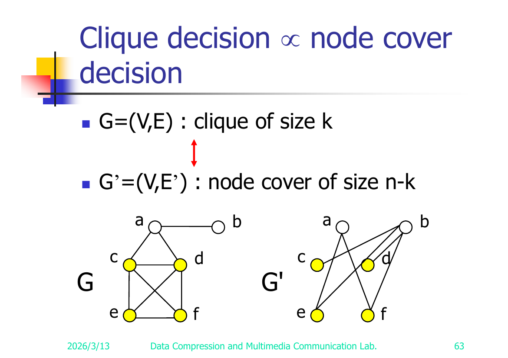
<figcaption>Slide 63 — G (left) with clique {c,d,e,f} of size k=4 ⇔ complement G′ (right) with node cover {a,b} of size n−k=2.</figcaption>

⇒ **Node cover decision is NP-complete.**

---

## Reduction 11 — SAT → Directed Hamiltonian Cycle (slide 64)

**Hamiltonian cycle problem (slide 64).** A **Hamiltonian cycle** is a round-trip path along n edges of G that **visits every vertex exactly once** and returns to its start.

> Example: Hamiltonian cycle `1, 2, 8, 7, 6, 5, 4, 3, 1`.

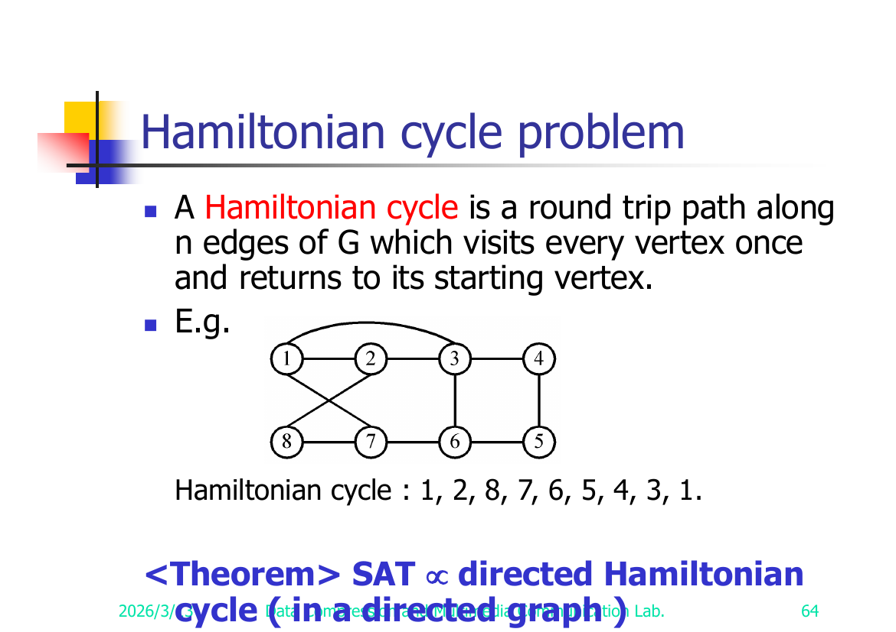
<figcaption>Slide 64 — Hamiltonian cycle example graph. Cycle drawn: 1, 2, 8, 7, 6, 5, 4, 3, 1.</figcaption>

> **Theorem: SAT → directed Hamiltonian cycle** (in a **directed** graph).

**Idea *(reconstructed, standard)*.** Build a directed graph with a "diamond/gadget" chain per variable (traversed left→right for `xᵢ=T`, right→left for `xᵢ=F`) and a vertex per clause; route the clause vertex through the variable gadgets so a Hamiltonian cycle exists iff each clause can be visited by some true literal. Formula satisfiable ⇔ directed Hamiltonian cycle exists.

> ⚠️ Reconstructed: slide 64 states only the theorem (plus the undirected example); **no gadget construction in the dump.** The variable-gadget / clause-vertex construction is the standard one; **validate against slide 64.**

---

## Reduction 12 — Directed Hamiltonian Cycle → TSP Decision (slides 65–66)

**Traveling salesperson problem (slide 65).** A **tour** of a directed graph `G=(V,E)` is a directed cycle that includes every vertex in V. The problem: find a **minimum-cost** tour.

> **Theorem: Directed Hamiltonian cycle → traveling salesperson decision problem.**

**Construction (slide 66).**


<figcaption>Slide 66 — TSP gadget. Left: original G (black edges, cost 1). Right: completed graph; edges added to complete it (blue) have cost 2. A tour of cost ≤ n uses only cost-1 edges ⇒ a Hamiltonian cycle of G.</figcaption>

Given directed graph `G=(V,E)` (a Hamiltonian-cycle instance), build a complete weighted directed graph on the same vertices with edge weights:
```
cost(u,v) = 1   if (u,v) ∈ E
cost(u,v) = 2   if (u,v) ∉ E      (a larger value; "2" per the slide)
```
Ask the TSP **decision** question with bound `C = n` (= |V|).

**Correctness.** A tour of total cost **≤ n** can only use cost-1 edges (any cost-2 edge pushes the total above n), i.e. it uses **only edges of G** ⇒ it is a **directed Hamiltonian cycle** of G. Conversely a Hamiltonian cycle of G has cost exactly n. So G has a directed Hamiltonian cycle ⇔ the TSP tour cost ≤ n.

> ⚠️ Reconstructed: slide 66 shows only a small picture with labels "1" and "2"; the weighting `1 / 2` and bound `C = n` above are the standard construction reading of those labels; **validate against slide 66.**

---

## Reduction 13 — Partition → 0/1 Knapsack Decision (slides 67–68)

**0/1 knapsack problem (slide 67).** `n` objects, each with weight `wᵢ > 0` and profit `pᵢ > 0`; knapsack capacity `M`.
```
Maximize   Σ_{1≤i≤n} pᵢ xᵢ
Subject to Σ_{1≤i≤n} wᵢ xᵢ ≤ M ,   xᵢ ∈ {0, 1}
```
**Decision version:** given K, is there a 0/1 choice with `Σ pᵢ xᵢ ≥ K` (subject to the weight constraint)?

> (The fractional **knapsack** problem allows `0 ≤ xᵢ ≤ 1` and is *not* NP-complete — solvable greedily.)

> **Theorem: partition → 0/1 knapsack decision problem.**

**Construction *(reconstructed, standard)*.** Given a partition instance `A = {a₁,…,aₙ}` with `Tsum = Σ aᵢ`, set `wᵢ = pᵢ = aᵢ`, capacity `M = Tsum/2`, and target profit `K = Tsum/2`. A subset with weight ≤ Tsum/2 and profit ≥ Tsum/2 must have weight = profit = Tsum/2 exactly ⇒ an equal-sum partition. So A is partitionable ⇔ the 0/1 knapsack decision answer is "Yes."

> ⚠️ Reconstructed: slide 68 states only the theorem; **no construction in the dump.** The `wᵢ=pᵢ=aᵢ, M=K=Tsum/2` construction is the standard one; **validate against slide 68.**

---

## Closing reference (slide 69)

> Refer to **Sec. 11.3, Sec. 11.4** and their exercises of **[Horowitz & Sahni 1998]** for the proofs of more NP-complete problems.

---

## ⚠️ Items I reconstructed / couldn't fully verify

Validation checklist — confirm each against the cited slide of the PDF (`source/Alg08 - 相容模式.pdf`). The dump drops the `≤ ≥ ≠ ∈ ∉ ⊆ ∨ ¬ □` glyphs, so logic/edge symbols were inferred throughout; the items below are the **load-bearing** reconstructions:

| # | Slide(s) | Item | What was reconstructed | Risk |
|---|----------|------|------------------------|------|
| 1 | 27 | Searching→SAT, "both ≠ 7" resolution | Renumbered the duplicated `(11)`/`(16)` derivation lines to (11)–(17) | Low (chain is clear) |
| 2 | 41 | SAT→3-SAT (⇒) | Chain-variable assignment (set yⱼ true before / false after the true literal's clause) | Medium — slide text garbled |
| 3 | 46, 47 | SATY→CN edge set E | Full edge families, esp. `(xᵢ,cⱼ)` for `xᵢ ∉ cⱼ` and `(¬xᵢ,cⱼ)` for `¬xᵢ ∉ cⱼ`; the `≠ / ∈ / ∉` conditions | ✅ **Verified against slide 47** (and edge set printed verbatim on slide 46). `∉` confirmed. See Appendix A. |
| 4 | 51 | CN → exact cover | **Construction not in dump** — only the theorem is stated | High — verify if slide carries a construction |
| 5 | 54 | Exact cover→sum-of-subsets example | Superscript restorations (`4⁰+4¹` etc.) and the 2nd variant's base/set list (a duplicated "S₃") | ✅ **Verified against slide 54.** Superscripts correct; the duplicated "S₃" is a **genuine slide typo** (4th set should be S₄={1,3}); 2nd variant uses base 2. See Appendix A. |
| 6 | 58 | Partition → bin packing | **Construction not in dump** — used standard 2-bins, capacity Tsum/2 | High |
| 7 | 60 | Bin packing → VLSI layout | **Construction not in dump** — rectangle-per-item intuition only | High |
| 8 | 61 | SAT → clique decision | **Construction not in dump** — used standard literal-vertex / inter-clause-non-conflict, k=m | High |
| 9 | 64 | SAT → directed Hamiltonian cycle | **Construction not in dump** — used standard variable-gadget/clause-vertex idea | High |
| 10 | 66 | Dir. Hamiltonian cycle → TSP | Edge weights `1/2` and bound `C=n` inferred from the picture labels "1","2" | ✅ **Edge weights verified against slide 66** (left = original G, edges cost 1; right = completed graph, added edges blue = cost 2). Bound `C=n` not printed on the slide (implied by construction). See Appendix A. |
| 11 | 68 | Partition → 0/1 knapsack | **Construction not in dump** — used standard `wᵢ=pᵢ=aᵢ, M=K=Tsum/2` | High |
| 12 | 31–33 | Node cover → SAT CNF | Grouped/restored the (A)–(D) clause families and the `= / ≠ / ∈` meanings | Medium-High |

**Note on items 4, 6, 7, 8, 9, 11:** these slides in the deck state the reduction **as a theorem only** (the textbook leaves the construction to Horowitz & Sahni Sec. 11.3–11.4). The constructions given here are the standard textbook ones, supplied so the note is self-contained — but they are **not transcribed from the slides.** Treat them as study aids and confirm scope expectations with the course.

---

## Appendix A — Figures (visually extracted from slide images)

Transcribed directly from the rendered slide PNGs (`render/A08/slide-NN.png`). These are the diagrams the text dump could not recover. Graph edges are listed explicitly; colors/assignments are read off the figures.

### Slide 13 — Semantic tree (unsatisfiable formula)

A binary tree, branching on variables, whose nodes are annotated with the clause that falsifies that branch. Reading the figure:

- Root `(7)(□)` — branches on x₂: left edge labelled `x₂ ← T : x₂`, right edge labelled `-x₂ : x₂ ← F`.
  - Right child `(3)(x₂)` — labelled **"become false"** (a leaf; clause (3) `x₂` falsified when x₂←F).
  - Left child `(6)(-x₂)` — branches on x₃: left edge `x₃`, right edge `-x₃`.
    - Left child `(4)(-x₃)` — leaf.
    - Right child `(5)(-x₂ ∨ x₃)` — branches on x₁: left edge `x₁`, right edge `-x₁`.
      - Left leaf `(1)(-x₁ ∨ -x₂ ∨ x₃)`.
      - Right leaf `(2)(x₁ ∨ -x₂)` — labelled **"become false"**.

Every leaf is attached to (falsified by) some clause ⇒ the formula is **unsatisfiable**. (This is the figure for the slide-12 unsatisfiable example.)

### Slide 25 — Semantic tree for Searching→SAT, "both inputs ≠ 7" (unsatisfiable)

A single descending (right-leaning) chain of decision nodes; each internal node branches into a leaf labelled by the clause it falsifies and a child that continues the chain. Top-to-bottom:

- Root branches on SUCCESS: left `SUCCESS` → child; right `-SUCCESS` → leaf **(8)**.
- Next node branches on FAILURE: left `FAILURE` → leaf **(7)**; right `-FAILURE` → child.
- branch `X(1)=7` → child / `X(1)≠7` → leaf **(9)**.
- branch `X(2)=7` → leaf **(10)** / `X(2)≠7` → child.
- branch on i: `i=1` → child / `i≠1` → child.
  - under `i=1`: `i=2` → leaf **(2)** / `i≠2` → leaf (closes).
  - under `i≠1`: `i=2` → leaf **(6)** / `i≠2` → leaf **(1)**.

Each leaf is attached to a clause of the CNF (slide 26) ⇒ no escaping assignment ⇒ **unsatisfiable** ⇒ 7 is absent. (Clause numbers match the slide-26 CNF.)

### Slide 29 — Semantic tree for Searching→SAT, "both inputs = 7" (satisfiable)

Same shape as slide 25 but the branch order is `X(1)=7 → X(2)=7 → SUCCESS → -FAILURE → i`. Leaves are labelled with clause numbers `(9),(10),(7),(8),(2),(1)` and `(6)`. Two root-to-leaf paths survive without hitting a contradiction. Slide caption (red): **"It implies that both assignments (i=1, i=2) satisfy the clauses."** ⇒ formula **satisfiable**; either index witnesses "7 is present."

### Slide 30 — Node cover example graph

Undirected graph, 5 vertices `{1,2,3,4,5}`.
Edge list: **(1,2), (1,5), (2,3), (3,4)**.
Layout: 1 top-left, 2 top-right, 3 middle, 4 bottom-right, 5 bottom-left. Vertex 1 connects right to 2 and down to 5; vertex 2 connects down-left to 3; vertex 3 connects down-right to 4.
Node covers shown: **{1,3}** and **{5,2,4}**.

### Slide 45 — Chromatic-number example graph (3-colorable)

Undirected graph, 5 vertices `{a,b,c,d,e}`.
Edge list: **(a,b), (a,d), (b,c), (d,e), (c,e)** (a 5-cycle a-b-c-e-d-a).
Layout: a top-left, b top-right, d middle-right, c-area; e at the bottom apex.
Coloring (k=3): **f(a)=1, f(b)=2, f(c)=1, f(d)=2, f(e)=3**.
Colors drawn: a = green(1), b = red(2), c = green(1), d = red(2), e = yellow(3). 3-colorable.

### Slide 47 — SATY→CN graph construction (the worked example) — CRITICAL

SATY instance, **n = 4**, clauses: **(1) x₁ ∨ x₂ ∨ x₃** and **(2) ¬x₃ ∨ ¬x₄ ∨ x₂**.

**Vertices (two rows):**
- Top row (8 literal vertices), left→right: `x₁, x₂, x₃, x₄, ¬x₁, ¬x₂, ¬x₃, ¬x₄`.
- Bottom row: the y-clique `y₁, y₂, y₃, y₄` then the two clause vertices `c₁, c₂`.

**Coloring shown above/below each vertex (an (n+1)=5-coloring):**

| vertex | x₁ | x₂ | x₃ | x₄ | ¬x₁ | ¬x₂ | ¬x₃ | ¬x₄ | y₁ | y₂ | y₃ | y₄ | c₁ | c₂ |
|--------|----|----|----|----|-----|-----|-----|-----|----|----|----|----|----|----|
| color  | 1  | 5  | 5  | 4  | 5   | 2   | 3   | 5   | 1  | 2  | 3  | 4  | 1  | 3  |

Vertex fill colors observed: x₁ black, x₂ yellow, x₃/x₄/¬x₁/¬x₂ white/open, ¬x₃ teal, ¬x₄ blue; y₁ black, y₂ yellow, y₃ teal, y₄ blue; c₁ black, c₂ teal. (Fill colors are decorative; the numeric labels are the coloring.)

**Edges (per the slide-46 construction, instantiated for n=4, the two clauses):**
- Conflict edges (xᵢ,¬xᵢ): (x₁,¬x₁), (x₂,¬x₂), (x₃,¬x₃), (x₄,¬x₄).
- y-clique (yᵢ,yⱼ) i≠j: all 6 pairs among {y₁,y₂,y₃,y₄}.
- (yᵢ, xⱼ) i≠j and (yᵢ, ¬xⱼ) i≠j: each yᵢ joins every literal vertex **except** xᵢ and ¬xᵢ (so yᵢ touches 6 of the 8 literal vertices). This is the dense web from each yᵢ up to the literal row.
- (xᵢ, cⱼ) for xᵢ ∉ cⱼ and (¬xᵢ, cⱼ) for ¬xᵢ ∉ cⱼ:
  - c₁ = {x₁,x₂,x₃} → c₁ joins the literals **not** in it: **x₄, ¬x₁, ¬x₂, ¬x₃, ¬x₄** (5 edges).
  - c₂ = {¬x₃,¬x₄,x₂} → c₂ joins: **x₁, x₃, x₄, ¬x₁, ¬x₂** (5 edges).

**Verification of the coloring (reads off a satisfying assignment):** yᵢ=i ✓. x₁=T (f(x₁)=1, f(¬x₁)=5=n+1) ✓; x₂=F (f(¬x₂)=2, f(x₂)=5) ✓; x₃=F (f(¬x₃)=3, f(x₃)=5) ✓; x₄=T (f(x₄)=4, f(¬x₄)=5) ✓. Clause colors: f(c₁)=1=f(x₁) ⇒ x₁∈c₁ true ✓; f(c₂)=3=f(¬x₃) ⇒ ¬x₃∈c₂ true ✓. Uses colors {1..5} and respects every edge ⇒ 5-colorable ⇔ satisfiable.

**SATY→CN VERDICT:** The note's reconstructed construction (V and the six edge families) is **CONFIRMED** — it matches slide 46's edge set verbatim and slide 47's drawn graph + coloring. The critical condition is **`(literal, cⱼ)` whenever the literal is NOT in cⱼ** (i.e. `∉`), exactly as the note states. No correction needed.

### Slide 50 — Set cover example

Family `F = {(a₁,a₃), (a₂,a₄), (a₂,a₃), (a₄)}`, named `s₁=(a₁,a₃), s₂=(a₂,a₄), s₃=(a₂,a₃), s₄=(a₄)`. Universe `{a₁,a₂,a₃,a₄}`.
- `T = {s₁, s₃, s₄}` — a **set cover** (covers a₁,a₃,a₂,a₄; not disjoint since a₃ repeats).
- `T = {s₁, s₂}` — a **set cover AND exact cover** (s₁={a₁,a₃}, s₂={a₂,a₄}, disjoint, cover all).

### Slide 54 — Exact cover → sum of subsets, worked example (two variants)

**Left variant (proper, base k+1 = 4, k = 3 sets):**
Universe `u₁=1, u₂=2, u₃=3` (n=3). Sets `S₁={1,2}, S₂={3}, S₃={1,3}`, `F={1,2,3}`.
```
a₁ = 4⁰ + 4¹ = 5     (S₁ has u₁,u₂)
a₂ = 4²      = 16    (S₂ has u₃)
a₃ = 4⁰ + 4² = 17    (S₃ has u₁,u₃)
C  = 4⁰ + 4¹ + 4² = 21
```
Exact cover {S₁,S₂} ⇒ 5 + 16 = 21 = C. ✓

**Right variant (base 2 — the deliberately too-small base, "k−1=2 is selected"):**
The slide's set list reads `S₁={1,2}, S₂={2}, S₃={2}, S₃={1,3}` — **the slide itself prints "S₃" twice**; the fourth set is clearly meant to be S₄={1,3} (this is a slide typo, not a transcription error).
```
a₁ = 2⁰ + 2¹ = 3
a₂ = 2¹      = 2
a₃ = 2¹      = 2
a₄ = 2¹ + 2² = 6
C  = 2⁰ + 2¹ + 2² = 7
```
Demonstrates that with too small a base, carries/collisions can occur. (Slide annotates "k−1=2 is selected" — i.e. the base used here is 2.)

### Slide 61 — Max clique example graph

Undirected graph, 6 vertices `{a,b,c,d,e,f}`.
Layout: a top, b top-right (pendant), c/d middle row, e/f bottom row.
Edge list: **(a,b), (a,c), (a,d), (c,d), (c,e), (c,f), (d,e), (d,f), (e,f)**.
(Note `b` is a pendant vertex, edge only to `a`.) {c,d,e,f} is a 4-clique (all 6 internal edges present).
- Maximal cliques: **{a,b}, {a,c,d}, {c,d,e,f}**.
- Maximum clique: **{c,d,e,f}**.

### Slide 63 — Clique → node cover (G and its complement G′)

Same 6 vertices `{a,b,c,d,e,f}` in both graphs.

**G** (left) — identical to the slide-61 graph:
Edge list: **(a,b), (a,c), (a,d), (c,d), (c,e), (c,f), (d,e), (d,f), (e,f)**.
Clique highlighted: `{c,d,e,f}` (size k=4); these four vertices drawn yellow.

**G′** (right) — the complement on the same 6 vertices (E′ = non-edges of G):
G has 9 edges; K₆ has 15; so G′ has **6 edges**.
Edge list of G′: **(a,e), (a,f), (b,c), (b,d), (b,e), (b,f)**.
(Check: a's non-neighbors in G are e,f → (a,e),(a,f); b's non-neighbors are c,d,e,f → 4 edges; c,d,e,f are mutually complete in G so no further G′ edges. Total 6. ✓ The drawing shows a and b at top each fanning down to lower vertices.)
Node cover of G′ = V∖clique = **{a,b}** (size n−k = 6−4 = 2). Every G′ edge is incident to a or b. ✓

### Slide 64 — Hamiltonian cycle example graph

Undirected graph, 8 vertices `{1,…,8}` in two rows: top `1,2,3,4` (left→right), bottom `8,7,6,5` (left→right, so 8 under 1, 5 under 4).
Edge list: **(1,2), (2,3), (3,4), (1,3) [the curved top arc], (1,6), (2,7) [the two crossing diagonals], (8,7), (7,6), (6,5), (4,5), (3,6)**.
(The crossing "X" in the middle is edges (1,6) and (2,7); the long curved arc over the top connects 1 and 3.)
Hamiltonian cycle drawn: **1, 2, 8, 7, 6, 5, 4, 3, 1**.
> Note: edge (2,8) is required by the stated cycle (2→8); the figure's lower-left region is slightly ambiguous, but the cycle 1-2-8-7-6-5-4-3-1 implies edges (2,8) and (3,1) exist. Treat the cycle as authoritative.

### Slide 66 — Directed Hamiltonian → TSP proof gadget

Two drawings of the **same 7-vertex** graph (heptagon layout).
- **Left:** the original Hamiltonian-cycle instance G — only its actual edges drawn (black), forming the sparse graph.
- **Right:** the TSP instance — the **complete** graph on the same 7 vertices. Edges that **were in G** are black and labelled cost **"1"**; edges **added to complete the graph** (not in G) are drawn in **blue** and labelled cost **"2"**.

This confirms the note's weighting: **cost = 1 for original edges, cost = 2 for added (non-)edges**, and a TSP tour of cost ≤ n uses only cost-1 edges ⇒ a Hamiltonian cycle of G. (The slide shows only the "1"/"2" labels and the two graphs; the bound C = n is implied by the construction, not printed.)
